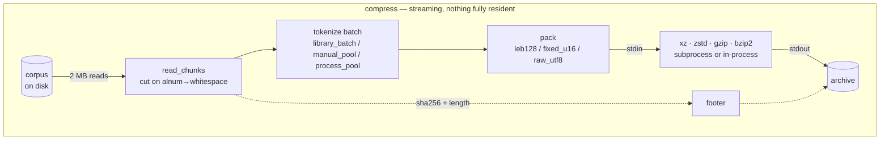
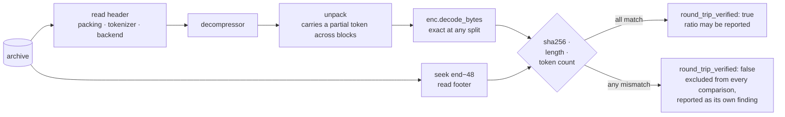
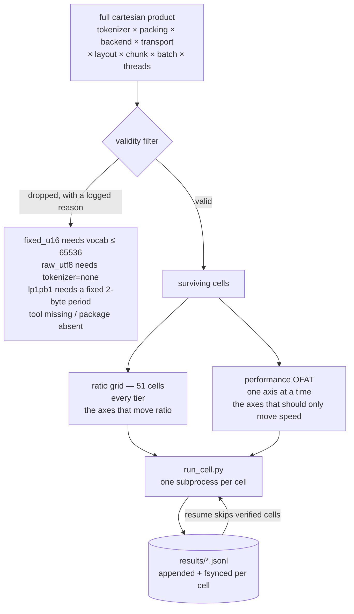

<pre>
███████    ███    ███████  ██     ██    ███    ███████
███████▓  ██ ██   ███████▓ ███   ███▓  ██ ██   ███████▓
██   ██▓ ██   ██  ██   ██▓ ████ ████▓ ██   ██  ██   ██▓
██   ██▓ ██   ██▓ ██   ██▓ ██▓███▓██▓ ██   ██▓ ██   ██▓
███████▓ ███████▓ ███████▓ ██▓ █▓▓██▓ ███████▓ ███████▓
███████▓ ███████▓ █████▓▓▓ ██▓  ▓ ██▓ ███████▓ █████▓▓▓
██▓▓▓▓▓▓ ██▓▓▓██▓ ██▓██▓   ██▓    ██▓ ██▓▓▓██▓ ██▓██▓
██▓      ██▓  ██▓ ██▓ ███  ██▓    ██▓ ██▓  ██▓ ██▓ ███
 ▓▓       ▓▓   ▓▓  ▓▓  ▓▓▓  ▓▓     ▓▓  ▓▓   ▓▓  ▓▓  ▓▓▓
</pre>

<div align="center">

  <a href="LICENSE"></a>
  <a href="report/summary.md"></a>
  <a href="results/README.md"></a>
  <a href="corpus/README.md"></a>
  <a href="https://deepwiki.com/shallowbyte/parmar"></a>
  <a href="https://www.python.org/"></a>

</div>

<p align="center">
  <b>English</b> ·
  <a href="docs/i18n/README.zh-CN.md">简体中文</a> ·
  <a href="docs/i18n/README.hi.md">हिन्दी</a> ·
  <a href="docs/i18n/README.es.md">Español</a> ·
  <a href="docs/i18n/README.ar.md">العربية</a> ·
  <a href="docs/i18n/README.pt-BR.md">Português</a> ·
  <a href="docs/i18n/README.ru.md">Русский</a> ·
  <a href="docs/i18n/README.ja.md">日本語</a> ·
  <a href="docs/i18n/README.de.md">Deutsch</a> ·
  <a href="docs/i18n/README.fr.md">Français</a> ·
  <a href="docs/i18n/README.ko.md">한국어</a>
</p>

A subword-tokenization pre-filter for byte-level entropy coders, plus the
stress-test harness built to find out whether it actually works.

> **Code walkthrough:** an auto-generated architectural tour of this repository
> is available at **[deepwiki.com/shallowbyte/parmar](https://deepwiki.com/shallowbyte/parmar)**.
> This README is the normative source for the *results*; DeepWiki is the easier
> way to navigate the *code*.

**Short answer: it works, for a narrower reason than the hypothesis claimed.**
Pre-tokenizing text buys **+7% to +9.6%** compression ratio over raw bytes at LZMA2's
best settings, the advantage **does widen with corpus size** — and it **plateaus**
once the corpus is well past the compressor's dictionary window, rather than growing
without bound. On `gzip`'s 32 KiB window the advantage is large (+15%) and completely
flat, which separates the two effects that were previously conflated: *representation
density* and *window expansion*. On `bzip2` pre-tokenization is a consistent **loss**
(−3.9%).

**And it is not a size-for-speed trade:** on 5 of the 7 backends parmar is smaller
*and* **faster** than raw bytes at the same time, at every tier — the compressor is
handed ~45% fewer bytes, and that saves more time than tokenizing costs. Numbers and
method below; every one of them comes from a configuration whose decompression was
actually executed and whose sha256 actually matched.

<picture>
  <source media="(prefers-color-scheme: dark)" srcset="report/ratio_gap_vs_corpus_size_dark.png">
  
</picture>

## What it is

Standard compressors find repeats inside a fixed-size sliding dictionary window
measured in **bytes**. parmar's premise: replace UTF-8 prose with BPE token IDs (the
same tokenization used to feed LLMs) before compressing. The token stream is roughly
45% smaller than the text, so a 64 MiB LZMA2 dictionary that normally spans ~64 MB of
prose can span ~120 MB of prose once the prose is pre-shrunk.

**The claim only becomes testable at scale.** On a 5 MB file the whole input already
fits inside the dictionary, so there is no window to expand and pre-tokenization buys
essentially nothing. The deliverable here is therefore not a single ratio number — it
is the **curve of (parmar ratio − raw-backend ratio) as a function of corpus size**,
and whether that curve rises.

Archive format is streaming end-to-end: chunks are read off the input handle,
tokenized, packed, and piped straight into an `xz`/`zstd` subprocess whose stdout is
the output file. Neither the token array nor the compressed payload is ever fully
resident. Every decompression re-hashes the reconstructed bytes and checks them
against a sha256 in the archive footer; **no ratio is reported as valid data unless
that check passed.**

## How it works

Nothing larger than one batch is ever resident. Chunks stream off the input handle,
tokenize, pack, and go straight into the compressor's stdin — whose stdout *is* the
output file, so the compressed payload never passes through Python.



Decompression is the same path in reverse, and **always runs**: every measured
configuration is decompressed and checked before its ratio is allowed to count.



### The archive

| offset | field |
|---|---|
| `0` | `PRMR` magic, version, packing code |
| `6…` | length-prefixed tokenizer name, backend name, transport |
| … | compressed payload |
| `EOF−48` | `orig_len` (u64), `token_count` (u64), `sha256` (32 B) |

The footer is at the end because `orig_len`, `token_count` and the hash are not known
until the whole input has streamed through. Decompression seeks to `size−48` first.

### How a sweep is built



A literal cartesian product is **~8,100 valid cells per tier** — weeks per tier at
measured throughput. The split above is the documented deviation: the ratio grid is
what produces the scale curve, and ratio is still recorded for every OFAT cell, so a
performance axis that *does* move ratio surfaces as a contradiction rather than being
averaged away.


## Layout

| file | what it is |
|---|---|
| `parmar_core.py` | the pipeline: packing schemes, backends, transports, tokenization layouts, archive format, compress/decompress |
| `parmar.py` | single-pipeline CLI (`compress` / `decompress` / `bench` / `selftest`) |
| `resources.py` | portable CPU/RAM/disk/tool/library detection |
| `build_corpus.py` | PG-19 corpus builder, tiered and resumable |
| `verify_boundaries.py` | chunk-boundary differential test — **blocking** |
| `matrix.py` | cell generation, validity filtering, subprocess-isolated execution, resume |
| `run_cell.py` | one matrix cell, in its own process |
| `analyze.py` | summary tables + the ratio-vs-corpus-size plot |
| `test_regressions.py` | regressions for the defects found in the original `parmar.py` |
| `test_axes.py` | every matrix axis value round-trip verified independently |
| `FINDINGS.md` | **everything that turned out to be wrong once the code could be run** |

## Setup

```bash
python -m venv venv
./venv/Scripts/python.exe -m pip install tiktoken numpy zstandard psutil matplotlib pandas
```

External tools used when present: `xz` (≥5.2 for `-T`), `zstd`, `gzip`, `bzip2`.
Missing tools do not silently change behaviour — the affected matrix cells are
skipped with a printed reason. `resources.py` prints exactly what it found:

```bash
python resources.py
```

## Reproducing

```bash
# 1. Build the corpus tiers (idempotent; re-running verifies sha256 and skips)
python build_corpus.py --tiers "64MB,256MB,1GB,4GB" --out ./corpus/

# 2. Smoke test: one config, smallest tier, fast profile
python matrix.py smoke --corpus ./corpus/pg19_64mb.txt

# 3. Boundary-safety differential test. BLOCKING -- a failure here means chunking
#    perturbs the token stream and every downstream ratio is contaminated.
python matrix.py verify-boundaries --corpus ./corpus/pg19_64mb.txt \
    --tokenizers "o200k_base,cl100k_base,r50k_base,p50k_base" \
    --chunk-sizes "1MB,2MB,4MB"

# 4. Packing property/fuzz test (also runs automatically before every sweep)
python matrix.py verify-leb128 --cases 50000

# 5. Dev-loop sweep: full matrix, smallest tier, fast backends only
python matrix.py sweep --corpus ./corpus/pg19_64mb.txt --profile fast --resume

# 6. Full sweep at a tier, resumable, behind the pre-flight estimate gate
python matrix.py sweep --corpus ./corpus/pg19_1gb.txt --profile full \
    --resume --confirm-estimate

# 7. Analysis (works on partial results -- no tier needs to be finished)
python analyze.py --results ./results/ --out ./report/

# 8. Re-run one anomalous cell by its row id
python matrix.py rerun-cell --results ./results/sweep_64mb.jsonl --row-id <id>

# or run the whole programme in sequence, resumable at any point
bash run_all.sh
```

`matrix.py plan --corpus ... --profile full` prints the generated cells and the
full drop log without running anything.

## Matrix shape

the design spec's axes as a literal cartesian product give **~8,100 valid cells per
corpus tier**, which at this machine's measured throughput is weeks per tier. The
product is split in two:

* **ratio grid** — full cross of the axes that determine ratio (tokenizer × packing ×
  backend), at fixed baseline performance settings. **51 cells.** Produces the
  ratio-vs-scale curve.
* **performance OFAT** — one factor at a time around the same baseline over the axes
  that should only affect speed (threads, layout, transport, chunk size, batch size),
  on representative backends.

Ratio is still recorded for every OFAT cell, so a performance axis that *does* move
ratio shows up as a contradiction rather than being averaged away.

## Results

Full tables in `report/summary.md`; plots in `report/ratio_vs_corpus_size.png` and
`report/ratio_gap_vs_corpus_size.png`. Corpus: PG-19, four tiers (64MB / 256MB / 1GB
/ 4GB), 10,629 documents.

**452 matrix cells, 452 round-trip verified, 0 failures — 21.4 hours of measured
cell time.** Every number below comes from a configuration whose decompression was
actually executed and whose sha256, byte length and token count all matched. Cells
that fail verification are excluded from comparisons and listed loudly in their own
section of the summary; there were none. Chunks cut at a boundary with no
tokenizer-safe split point: **0**, across all 452 cells.

### Q1. Does the parmar/raw-backend ratio gap grow with corpus size?

**Yes — but only for backends that have a window big enough to expand, and it
plateaus once the corpus is a few multiples past that window.**

Ratio gap as a percentage of the same backend's raw-bytes ratio, pipeline held fixed
at `p50k_base + fixed_u16`:

| backend | effective window | 64MB | 256MB | 1GB | 4GB | shape |
|---|---|---|---|---|---|---|
| `gzip_9` | 32 KiB | +15.38% | +15.24% | +15.34% | +15.30% | **flat** |
| `bz2_9` | 900 KiB block | −3.87% | −3.90% | −3.83% | −3.85% | **flat, negative** |
| `zstd_12` | 128 MiB | +6.12% | +6.40% | +6.54% | +6.53% | rises, plateaus |
| `zstd_19` | 128 MiB | +5.04% | +5.43% | +5.57% | +5.58% | rises, plateaus |
| `lzma_fast` | 32 MiB | +8.16% | +8.87% | +9.22% | +9.21% | rises, plateaus |
| `lzma_extreme` | 64 MiB | +7.55% | +8.56% | +8.94% | +9.08% | rises, plateaus |
| `lzma_tuned_lp1pb1` | 64 MiB | +8.22% | +9.08% | +9.44% | +9.58% | rises |
| `zstd_22_long` | 2 GiB | +3.65% | +4.35% | +4.91% | +5.19% | **still climbing** |

Across all 44 backend/pipeline combinations: **32 widen, 12 flat, 0 narrow.** The 12
flat ones are exactly the six `gzip_9` and six `bz2_9` combinations.

The mechanism is visible in the shape, not just the sign:

* `gzip_9`'s 32 KiB window is saturated at every tier, so its (large, +15%) gain is
  **pure representation density** and does not grow at all. This is the control that
  separates the two effects — and it shows most of parmar's benefit at small scale
  was never about windows.
* The LZMA backends climb from 64MB to 1GB and then flatten: once the corpus is
  ~16x the dictionary, both the tokenized and the raw stream are equally
  "windowed out" and the advantage stops growing.
* `zstd_22_long`, with a 2 GiB window, is the one backend **still climbing at 4GB** —
  because 4GB is only 2x its window, i.e. it is still in the regime the others have
  already left.

**The plateau point tracks each backend's window size.** That is the window-expansion
hypothesis confirming itself, and it is a genuine refinement: the original claim
implied unbounded growth with corpus size, and that part is **not** what happens.

Best absolute ratios (parmar vs the best raw backend at the same tier):

| tier | best parmar | best raw | advantage |
|---|---|---|---|
| 64MB | **3.9304** (`p50k+fixed_u16` / `lzma_tuned_lp1pb1`) | 3.6318 (`lzma_extreme`) | +8.22% |
| 256MB | **4.0488** | 3.7198 (`zstd_22_long`) | +8.84% |
| 1GB | **4.0855** | 3.7817 (`zstd_22_long`) | +8.03% |
| 4GB | **4.0785** | 3.8027 (`zstd_22_long`) | +7.25% |

Absolute ratios are not perfectly monotonic across tiers because each tier is a
different set of documents; the per-backend gap above is the controlled comparison.


<picture>
  <source media="(prefers-color-scheme: dark)" srcset="report/ratio_vs_corpus_size_dark.png">
  
</picture>

### Q2. Does `fixed_u16` + `lp=1,pb=1` beat `LEB128` + `lc=3,lp=0,pb=0`?

**Yes, clearly — but mostly for a different reason than the theory gave.**

At 64MB, on the tokenizers where both packings are valid:

| tokenizer | LEB128 + lc3/lp0/pb0 | fixed_u16 + lc3/lp0/pb0 | fixed_u16 + lc1/lp1/pb1 | tuned vs LEB128 |
|---|---|---|---|---|
| `r50k_base` | 3.6856 | 3.8975 | 3.9214 | **+6.40%** |
| `p50k_base` | 3.6915 | 3.9060 | 3.9304 | **+6.47%** |

Decomposing that +6.4%: switching LEB128 → `fixed_u16` at *unchanged* lc/lp/pb is
worth **+5.7%**, and the `lp=1,pb=1` alignment tuning on top is worth a further
**+0.61%**. So the alignment theory is directionally right and does pay — but ~90% of
the win is the fixed-width regularity itself, not the literal-position tuning that
was argued for from first principles. `lzma_tuned_lp1pb1` is nonetheless the
best-ratio configuration at every tier tested.


<picture>
  <source media="(prefers-color-scheme: dark)" srcset="report/packing_decomposition_dark.png">
  
</picture>

### Q3. Does `manual_pool` ever beat `library_batch`?

**No. This is a clean negative result — the hypothesis did not hold.**

Across both tiers where the comparison is available, `manual_pool` beat
`library_batch` in **exactly 8 of 16** comparable configurations. That is chance.
Individual deltas swing from −6.8% to +44%, in both directions, with no consistent
pattern by thread count, chunk size, backend, or corpus size.

The swings are large in percentage terms because the quantity being measured is
small and noisy: tokenization is ~0.7–3.4 s of a cell that takes 20 s to 60 min, and
two nominally identical `library_batch` runs of the *same work* differ by as much as
0.71 s vs 1.24 s. The effect being measured is the same order as the measurement
noise, which is itself the finding.

**Conclusion: the hand-rolled worker pool is not worth its complexity.** tiktoken's
`encode_ordinary_batch` already releases the GIL and parallelises internally in Rust;
there is no headroom above it for Python-side coordination to recover. `process_pool`
additionally pays Windows spawn cost (~1–2 s and ~100 MB per worker) for no return.
The design spec was right to flag this as an open empirical question rather than a
settled design choice — and the answer is that the simple option wins.

### Q4. What is the real `xz -T` speedup curve, and where does the floor kick in?

**The 2x-dictionary floor from the design spec is real, and the speedup above it is
governed by the block count — which pre-tokenization reduces.**

The quantity that matters is the size of the stream *fed to xz* (the packed token
stream), not the corpus and not the compressed output. Blocks = `fed / (2 x dict)`:

| tier | pipeline | backend | fed to xz | blocks | T4 | T20 | ratio cost |
|---|---|---|---|---|---|---|---|
| 64MB | raw | `lzma_extreme` | 64 MB | **1** | 1.01× | 1.01× | **0.00%** |
| 64MB | `r50k+fixed_u16` | `lzma_extreme` | 36 MB | **1** | 1.12× | 1.13× | **0.00%** |
| 64MB | `o200k+leb128` | `lzma_fast` | <64 MB | **1** | 1.17× | 1.22× | **0.00%** |
| 1GB | `r50k+fixed_u16` | `lzma_extreme` | 579 MB | **5** | 3.61× | **4.97×** | −1.30% |
| 1GB | raw | `lzma_extreme` | 1025 MB | **8** | 3.78× | **7.49×** | −1.16% |
| 1GB | `r50k+fixed_u16` | `lzma_fast` | 579 MB | **9** | 3.26× | **7.94×** | −1.38% |
| 1GB | raw | `lzma_fast` | 1025 MB | **16** | 4.10× | **11.76×** | −1.35% |

At 4GB the block counts grow past the core count, and the constraint changes:

| tier | pipeline | backend | fed to xz | blocks | T4 | T20 | ratio cost |
|---|---|---|---|---|---|---|---|
| 4GB | `r50k+fixed_u16` | `lzma_extreme` | 2315 MB | 18 | 3.96× | 9.43× | −1.29% |
| 4GB | raw | `lzma_extreme` | 4096 MB | 32 | 3.85× | 10.82× | −1.27% |
| 4GB | `r50k+fixed_u16` | `lzma_fast` | 2315 MB | 36 | 4.31× | 11.28× | −1.35% |
| 4GB | raw | `lzma_fast` | 4096 MB | 64 | 3.81× | 11.48× | −1.36% |

**There are three regimes, and `-T` behaves completely differently in each:**

**1. Below the floor (`fed < 2 x dict`) — one block.** `-T` buys nothing (0.99–1.22×)
and costs nothing. The ratio is bit-identical across T1/T4/T20, which *confirms* no
splitting occurred rather than merely inferring it. This is the regime the 64MB tier
sits in, and it is why the original 5 MB experiments saw no multithreading benefit.

**2. Blocks < cores — speedup tracks the block count almost 1:1.** At 1GB: 5 blocks →
4.97×, 8 → 7.49×, 9 → 7.94×, 16 → 11.76×. Threads beyond the block count do nothing.

**3. Blocks > cores — speedup saturates on hardware.** At 4GB, 18 to 64 blocks all
land at 9.4–11.5× on 20 cores (~50% parallel efficiency). More blocks stop helping.

So useful thread count is approximately **`min(fed_bytes / (2 x dict_size), cores)`**.

**Pre-tokenization has a hidden parallelism cost that had not been flagged.** Because
parmar shrinks the compressor's input by ~45%, it shrinks the block count at a fixed
block size. On the same 1GB corpus and backend, raw bytes get 8 blocks and 7.49×
while `fixed_u16` gets 5 blocks and 4.97× — parmar gives up **~34% of the available
multithreaded speedup** for its ratio win. At 4GB this disappears, because both are
past the core-count ceiling anyway. It is a real trade-off in regime 2 only.

The MT ratio cost is **~1.3% for LZMA at every scale** and, notably, **exactly 0.00%
for zstd** at every level and tier tested — zstd's multithreading does not reset the
window between jobs the way xz's independent blocks do. If you need multithreading
without a ratio penalty, that is a concrete reason to prefer zstd over xz here.

<picture>
  <source media="(prefers-color-scheme: dark)" srcset="report/thread_scaling_dark.png">
  
</picture>

### Which configuration should you actually use?

<picture>
  <source media="(prefers-color-scheme: dark)" srcset="report/ratio_vs_throughput_pareto_dark.png">
  
</picture>

The frontier spans **3.18x at 79 MB/s** (raw + `zstd_12`) to **4.09x at 7.9 MB/s** (`p50k_base+fixed_u16` + `lzma_tuned_lp1pb1`) — a 29% size difference for a 10x speed difference. `p50k_base+fixed_u16` appears at nearly every point on it, which is the practical takeaway: the packing choice is close to free, and the backend is where you trade.

### The result that matters most in practice

Pre-tokenizing is not a size-for-speed trade. On **5 of the 7 backends, at every
tier, parmar is smaller *and* faster than raw bytes simultaneously** — because the
compressor is handed ~45% fewer bytes, and the time saved compressing them exceeds
the time spent tokenizing.

| backend | raw | best parmar | verdict |
|---|---|---|---|
| `lzma_extreme` @4GB | 3.7221x @ 11.6 MB/s | **4.0454x @ 16.9 MB/s** | smaller **and** 1.5x faster |
| `lzma_fast` @64MB | 3.6114x @ 0.45 MB/s | **3.9061x @ 2.93 MB/s** | smaller **and** 6.5x faster |
| `gzip_9` @1GB | 2.6928x @ 18.5 MB/s | **2.9413x @ 23.4 MB/s** | smaller **and** faster |
| `zstd_19` @4GB | 3.5714x @ 14.4 MB/s | **3.6765x @ 23.3 MB/s** | smaller **and** 1.6x faster |
| `zstd_22_long` @1GB | 3.7817x @ 1.6 MB/s | **3.9513x @ 2.3 MB/s** | smaller **and** faster |
| `zstd_12` @1GB | 3.1825x @ 79.0 MB/s | 3.3905x @ 39.0 MB/s | smaller but **2x slower** |
| `bz2_9` @1GB | **3.5659x** @ 19.8 MB/s | 3.4571x @ 17.2 MB/s | **raw wins outright** |

The two exceptions are informative. `zstd_12` is fast enough that tokenization becomes
the bottleneck, so above 256MB parmar buys size at a real speed cost. `bz2_9` loses on
both — bzip2's Burrows-Wheeler transform exploits byte-level text structure that
tokenization destroys.

## Use cases

Grounded in the measurements above, not in speculation:

- **Archiving large prose corpora.** The strongest case: with `lzma` or high-level
  `zstd` you get both a smaller archive and a shorter compression run.
- **Anything stuck on gzip/deflate.** `gzip_9` gains **+15%** and, unusually, gains it
  at *every* corpus size — because gzip's 32 KiB window is always saturated, so the
  benefit is pure representation density with no scale threshold. If you cannot change
  the compressor but can change what you feed it, this is the clearest win here, and it
  works on small inputs too.
- **Storing text that is going to be tokenized anyway** — LLM training shards, eval
  sets, retrieval corpora. The tokens *are* the payload, so a reader skips
  re-tokenization entirely on the way back out. That is a systems win on top of ratio.
- **Cold storage where read frequency is low.** Decompression carries a detokenization
  cost that compression does not, so the asymmetry favours write-once/read-rarely.

## Scope and non-goals

- **Not a general-purpose archiver.** An archive is not self-contained: it records the
  tokenizer *name*, not its vocabulary, so decompression needs the exact same
  `tiktoken` encoding available. Treat archives as coupled to their tokenizer version.
- **Not a secure format.** No encryption and no authentication. The footer sha256 is an
  integrity check against corruption, stored in the clear beside the data it describes
  — it is not a MAC. See [`SECURITY.md`](SECURITY.md).
- **Not validated on non-prose.** Every number here is English prose (PG-19). Code,
  JSON, logs and markup are untested and could behave differently in either direction.
- **Not a speed play at the fast end.** If you are already on `zstd -12` or below for
  throughput, pre-tokenizing costs you speed above 256MB.
- **Not for bzip2.** Measured as a consistent loss; do not use them together.

## Limitations

Honest list, all of them measured or documented rather than suspected:

- **The chunk-boundary rule needs an ASCII alphanumeric followed by whitespace.**
  Unbroken digit runs, pure-punctuation blobs and unspaced scripts such as CJK have no
  safe cut point. The chunker falls back to a merely UTF-8-safe cut and **counts it**
  in `unsafe_boundary_cuts`, carried into every results row. On PG-19 that count is
  zero at every tier and chunk size — on a Chinese or Japanese corpus it would not be.
- **`fixed_u16` — the best-performing packing — only works for vocabularies ≤ 65,536**,
  i.e. `r50k_base` and `p50k_base`. The modern large-vocabulary tokenizers cannot use
  it and are stuck with LEB128, which is where most of the ratio win came from.
- **Pre-tokenizing reduces multithreaded parallelism.** Fewer bytes fed to `xz` means
  fewer blocks; at 1GB that costs ~34% of the available `-T` speedup.
- **All timings are from one machine** (20 cores, Windows). Ratios are
  platform-independent; throughput and thread-scaling numbers are not.
- **The plateau bound is only established up to 4GB.** `zstd_22_long` was still rising
  at the top tier, so its ceiling is unmeasured.

## Future work

Ordered by how much each would actually teach:

1. **Sweep dictionary size instead of corpus size.** The plateau tracks the *window*,
   not the corpus, so varying `dict_size` at a fixed 1GB corpus would isolate the
   mechanism far more cheaply than the corpus ladder did — and would predict the
   plateau point for any backend rather than observing it per-backend.
2. **Frequency-remap token IDs before packing.** LEB128 spends 3 bytes on any ID above
   16,383, and `o200k_base` puts most of its vocabulary there. Renumbering IDs by
   corpus frequency would move common tokens into the 1–2 byte range. This is the most
   promising untested idea for closing the gap between LEB128 and `fixed_u16` on
   large-vocabulary tokenizers.
3. **Non-prose corpora**, source code first — it is highly repetitive at the token
   level and its pretokenization behaviour is very different from prose.
4. **A cut rule for unspaced scripts**, which would make the technique usable on CJK
   text at all.
5. **An 8GB+ tier**, purely to find where `zstd_22_long`'s 2 GiB window plateaus.
6. **SentencePiece / Gemma tokenizers**, deliberately excluded this round because they
   require a gated model download and would break the run-anywhere property.


## Corpus

`deepmind/pg19` (Apache 2.0) — Rae et al. 2019, *Compressive Transformers for
Long-Range Sequence Modelling*, arXiv:1911.05507.

Note that `datasets.load_dataset("deepmind/pg19", streaming=True)` **cannot work**:
the Hub repo carries only a loading script and file lists, has no parquet, and its
`refs/convert/parquet` branch has no data either — while loading scripts were removed
in `datasets` 3.0. `build_corpus.py` fetches the books directly from the public GCS
bucket the script points at. See `FINDINGS.md` §1.
