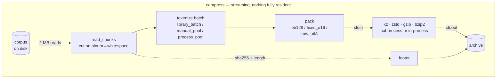
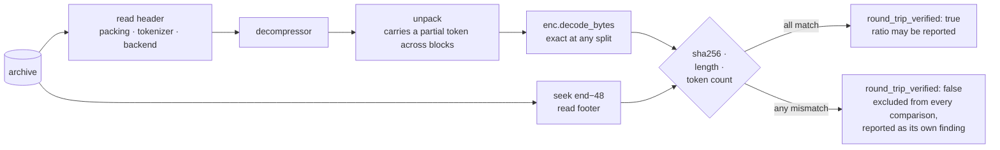
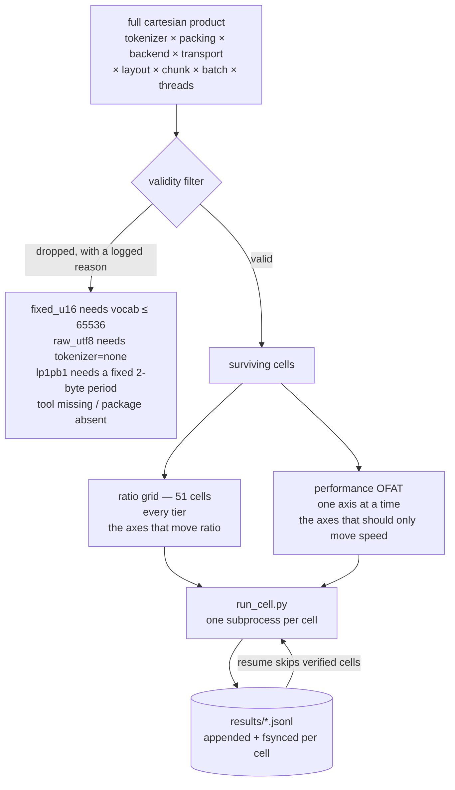

<div align="center">

<pre>
██████   █████  ██████  ███    ███  █████  ██████  
██   ██ ██   ██ ██   ██ ████  ████ ██   ██ ██   ██ 
██████  ███████ ██████  ██ ████ ██ ███████ ██████  
██      ██   ██ ██   ██ ██  ██  ██ ██   ██ ██   ██ 
██      ██   ██ ██   ██ ██      ██ ██   ██ ██   ██ 
</pre>

  <a href="../../LICENSE"></a>
  <a href="../../report/summary.md"></a>
  <a href="../../results/README.md"></a>
  <a href="../../corpus/README.md"></a>
  <a href="https://deepwiki.com/shallowbyte/parmar"></a>
  <a href="https://www.python.org/"></a>

</div>

<p align="center">
  <a href="../../README.md">English</a> ·
  <a href="README.zh-CN.md">简体中文</a> ·
  <a href="README.es.md">Español</a> ·
  <a href="README.pt-BR.md">Português</a> ·
  <a href="README.ru.md">Русский</a> ·
  <a href="README.ja.md">日本語</a> ·
  <b>Deutsch</b> ·
  <a href="README.fr.md">Français</a> ·
  <a href="README.ko.md">한국어</a>
</p>

> Dieses Dokument ist eine Übersetzung und dient nur der Übersichtlichkeit.
> **Die [englische README](../../README.md) ist die normative Version** — bei
> Abweichungen zwischen beiden ist die englische Version maßgeblich. Code,
> Befehle, Dateinamen, Bezeichner und sämtliche Zahlenwerte bleiben unübersetzt
> im Original.

Ein Subword-Tokenisierungs-Vorfilter für byte-basierte Entropie-Codierer, sowie
das Stresstest-Framework, das gebaut wurde, um herauszufinden, ob er
tatsächlich funktioniert.

> **Code-Rundgang:** Eine automatisch generierte architektonische Tour durch
> dieses Repository ist verfügbar unter
> **[deepwiki.com/shallowbyte/parmar](https://deepwiki.com/shallowbyte/parmar)**.
> Diese README ist die normative Quelle für die *Ergebnisse*; DeepWiki ist der
> einfachere Weg, um den *Code* zu navigieren.

**Kurze Antwort: Es funktioniert, aus einem engeren Grund, als die Hypothese
behauptete.** Vor-Tokenisierung von Text bringt bei den besten Einstellungen
von LZMA2 **+7% bis +9.6%** Kompressionsrate gegenüber Rohbytes, der Vorteil
**wächst tatsächlich mit der Korpusgröße** — und er **erreicht ein Plateau**,
sobald der Korpus deutlich über das Wörterbuchfenster des Kompressors
hinausgeht, statt unbegrenzt weiterzuwachsen. Bei `gzip`s 32-KiB-Fenster ist
der Vorteil groß (+15%) und vollkommen flach, was die beiden zuvor vermengten
Effekte trennt: *Darstellungsdichte* und *Fenstererweiterung*. Bei `bzip2` ist
Vor-Tokenisierung ein durchgehender **Verlust** (−3.9%).

**Und es ist kein Tausch von Größe gegen Geschwindigkeit:** Bei 5 der 7
Backends ist parmar zur selben Zeit kleiner *und* **schneller** als Rohbytes,
auf jeder Stufe — dem Kompressor werden ~45% weniger Bytes übergeben, und das
spart mehr Zeit ein, als die Tokenisierung kostet. Zahlen und Methode weiter
unten; jede einzelne davon stammt aus einer Konfiguration, deren
Dekompression tatsächlich ausgeführt wurde und deren sha256 tatsächlich
übereinstimmte.

<picture>
  <source media="(prefers-color-scheme: dark)" srcset="../../report/ratio_gap_vs_corpus_size_dark.png">
  
</picture>

## Was es ist

Standardkompressoren finden Wiederholungen innerhalb eines gleitenden
Wörterbuchfensters fester Größe, gemessen in **Bytes**. Die Prämisse von
parmar: UTF-8-Prosa vor der Kompression durch BPE-Token-IDs ersetzen (dieselbe
Tokenisierung, mit der auch LLMs gefüttert werden). Der Token-Strom ist etwa
45% kleiner als der Text, sodass ein 64-MiB-LZMA2-Wörterbuch, das normalerweise
~64 MB Prosa umfasst, nach dem Vorab-Schrumpfen der Prosa ~120 MB Prosa
umfassen kann.

**Die Behauptung wird erst im großen Maßstab testbar.** Bei einer 5-MB-Datei
passt die gesamte Eingabe bereits vollständig in das Wörterbuch, sodass kein
Fenster zum Erweitern vorhanden ist und Vor-Tokenisierung im Wesentlichen
nichts bringt. Das eigentliche Ergebnis hier ist daher keine einzelne
Kompressionsraten-Zahl — es ist die **Kurve von (parmar-Kompressionsrate −
Roh-Backend-Kompressionsrate) als Funktion der Korpusgröße**, und ob diese
Kurve ansteigt.

Das Archivformat ist durchgehend streamend: Chunks werden vom Eingabe-Handle
gelesen, tokenisiert, gepackt und direkt in einen `xz`/`zstd`-Subprozess
geleitet, dessen stdout die Ausgabedatei ist. Weder das Token-Array noch die
komprimierte Nutzlast liegt jemals vollständig im Speicher. Jede Dekompression
berechnet den Hash der rekonstruierten Bytes neu und prüft ihn gegen einen
sha256 im Archiv-Footer; **keine Kompressionsrate wird als gültiges Datum
gemeldet, sofern diese Prüfung nicht bestanden wurde.**

## Funktionsweise

Nie liegt mehr als ein Batch im Speicher. Chunks strömen vom Eingabe-Handle,
werden tokenisiert, gepackt und gelangen direkt in die stdin des Kompressors —
dessen stdout *ist* die Ausgabedatei, sodass die komprimierte Nutzlast Python
niemals durchläuft.



Dekompression ist derselbe Pfad in umgekehrter Richtung, und sie **läuft
immer**: Jede gemessene Konfiguration wird dekomprimiert und geprüft, bevor
ihre Kompressionsrate gezählt werden darf.



### Das Archiv

| Offset | Feld |
|---|---|
| `0` | `PRMR`-Magic, Version, Packing-Code |
| `6…` | längenpräfixierter Tokenizer-Name, Backend-Name, Transport |
| … | komprimierte Nutzlast |
| `EOF−48` | `orig_len` (u64), `token_count` (u64), `sha256` (32 B) |

Der Footer steht am Ende, weil `orig_len`, `token_count` und der Hash erst
bekannt sind, nachdem die gesamte Eingabe durchgestreamt wurde. Die
Dekompression springt zunächst zu `size−48`.

### Wie ein Sweep aufgebaut wird



Ein wörtliches kartesisches Produkt ergibt **~8,100 gültige Zellen pro
Stufe** — bei gemessenem Durchsatz Wochen pro Stufe. Die obige Aufteilung ist
die dokumentierte Abweichung: Das Ratio-Grid ist das, was die Skalenkurve
erzeugt, und die Kompressionsrate wird weiterhin für jede OFAT-Zelle erfasst,
sodass eine Performance-Achse, die *tatsächlich* die Kompressionsrate
beeinflusst, als Widerspruch sichtbar wird, statt herausgemittelt zu werden.


## Struktur

| Datei | was sie ist |
|---|---|
| `parmar_core.py` | die Pipeline: Packing-Schemata, Backends, Transporte, Tokenisierungs-Layouts, Archivformat, Komprimieren/Dekomprimieren |
| `parmar.py` | Single-Pipeline-CLI (`compress` / `decompress` / `bench` / `selftest`) |
| `resources.py` | portable Erkennung von CPU/RAM/Festplatte/Tools/Bibliotheken |
| `build_corpus.py` | PG-19-Korpus-Builder, gestuft und fortsetzbar |
| `verify_boundaries.py` | differenzieller Chunk-Grenzen-Test — **blockierend** |
| `matrix.py` | Zellengenerierung, Gültigkeitsfilterung, subprozessisolierte Ausführung, Fortsetzen |
| `run_cell.py` | eine Matrixzelle, im eigenen Prozess |
| `analyze.py` | Zusammenfassungstabellen + der Plot Kompressionsrate-vs-Korpusgröße |
| `test_regressions.py` | Regressionen für die im ursprünglichen `parmar.py` gefundenen Fehler |
| `test_axes.py` | jeder Matrixachsen-Wert unabhängig per Round-Trip verifiziert |
| `FINDINGS.md` | **alles, was sich als falsch herausstellte, sobald der Code tatsächlich ausgeführt werden konnte** |

## Einrichtung

```bash
python -m venv venv
./venv/Scripts/python.exe -m pip install tiktoken numpy zstandard psutil matplotlib pandas
```

Externe Tools, die bei Vorhandensein genutzt werden: `xz` (≥5.2 für `-T`),
`zstd`, `gzip`, `bzip2`. Fehlende Tools ändern das Verhalten nicht
stillschweigend — die betroffenen Matrixzellen werden mit ausgegebenem Grund
übersprungen. `resources.py` gibt genau aus, was es gefunden hat:

```bash
python resources.py
```

## Reproduktion

```bash
# 1. Erstellt die Korpus-Stufen (idempotent; erneutes Ausführen verifiziert sha256 und überspringt)
python build_corpus.py --tiers "64MB,256MB,1GB,4GB" --out ./corpus/

# 2. Smoke-Test: eine Konfiguration, kleinste Stufe, schnelles Profil
python matrix.py smoke --corpus ./corpus/pg19_64mb.txt

# 3. Grenzsicherheits-Differenztest. BLOCKIEREND -- ein Fehlschlag hier bedeutet,
#    dass Chunking den Token-Strom stört und jede nachgelagerte Kompressionsrate
#    kontaminiert ist.
python matrix.py verify-boundaries --corpus ./corpus/pg19_64mb.txt \
    --tokenizers "o200k_base,cl100k_base,r50k_base,p50k_base" \
    --chunk-sizes "1MB,2MB,4MB"

# 4. Packing-Eigenschafts-/Fuzz-Test (läuft auch automatisch vor jedem Sweep)
python matrix.py verify-leb128 --cases 50000

# 5. Dev-Loop-Sweep: volle Matrix, kleinste Stufe, nur schnelle Backends
python matrix.py sweep --corpus ./corpus/pg19_64mb.txt --profile fast --resume

# 6. Voller Sweep auf einer Stufe, fortsetzbar, hinter dem Preflight-Schätzungs-Gate
python matrix.py sweep --corpus ./corpus/pg19_1gb.txt --profile full \
    --resume --confirm-estimate

# 7. Analyse (funktioniert mit Teilergebnissen -- keine Stufe muss abgeschlossen sein)
python analyze.py --results ./results/ --out ./report/

# 8. Eine anomale Zelle anhand ihrer Zeilen-ID erneut ausführen
python matrix.py rerun-cell --results ./results/sweep_64mb.jsonl --row-id <id>

# oder das gesamte Programm der Reihe nach ausführen, an jedem Punkt fortsetzbar
bash run_all.sh
```

`matrix.py plan --corpus ... --profile full` gibt die generierten Zellen und
das vollständige Drop-Log aus, ohne etwas auszuführen.

## Matrixform

Die Achsen der Design-Spezifikation ergeben als wörtliches kartesisches
Produkt **~8,100 gültige Zellen pro Korpus-Stufe**, was beim gemessenen
Durchsatz dieser Maschine Wochen pro Stufe bedeutet. Das Produkt wird in zwei
Teile gespalten:

* **Ratio-Grid** — vollständige Kreuzung der Achsen, die die Kompressionsrate
  bestimmen (Tokenizer × Packing × Backend), bei festen
  Baseline-Performance-Einstellungen. **51 Zellen.** Erzeugt die Kurve
  Kompressionsrate-vs-Skala.
* **Performance-OFAT** — jeweils ein Faktor rund um dieselbe Baseline über die
  Achsen, die nur die Geschwindigkeit beeinflussen sollten (Threads, Layout,
  Transport, Chunk-Größe, Batch-Größe), auf repräsentativen Backends.

Die Kompressionsrate wird weiterhin für jede OFAT-Zelle erfasst, sodass eine
Performance-Achse, die *tatsächlich* die Kompressionsrate beeinflusst, als
Widerspruch sichtbar wird, statt herausgemittelt zu werden.

## Ergebnisse

Vollständige Tabellen in `report/summary.md`; Plots in
`report/ratio_vs_corpus_size.png` und `report/ratio_gap_vs_corpus_size.png`.
Korpus: PG-19, vier Stufen (64MB / 256MB / 1GB / 4GB), 10,629 Dokumente.

**452 Matrixzellen, 452 per Round-Trip verifiziert, 0 Fehlschläge — 21.4
Stunden gemessene Zellzeit.** Jede Zahl unten stammt aus einer Konfiguration,
deren Dekompression tatsächlich ausgeführt wurde und deren sha256, Byte-Länge
und Token-Anzahl allesamt übereinstimmten. Zellen, die die Verifikation nicht
bestehen, werden von Vergleichen ausgeschlossen und deutlich sichtbar in einem
eigenen Abschnitt der Zusammenfassung aufgeführt; es gab keine. Chunks, die an
einer Grenze ohne tokenizer-sicheren Trennpunkt geschnitten wurden: **0**,
über alle 452 Zellen hinweg.

### F1. Wächst die parmar/Roh-Backend-Kompressionsraten-Differenz mit der Korpusgröße?

**Ja — aber nur bei Backends, deren Fenster groß genug ist, um sich zu
erweitern, und sie erreicht ein Plateau, sobald der Korpus dieses Fenster um
ein paar Vielfache übersteigt.**

Kompressionsraten-Differenz als Prozentsatz der Rohbyte-Kompressionsrate
desselben Backends, Pipeline fest auf `p50k_base + fixed_u16` gehalten:

| Backend | effektives Fenster | 64MB | 256MB | 1GB | 4GB | Form |
|---|---|---|---|---|---|---|
| `gzip_9` | 32 KiB | +15.38% | +15.24% | +15.34% | +15.30% | **flach** |
| `bz2_9` | 900 KiB Block | −3.87% | −3.90% | −3.83% | −3.85% | **flach, negativ** |
| `zstd_12` | 128 MiB | +6.12% | +6.40% | +6.54% | +6.53% | steigt, erreicht Plateau |
| `zstd_19` | 128 MiB | +5.04% | +5.43% | +5.57% | +5.58% | steigt, erreicht Plateau |
| `lzma_fast` | 32 MiB | +8.16% | +8.87% | +9.22% | +9.21% | steigt, erreicht Plateau |
| `lzma_extreme` | 64 MiB | +7.55% | +8.56% | +8.94% | +9.08% | steigt, erreicht Plateau |
| `lzma_tuned_lp1pb1` | 64 MiB | +8.22% | +9.08% | +9.44% | +9.58% | steigt |
| `zstd_22_long` | 2 GiB | +3.65% | +4.35% | +4.91% | +5.19% | **steigt weiterhin** |

Über alle 44 Backend/Pipeline-Kombinationen hinweg: **32 verbreitern sich, 12
sind flach, 0 verengen sich.** Die 12 flachen sind genau die sechs
`gzip_9`- und sechs `bz2_9`-Kombinationen.

Der Mechanismus zeigt sich in der Form, nicht nur im Vorzeichen:

* Das 32-KiB-Fenster von `gzip_9` ist auf jeder Stufe gesättigt, sodass sein
  (großer, +15%) Gewinn **reine Darstellungsdichte** ist und überhaupt nicht
  wächst. Das ist die Kontrollgröße, die die beiden Effekte trennt — und sie
  zeigt, dass der größte Teil von parmars Vorteil im kleinen Maßstab nie
  etwas mit Fenstern zu tun hatte.
* Die LZMA-Backends steigen von 64MB bis 1GB an und flachen dann ab: Sobald
  der Korpus etwa das 16-fache des Wörterbuchs erreicht, sind sowohl der
  tokenisierte als auch der rohe Strom gleichermaßen „aus dem Fenster
  gelaufen", und der Vorteil hört auf zu wachsen.
* `zstd_22_long`, mit einem 2-GiB-Fenster, ist das einzige Backend, das **bei
  4GB noch weiter steigt** — weil 4GB nur das 2-fache seines Fensters ist,
  d. h. es befindet sich noch in dem Regime, das die anderen bereits
  verlassen haben.

**Der Plateaupunkt folgt der Fenstergröße des jeweiligen Backends.** Das ist
die Fenstererweiterungs-Hypothese, die sich selbst bestätigt, und es ist eine
echte Verfeinerung: Die ursprüngliche Behauptung implizierte unbegrenztes
Wachstum mit der Korpusgröße, und dieser Teil trifft **nicht** zu.

Beste absolute Kompressionsraten (parmar gegenüber dem besten Roh-Backend auf
derselben Stufe):

| Stufe | bestes parmar | bestes Roh | Vorteil |
|---|---|---|---|
| 64MB | **3.9304** (`p50k+fixed_u16` / `lzma_tuned_lp1pb1`) | 3.6318 (`lzma_extreme`) | +8.22% |
| 256MB | **4.0488** | 3.7198 (`zstd_22_long`) | +8.84% |
| 1GB | **4.0855** | 3.7817 (`zstd_22_long`) | +8.03% |
| 4GB | **4.0785** | 3.8027 (`zstd_22_long`) | +7.25% |

Absolute Kompressionsraten verlaufen über die Stufen hinweg nicht perfekt
monoton, weil jede Stufe eine andere Dokumentmenge ist; die oben gezeigte
Differenz pro Backend ist der kontrollierte Vergleich.


<picture>
  <source media="(prefers-color-scheme: dark)" srcset="../../report/ratio_vs_corpus_size_dark.png">
  
</picture>

### F2. Schlägt `fixed_u16` + `lp=1,pb=1` `LEB128` + `lc=3,lp=0,pb=0`?

**Ja, eindeutig — aber größtenteils aus einem anderen Grund, als die Theorie
angab.**

Bei 64MB, für die Tokenizer, bei denen beide Packing-Varianten gültig sind:

| Tokenizer | LEB128 + lc3/lp0/pb0 | fixed_u16 + lc3/lp0/pb0 | fixed_u16 + lc1/lp1/pb1 | getunt vs. LEB128 |
|---|---|---|---|---|
| `r50k_base` | 3.6856 | 3.8975 | 3.9214 | **+6.40%** |
| `p50k_base` | 3.6915 | 3.9060 | 3.9304 | **+6.47%** |

Zerlegt man diese +6.4%: Der Wechsel von LEB128 zu `fixed_u16` bei
*unveränderten* lc/lp/pb ist **+5.7%** wert, und das `lp=1,pb=1`-
Ausrichtungs-Tuning obendrauf ist weitere **+0.61%** wert. Die
Ausrichtungstheorie liegt also in der Richtung richtig und zahlt sich
tatsächlich aus — aber ~90% des Gewinns stammen aus der festen Breite selbst,
nicht aus dem Literal-Positions-Tuning, das aus ersten Prinzipien hergeleitet
wurde. `lzma_tuned_lp1pb1` ist dennoch auf jeder getesteten Stufe die
Konfiguration mit der besten Kompressionsrate.


<picture>
  <source media="(prefers-color-scheme: dark)" srcset="../../report/packing_decomposition_dark.png">
  
</picture>

### F3. Schlägt `manual_pool` jemals `library_batch`?

**Nein. Dies ist ein sauberes negatives Ergebnis — die Hypothese hat sich
nicht bestätigt.**

Über beide Stufen hinweg, auf denen der Vergleich verfügbar ist, schlug
`manual_pool` `library_batch` in **genau 8 von 16** vergleichbaren
Konfigurationen. Das ist Zufall. Einzelne Deltas schwanken zwischen −6.8% und
+44%, in beide Richtungen, ohne konsistentes Muster nach Thread-Anzahl,
Chunk-Größe, Backend oder Korpusgröße.

Die Ausschläge sind prozentual groß, weil die gemessene Größe klein und
verrauscht ist: Die Tokenisierung macht ~0.7–3.4 s einer Zelle aus, die 20 s
bis 60 min dauert, und zwei nominell identische `library_batch`-Läufe
*derselben Arbeit* unterscheiden sich um bis zu 0.71 s gegenüber 1.24 s. Der
gemessene Effekt liegt in derselben Größenordnung wie das Messrauschen, was
selbst das Ergebnis ist.

**Fazit: Der handgeschriebene Worker-Pool ist seine Komplexität nicht wert.**
tiktokens `encode_ordinary_batch` gibt bereits das GIL frei und parallelisiert
intern in Rust; darüber gibt es keinen Spielraum, den eine Python-seitige
Koordination noch ausschöpfen könnte. `process_pool` zahlt zusätzlich die
Windows-Spawn-Kosten (~1–2 s und ~100 MB pro Worker) — ohne Gegenwert. Die
Design-Spezifikation lag richtig damit, dies als offene empirische Frage
statt als feststehende Designentscheidung zu kennzeichnen — und die Antwort
lautet, dass die einfache Option gewinnt.

### F4. Wie sieht die tatsächliche Beschleunigungskurve von `xz -T` aus, und wo greift die Untergrenze?

**Die 2-fache-Wörterbuch-Untergrenze aus der Design-Spezifikation ist real,
und die Beschleunigung oberhalb davon wird von der Blockanzahl bestimmt — die
Vor-Tokenisierung reduziert.**

Die entscheidende Größe ist die Größe des Stroms, *der xz zugeführt wird*
(der gepackte Token-Strom), nicht der Korpus und nicht die komprimierte
Ausgabe. Blöcke = `fed / (2 x dict)`:

| Stufe | Pipeline | Backend | an xz übergeben | Blöcke | T4 | T20 | Kompressionsraten-Kosten |
|---|---|---|---|---|---|---|---|
| 64MB | raw | `lzma_extreme` | 64 MB | **1** | 1.01× | 1.01× | **0.00%** |
| 64MB | `r50k+fixed_u16` | `lzma_extreme` | 36 MB | **1** | 1.12× | 1.13× | **0.00%** |
| 64MB | `o200k+leb128` | `lzma_fast` | <64 MB | **1** | 1.17× | 1.22× | **0.00%** |
| 1GB | `r50k+fixed_u16` | `lzma_extreme` | 579 MB | **5** | 3.61× | **4.97×** | −1.30% |
| 1GB | raw | `lzma_extreme` | 1025 MB | **8** | 3.78× | **7.49×** | −1.16% |
| 1GB | `r50k+fixed_u16` | `lzma_fast` | 579 MB | **9** | 3.26× | **7.94×** | −1.38% |
| 1GB | raw | `lzma_fast` | 1025 MB | **16** | 4.10× | **11.76×** | −1.35% |

Bei 4GB wachsen die Blockanzahlen über die Kernanzahl hinaus, und die
Randbedingung ändert sich:

| Stufe | Pipeline | Backend | an xz übergeben | Blöcke | T4 | T20 | Kompressionsraten-Kosten |
|---|---|---|---|---|---|---|---|
| 4GB | `r50k+fixed_u16` | `lzma_extreme` | 2315 MB | 18 | 3.96× | 9.43× | −1.29% |
| 4GB | raw | `lzma_extreme` | 4096 MB | 32 | 3.85× | 10.82× | −1.27% |
| 4GB | `r50k+fixed_u16` | `lzma_fast` | 2315 MB | 36 | 4.31× | 11.28× | −1.35% |
| 4GB | raw | `lzma_fast` | 4096 MB | 64 | 3.81× | 11.48× | −1.36% |

**Es gibt drei Regime, und `-T` verhält sich in jedem davon vollkommen
unterschiedlich:**

**1. Unterhalb der Untergrenze (`fed < 2 x dict`) — ein Block.** `-T` bringt
nichts (0.99–1.22×) und kostet nichts. Die Kompressionsrate ist bitidentisch
über T1/T4/T20 hinweg, was *bestätigt*, dass keine Aufteilung stattgefunden
hat, statt es nur zu vermuten. Das ist das Regime, in dem sich die 64MB-Stufe
befindet, und es erklärt, warum die ursprünglichen 5-MB-Experimente keinen
Multithreading-Vorteil zeigten.

**2. Blöcke < Kerne — die Beschleunigung folgt der Blockanzahl fast 1:1.** Bei
1GB: 5 Blöcke → 4.97×, 8 → 7.49×, 9 → 7.94×, 16 → 11.76×. Threads über die
Blockanzahl hinaus bewirken nichts.

**3. Blöcke > Kerne — die Beschleunigung sättigt an der Hardware.** Bei 4GB
landen 18 bis 64 Blöcke alle bei 9.4–11.5× auf 20 Kernen (~50% parallele
Effizienz). Mehr Blöcke helfen nicht mehr.

Die sinnvolle Thread-Anzahl ist daher etwa
**`min(fed_bytes / (2 x dict_size), cores)`**.

**Vor-Tokenisierung hat versteckte Parallelisierungskosten, die zuvor nicht
benannt wurden.** Weil parmar die Eingabe des Kompressors um ~45% verkleinert,
verkleinert es bei fester Blockgröße auch die Blockanzahl. Auf demselben
1GB-Korpus und -Backend erhalten Rohbytes 8 Blöcke und 7.49×, während
`fixed_u16` 5 Blöcke und 4.97× erhält — parmar gibt **~34% der verfügbaren
Multithreading-Beschleunigung** für seinen Kompressionsraten-Gewinn auf. Bei
4GB verschwindet das, weil beide ohnehin über der Kernanzahl-Obergrenze
liegen. Es ist nur in Regime 2 ein echter Kompromiss.

Die MT-Kompressionsraten-Kosten liegen **bei jedem Maßstab bei ~1.3% für
LZMA** und, bemerkenswerterweise, **bei jeder getesteten Stufe und jedem
Level bei exakt 0.00% für zstd** — zstds Multithreading setzt das Fenster
zwischen Jobs nicht zurück, wie es xz's unabhängige Blöcke tun. Wenn Sie
Multithreading ohne Kompressionsraten-Einbuße benötigen, ist das hier ein
konkreter Grund, zstd gegenüber xz zu bevorzugen.

<picture>
  <source media="(prefers-color-scheme: dark)" srcset="../../report/thread_scaling_dark.png">
  
</picture>

### Welche Konfiguration sollten Sie tatsächlich verwenden?

<picture>
  <source media="(prefers-color-scheme: dark)" srcset="../../report/ratio_vs_throughput_pareto_dark.png">
  
</picture>

Die Front reicht von **3.18x bei 79 MB/s** (raw + `zstd_12`) bis **4.09x bei
7.9 MB/s** (`p50k_base+fixed_u16` + `lzma_tuned_lp1pb1`) — ein 29%iger
Größenunterschied für einen 10-fachen Geschwindigkeitsunterschied.
`p50k_base+fixed_u16` erscheint an nahezu jedem Punkt darauf, was die
praktische Erkenntnis ist: Die Wahl des Packings ist nahezu kostenlos, und
beim Backend liegt der eigentliche Kompromiss.

### Das in der Praxis wichtigste Ergebnis

Vor-Tokenisierung ist kein Tausch von Größe gegen Geschwindigkeit. Bei **5 der
7 Backends ist parmar auf jeder Stufe gleichzeitig kleiner *und* schneller als
Rohbytes** — weil dem Kompressor ~45% weniger Bytes übergeben werden, und die
dabei eingesparte Kompressionszeit den Zeitaufwand für die Tokenisierung
übersteigt.

| Backend | Roh | bestes parmar | Urteil |
|---|---|---|---|
| `lzma_extreme` @4GB | 3.7221x @ 11.6 MB/s | **4.0454x @ 16.9 MB/s** | kleiner **und** 1.5x schneller |
| `lzma_fast` @64MB | 3.6114x @ 0.45 MB/s | **3.9061x @ 2.93 MB/s** | kleiner **und** 6.5x schneller |
| `gzip_9` @1GB | 2.6928x @ 18.5 MB/s | **2.9413x @ 23.4 MB/s** | kleiner **und** schneller |
| `zstd_19` @4GB | 3.5714x @ 14.4 MB/s | **3.6765x @ 23.3 MB/s** | kleiner **und** 1.6x schneller |
| `zstd_22_long` @1GB | 3.7817x @ 1.6 MB/s | **3.9513x @ 2.3 MB/s** | kleiner **und** schneller |
| `zstd_12` @1GB | 3.1825x @ 79.0 MB/s | 3.3905x @ 39.0 MB/s | kleiner, aber **2x langsamer** |
| `bz2_9` @1GB | **3.5659x** @ 19.8 MB/s | 3.4571x @ 17.2 MB/s | **Rohbytes gewinnen eindeutig** |

Die beiden Ausnahmen sind aufschlussreich. `zstd_12` ist schnell genug, dass
die Tokenisierung zum Flaschenhals wird, sodass parmar oberhalb von 256MB
Größe zu einem echten Geschwindigkeitspreis erkauft. `bz2_9` verliert bei
beidem — bzip2s Burrows-Wheeler-Transformation nutzt Byte-Ebenen-Textstruktur
aus, die die Tokenisierung zerstört.

## Anwendungsfälle

Verankert in den obigen Messungen, nicht in Spekulation:

- **Archivierung großer Prosakorpora.** Der stärkste Fall: Mit `lzma` oder
  hochstufigem `zstd` erhalten Sie sowohl ein kleineres Archiv als auch einen
  kürzeren Kompressionslauf.
- **Alles, was an gzip/deflate gebunden ist.** `gzip_9` gewinnt **+15%** und,
  ungewöhnlicherweise, gewinnt es bei *jeder* Korpusgröße — weil gzips
  32-KiB-Fenster immer gesättigt ist, sodass der Vorteil reine
  Darstellungsdichte ohne Skalenschwelle ist. Wenn Sie den Kompressor nicht
  ändern können, aber ändern können, was Sie ihm zuführen, ist dies der
  klarste Gewinn hier, und er funktioniert auch bei kleinen Eingaben.
- **Speicherung von Text, der ohnehin tokenisiert werden wird** —
  LLM-Trainings-Shards, Eval-Sets, Retrieval-Korpora. Die Token *sind* die
  Nutzlast, sodass ein Reader die erneute Tokenisierung auf dem Rückweg
  vollständig überspringt. Das ist ein Systemgewinn zusätzlich zur
  Kompressionsrate.
- **Kaltspeicher mit niedriger Lesehäufigkeit.** Dekompression trägt
  Detokenisierungskosten, die die Kompression nicht hat, sodass die
  Asymmetrie Write-once/Read-rarely begünstigt.

## Umfang und Nicht-Ziele

- **Kein Allzweck-Archivierer.** Ein Archiv ist nicht in sich abgeschlossen:
  Es speichert den *Namen* des Tokenizers, nicht sein Vokabular, sodass die
  Dekompression exakt dieselbe verfügbare `tiktoken`-Kodierung benötigt.
  Behandeln Sie Archive als an ihre Tokenizer-Version gekoppelt.
- **Kein sicheres Format.** Keine Verschlüsselung und keine
  Authentifizierung. Der sha256 im Footer ist eine Integritätsprüfung gegen
  Beschädigung, im Klartext neben den Daten gespeichert, die er beschreibt —
  er ist kein MAC. Siehe [`SECURITY.md`](../../SECURITY.md).
- **Nicht für Nicht-Prosa validiert.** Jede Zahl hier stammt aus englischer
  Prosa (PG-19). Code, JSON, Logs und Markup sind ungetestet und könnten sich
  in beide Richtungen anders verhalten.
- **Kein Geschwindigkeitsvorteil am schnellen Ende.** Wenn Sie für Durchsatz
  bereits `zstd -12` oder darunter verwenden, kostet Vor-Tokenisierung Sie
  oberhalb von 256MB Geschwindigkeit.
- **Nicht für bzip2.** Gemessen als durchgehender Verlust; verwenden Sie
  beide nicht zusammen.

## Einschränkungen

Ehrliche Liste, alle gemessen oder dokumentiert statt nur vermutet:

- **Die Chunk-Grenzregel benötigt ein ASCII-alphanumerisches Zeichen gefolgt
  von Whitespace.** Ununterbrochene Ziffernfolgen, reine
  Interpunktions-Blöcke und Schriftsysteme ohne Leerzeichen wie CJK haben
  keinen sicheren Schnittpunkt. Der Chunker greift dann auf einen lediglich
  UTF-8-sicheren Schnitt zurück und **zählt dies** in
  `unsafe_boundary_cuts`, das in jede Ergebniszeile übernommen wird. Bei
  PG-19 ist diese Anzahl auf jeder Stufe und bei jeder Chunk-Größe null — bei
  einem chinesischen oder japanischen Korpus wäre sie es nicht.
- **`fixed_u16` — das leistungsstärkste Packing — funktioniert nur für
  Vokabulare ≤ 65,536**, d. h. für `r50k_base` und `p50k_base`. Die modernen
  Tokenizer mit großem Vokabular können es nicht nutzen und sind auf LEB128
  angewiesen, woher der größte Teil des Kompressionsraten-Gewinns stammte.
- **Vor-Tokenisierung reduziert multithreaded Parallelität.** Weniger an `xz`
  übergebene Bytes bedeuten weniger Blöcke; bei 1GB kostet das ~34% der
  verfügbaren `-T`-Beschleunigung.
- **Alle Zeitmessungen stammen von einer einzigen Maschine** (20 Kerne,
  Windows). Kompressionsraten sind plattformunabhängig; Durchsatz- und
  Thread-Skalierungswerte sind es nicht.
- **Die Plateaugrenze ist nur bis 4GB abgesichert.** `zstd_22_long` stieg auf
  der obersten Stufe noch weiter an, sodass seine Obergrenze ungemessen
  bleibt.

## Zukünftige Arbeit

Geordnet danach, wie viel jede davon tatsächlich lehren würde:

1. **Wörterbuchgröße statt Korpusgröße sweepen.** Das Plateau folgt dem
   *Fenster*, nicht dem Korpus, sodass eine Variation von `dict_size` bei
   festem 1GB-Korpus den Mechanismus weit günstiger isolieren würde als die
   Korpus-Leiter — und den Plateaupunkt für jedes Backend vorhersagen würde,
   statt ihn pro Backend zu beobachten.
2. **Token-IDs vor dem Packing nach Häufigkeit umnummerieren.** LEB128
   verbraucht 3 Bytes für jede ID über 16,383, und `o200k_base` platziert den
   Großteil seines Vokabulars dort. Eine Neunummerierung der IDs nach
   Korpushäufigkeit würde häufige Token in den 1–2-Byte-Bereich verschieben.
   Das ist die vielversprechendste ungetestete Idee, um die Lücke zwischen
   LEB128 und `fixed_u16` bei Tokenizern mit großem Vokabular zu schließen.
3. **Nicht-Prosa-Korpora**, zuerst Quellcode — er ist auf Token-Ebene stark
   repetitiv, und sein Vor-Tokenisierungs-Verhalten unterscheidet sich stark
   von Prosa.
4. **Eine Schnittregel für Schriftsysteme ohne Leerzeichen**, die die
   Technik überhaupt erst auf CJK-Text anwendbar machen würde.
5. **Eine 8GB+-Stufe**, einzig um herauszufinden, wo das 2-GiB-Fenster von
   `zstd_22_long` ein Plateau erreicht.
6. **SentencePiece-/Gemma-Tokenizer**, in dieser Runde bewusst
   ausgeschlossen, weil sie einen zugangsbeschränkten Modell-Download
   erfordern und die Run-anywhere-Eigenschaft brechen würden.


## Korpus

`deepmind/pg19` (Apache 2.0) — Rae et al. 2019, *Compressive Transformers for
Long-Range Sequence Modelling*, arXiv:1911.05507.

Beachten Sie, dass `datasets.load_dataset("deepmind/pg19", streaming=True)`
**nicht funktionieren kann**: Das Hub-Repository enthält nur ein Lade-Skript
und Dateilisten, hat kein parquet, und auch sein `refs/convert/parquet`-Branch
hat keine Daten — während Lade-Skripte in `datasets` 3.0 entfernt wurden.
`build_corpus.py` holt die Bücher direkt aus dem öffentlichen GCS-Bucket, auf
den das Skript verweist. Siehe `FINDINGS.md` §1.

<sub>Übersetzt aus <code>README.md</code> beim Commit <code>4af1fd0</code>. Wo dieses
Dokument und die englische README voneinander abweichen, ist die englische maßgeblich.</sub>
