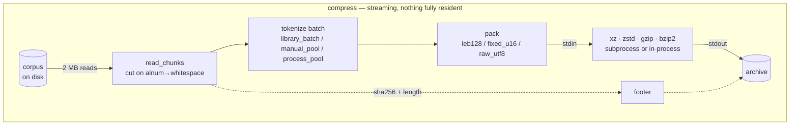
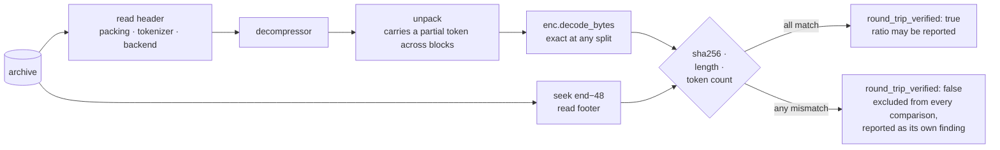
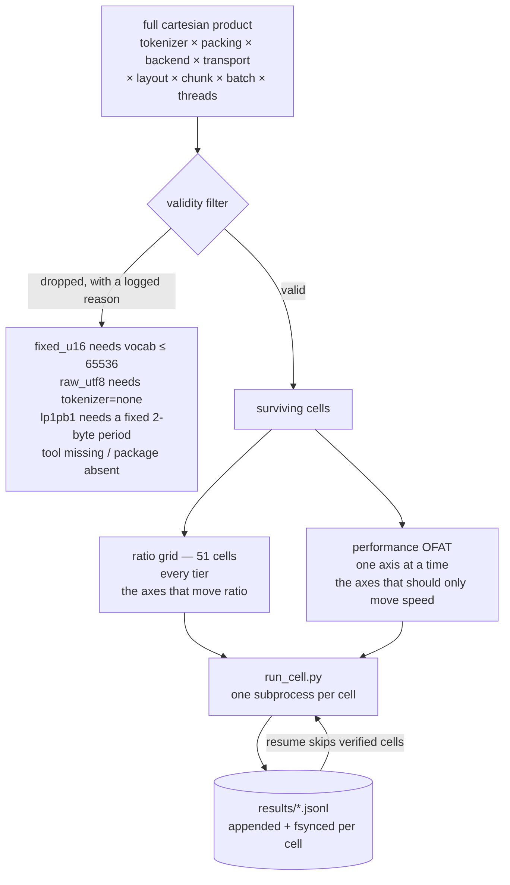

<div align="center">

<pre>
██████   █████  ██████  ███    ███  █████  ██████  
██   ██ ██   ██ ██   ██ ████  ████ ██   ██ ██   ██ 
██████  ███████ ██████  ██ ████ ██ ███████ ██████  
██      ██   ██ ██   ██ ██  ██  ██ ██   ██ ██   ██ 
██      ██   ██ ██   ██ ██      ██ ██   ██ ██   ██ 
</pre>

  <a href="../../LICENSE"></a>
  <a href="../../report/summary.md"></a>
  <a href="../../results/README.md"></a>
  <a href="../../corpus/README.md"></a>
  <a href="https://deepwiki.com/shallowbyte/parmar"></a>
  <a href="https://www.python.org/"></a>

</div>

<p align="center">
  <a href="../../README.md">English</a> ·
  <a href="README.zh-CN.md">简体中文</a> ·
  <b>Español</b> ·
  <a href="README.pt-BR.md">Português</a> ·
  <a href="README.ru.md">Русский</a> ·
  <a href="README.ja.md">日本語</a> ·
  <a href="README.de.md">Deutsch</a> ·
  <a href="README.fr.md">Français</a> ·
  <a href="README.ko.md">한국어</a>
</p>

> Este documento es una traducción proporcionada por comodidad. **El [README en inglés](../../README.md) es la versión normativa** — en caso de discrepancia entre ambos, prevalece la versión en inglés. El código, los comandos, los nombres de archivo, los identificadores y todos los números se mantienen sin traducir.

Un prefiltro de tokenización en subpalabras (subword) para codificadores de entropía a nivel de byte, junto con el arnés de pruebas de esfuerzo construido para averiguar si realmente funciona.

> **Recorrido por el código:** un recorrido arquitectónico generado automáticamente de este repositorio
> está disponible en **[deepwiki.com/shallowbyte/parmar](https://deepwiki.com/shallowbyte/parmar)**.
> Este README es la fuente normativa de los *resultados*; DeepWiki es la forma más sencilla
> de recorrer el *código*.

**Respuesta corta: funciona, por una razón más limitada que la que planteaba la hipótesis.**
Pretokenizar el texto aporta entre **+7% y +9.6%** de tasa de compresión frente a los bytes en bruto con la mejor configuración de LZMA2; la ventaja **sí se amplía con el tamaño del corpus** — y **alcanza una meseta**
una vez que el corpus supera ampliamente la ventana de diccionario del compresor, en lugar de crecer
sin límite. En la ventana de 32 KiB de `gzip` la ventaja es grande (+15%) y completamente plana, lo que
separa dos efectos que antes se confundían entre sí: *densidad de representación* y *expansión de
ventana*. En `bzip2` la pretokenización es una **pérdida** constante
(−3.9%).

**Y no es un intercambio de tamaño por velocidad:** en 5 de los 7 backends parmar es más pequeño
*y* **más rápido** que los bytes en bruto al mismo tiempo, en todos los niveles — al compresor se le
entrega ~45% menos bytes, y eso ahorra más tiempo del que cuesta tokenizar. Las cifras y el método van
más abajo; cada una de ellas proviene de una configuración cuya descompresión realmente se ejecutó y
cuyo sha256 realmente coincidió.

<picture>
  <source media="(prefers-color-scheme: dark)" srcset="../../report/ratio_gap_vs_corpus_size_dark.png">
  
</picture>

## Qué es

Los compresores estándar buscan repeticiones dentro de una ventana de diccionario deslizante de tamaño
fijo, medida en **bytes**. La premisa de parmar: sustituir la prosa UTF-8 por identificadores de token
BPE (la misma tokenización usada para alimentar a los LLM) antes de comprimir. El flujo de tokens es
aproximadamente 45% más pequeño que el texto, de modo que un diccionario LZMA2 de 64 MiB, que
normalmente abarca ~64 MB de prosa, puede abarcar ~120 MB de prosa una vez que la prosa se ha reducido
de antemano.

**La afirmación solo se vuelve verificable a gran escala.** En un archivo de 5 MB, toda la entrada ya
cabe dentro del diccionario, de modo que no hay ventana que expandir y la pretokenización no aporta
prácticamente nada. Por eso, lo que se entrega aquí no es un único número de tasa — es la **curva de
(tasa de parmar − tasa del backend en bruto) en función del tamaño del corpus**, y si esa curva sube.

El formato de archivo es de transmisión (streaming) de principio a fin: los fragmentos se leen del
identificador de entrada, se tokenizan, se empaquetan, y se canalizan directamente a un subproceso
`xz`/`zstd` cuya salida estándar es el archivo de salida. Ni el arreglo de tokens ni la carga útil
comprimida residen jamás por completo en memoria. Cada descompresión vuelve a calcular el hash de los
bytes reconstruidos y lo compara con un sha256 en el pie del archivo; **ninguna tasa se reporta como
dato válido a menos que esa verificación haya pasado.**

## Cómo funciona

Nada más grande que un lote reside en memoria en ningún momento. Los fragmentos fluyen desde el
identificador de entrada, se tokenizan, se empaquetan, y van directamente a la entrada estándar del
compresor — cuya salida estándar *es* el archivo de salida, de modo que la carga útil comprimida nunca
pasa por Python.



La descompresión es la misma ruta en sentido inverso, y **siempre se ejecuta**: cada configuración
medida se descomprime y se verifica antes de que se permita que su tasa cuente.



### El archivo

| desplazamiento | campo |
|---|---|
| `0` | número mágico `PRMR`, versión, código de empaquetado |
| `6…` | nombre del tokenizador con prefijo de longitud, nombre del backend, transporte |
| … | carga útil comprimida |
| `EOF−48` | `orig_len` (u64), `token_count` (u64), `sha256` (32 B) |

El pie está al final porque `orig_len`, `token_count` y el hash no se conocen hasta que toda la entrada
ha pasado por el flujo. La descompresión busca primero la posición `size−48`.

### Cómo se construye un barrido



Un producto cartesiano literal da **~8,100 celdas válidas por nivel** — semanas por nivel al rendimiento
medido. La división anterior es la desviación documentada: la cuadrícula de tasa es lo que produce la
curva de escala, y la tasa se sigue registrando para cada celda OFAT, de modo que un eje de rendimiento
que *sí* mueve la tasa aparece como una contradicción en lugar de diluirse en el promedio.


## Estructura del repositorio

| archivo | qué es |
|---|---|
| `parmar_core.py` | la canalización: esquemas de empaquetado, backends, transportes, disposiciones de tokenización, formato de archivo, compresión/descompresión |
| `parmar.py` | CLI de canalización única (`compress` / `decompress` / `bench` / `selftest`) |
| `resources.py` | detección portátil de CPU/RAM/disco/herramientas/bibliotecas |
| `build_corpus.py` | constructor del corpus PG-19, por niveles y reanudable |
| `verify_boundaries.py` | prueba diferencial de límites de fragmento — **bloqueante** |
| `matrix.py` | generación de celdas, filtrado de validez, ejecución aislada por subproceso, reanudación |
| `run_cell.py` | una celda de la matriz, en su propio proceso |
| `analyze.py` | tablas resumen + la gráfica de tasa frente a tamaño de corpus |
| `test_regressions.py` | regresiones para los defectos encontrados en el `parmar.py` original |
| `test_axes.py` | cada valor de cada eje de la matriz verificado de forma independiente en ida y vuelta |
| `FINDINGS.md` | **todo lo que resultó ser incorrecto una vez que el código pudo ejecutarse** |

## Configuración

```bash
python -m venv venv
./venv/Scripts/python.exe -m pip install tiktoken numpy zstandard psutil matplotlib pandas
```

Herramientas externas usadas cuando están presentes: `xz` (≥5.2 para `-T`), `zstd`, `gzip`, `bzip2`.
La ausencia de herramientas no cambia el comportamiento en silencio — las celdas de matriz afectadas se
omiten con un motivo impreso. `resources.py` imprime exactamente lo que encontró:

```bash
python resources.py
```

## Reproducción

```bash
# 1. Construye los niveles del corpus (idempotente; volver a ejecutar verifica el sha256 y omite)
python build_corpus.py --tiers "64MB,256MB,1GB,4GB" --out ./corpus/

# 2. Prueba de humo: una configuración, el nivel más pequeño, perfil rápido
python matrix.py smoke --corpus ./corpus/pg19_64mb.txt

# 3. Prueba diferencial de seguridad de límites. BLOQUEANTE -- un fallo aquí significa que el
#    fragmentado perturba el flujo de tokens y que toda tasa posterior queda contaminada.
python matrix.py verify-boundaries --corpus ./corpus/pg19_64mb.txt \
    --tokenizers "o200k_base,cl100k_base,r50k_base,p50k_base" \
    --chunk-sizes "1MB,2MB,4MB"

# 4. Prueba de propiedades/fuzzing del empaquetado (también se ejecuta automáticamente antes de cada barrido)
python matrix.py verify-leb128 --cases 50000

# 5. Barrido de ciclo de desarrollo: matriz completa, nivel más pequeño, solo backends rápidos
python matrix.py sweep --corpus ./corpus/pg19_64mb.txt --profile fast --resume

# 6. Barrido completo en un nivel, reanudable, tras la puerta de estimación previa
python matrix.py sweep --corpus ./corpus/pg19_1gb.txt --profile full \
    --resume --confirm-estimate

# 7. Análisis (funciona con resultados parciales -- ningún nivel necesita estar terminado)
python analyze.py --results ./results/ --out ./report/

# 8. Vuelve a ejecutar una celda anómala por su id de fila
python matrix.py rerun-cell --results ./results/sweep_64mb.jsonl --row-id <id>

# o ejecuta todo el programa en secuencia, reanudable en cualquier punto
bash run_all.sh
```

`matrix.py plan --corpus ... --profile full` imprime las celdas generadas y el registro completo de
descartes sin ejecutar nada.

## Forma de la matriz

los ejes de la especificación de diseño, como producto cartesiano literal, dan **~8,100 celdas válidas
por nivel de corpus**, lo que al rendimiento medido en esta máquina equivale a semanas por nivel. El
producto se divide en dos:

* **cuadrícula de tasa** — cruce completo de los ejes que determinan la tasa (tokenizador × empaquetado
  × backend), con la configuración de rendimiento base fija. **51 celdas.** Produce la curva de tasa
  frente a escala.
* **OFAT de rendimiento** — un factor a la vez alrededor de la misma base, sobre los ejes que deberían
  afectar solo a la velocidad (hilos, disposición, transporte, tamaño de fragmento, tamaño de lote), en
  backends representativos.

La tasa se sigue registrando para cada celda OFAT, de modo que un eje de rendimiento que *sí* mueve la
tasa aparece como una contradicción en lugar de diluirse en el promedio.

## Resultados

Tablas completas en `report/summary.md`; gráficas en `report/ratio_vs_corpus_size.png` y
`report/ratio_gap_vs_corpus_size.png`. Corpus: PG-19, cuatro niveles (64MB / 256MB / 1GB / 4GB), 10,629
documentos.

**452 celdas de la matriz, 452 verificadas por ida y vuelta, 0 fallos — 21.4 horas de tiempo de celda
medido.** Cada cifra a continuación proviene de una configuración cuya descompresión realmente se
ejecutó y cuyo sha256, longitud en bytes y recuento de tokens coincidieron todos. Las celdas que no
superan la verificación se excluyen de todas las comparaciones y se listan de forma explícita en su
propia sección del resumen; no hubo ninguna. Fragmentos cortados en un límite sin un punto de corte
seguro para el tokenizador: **0**, en las 452 celdas.

### P1. ¿La diferencia de tasa entre parmar y el backend en bruto crece con el tamaño del corpus?

**Sí — pero solo para los backends que tienen una ventana lo bastante grande como para expandirse, y
alcanza una meseta una vez que el corpus supera esa ventana en unas pocas veces.**

Diferencia de tasa como porcentaje de la tasa en bruto del mismo backend, con la canalización fija en
`p50k_base + fixed_u16`:

| backend | ventana efectiva | 64MB | 256MB | 1GB | 4GB | forma |
|---|---|---|---|---|---|---|
| `gzip_9` | 32 KiB | +15.38% | +15.24% | +15.34% | +15.30% | **plana** |
| `bz2_9` | bloque de 900 KiB | −3.87% | −3.90% | −3.83% | −3.85% | **plana, negativa** |
| `zstd_12` | 128 MiB | +6.12% | +6.40% | +6.54% | +6.53% | sube, alcanza meseta |
| `zstd_19` | 128 MiB | +5.04% | +5.43% | +5.57% | +5.58% | sube, alcanza meseta |
| `lzma_fast` | 32 MiB | +8.16% | +8.87% | +9.22% | +9.21% | sube, alcanza meseta |
| `lzma_extreme` | 64 MiB | +7.55% | +8.56% | +8.94% | +9.08% | sube, alcanza meseta |
| `lzma_tuned_lp1pb1` | 64 MiB | +8.22% | +9.08% | +9.44% | +9.58% | sube |
| `zstd_22_long` | 2 GiB | +3.65% | +4.35% | +4.91% | +5.19% | **sigue subiendo** |

En las 44 combinaciones backend/canalización: **32 se amplían, 12 son planas, 0 se reducen.** Las 12
planas son exactamente las seis combinaciones de `gzip_9` y las seis de `bz2_9`.

El mecanismo es visible en la forma, no solo en el signo:

* La ventana de 32 KiB de `gzip_9` está saturada en todos los niveles, de modo que su ganancia (grande,
  +15%) es **densidad de representación pura** y no crece en absoluto. Este es el control que separa
  los dos efectos — y muestra que buena parte del beneficio de parmar a pequeña escala nunca tuvo que
  ver con las ventanas.
* Los backends LZMA suben desde 64MB hasta 1GB y luego se aplanan: una vez que el corpus es ~16 veces
  el diccionario, tanto el flujo tokenizado como el flujo en bruto están igualmente "fuera de ventana" y
  la ventaja deja de crecer.
* `zstd_22_long`, con una ventana de 2 GiB, es el único backend que **sigue subiendo en 4GB** — porque
  4GB es solo 2 veces su ventana, es decir, todavía está en el régimen que los demás ya han dejado
  atrás.

**El punto de meseta sigue el tamaño de ventana de cada backend.** Eso es la hipótesis de expansión de
ventana confirmándose a sí misma, y es un refinamiento genuino: la afirmación original implicaba un
crecimiento sin límite con el tamaño del corpus, y esa parte **no** es lo que ocurre.

Mejores tasas absolutas (parmar frente al mejor backend en bruto en el mismo nivel):

| nivel | mejor parmar | mejor en bruto | ventaja |
|---|---|---|---|
| 64MB | **3.9304** (`p50k+fixed_u16` / `lzma_tuned_lp1pb1`) | 3.6318 (`lzma_extreme`) | +8.22% |
| 256MB | **4.0488** | 3.7198 (`zstd_22_long`) | +8.84% |
| 1GB | **4.0855** | 3.7817 (`zstd_22_long`) | +8.03% |
| 4GB | **4.0785** | 3.8027 (`zstd_22_long`) | +7.25% |

Las tasas absolutas no son perfectamente monótonas entre niveles porque cada nivel es un conjunto
distinto de documentos; la diferencia por backend anterior es la comparación controlada.


<picture>
  <source media="(prefers-color-scheme: dark)" srcset="../../report/ratio_vs_corpus_size_dark.png">
  
</picture>

### P2. ¿`fixed_u16` + `lp=1,pb=1` supera a `LEB128` + `lc=3,lp=0,pb=0`?

**Sí, claramente — pero sobre todo por una razón distinta de la que daba la teoría.**

A 64MB, en los tokenizadores donde ambos empaquetados son válidos:

| tokenizador | LEB128 + lc3/lp0/pb0 | fixed_u16 + lc3/lp0/pb0 | fixed_u16 + lc1/lp1/pb1 | ajustado vs LEB128 |
|---|---|---|---|---|
| `r50k_base` | 3.6856 | 3.8975 | 3.9214 | **+6.40%** |
| `p50k_base` | 3.6915 | 3.9060 | 3.9304 | **+6.47%** |

Descomponiendo ese +6.4%: cambiar de LEB128 a `fixed_u16` con lc/lp/pb *sin cambios* vale **+5.7%**, y
el ajuste de alineación `lp=1,pb=1` añade otro **+0.61%** por encima. Así que la teoría de alineación es
correcta en su dirección y sí compensa — pero ~90% de la ganancia es la regularidad del ancho fijo en sí
misma, no el ajuste de posición literal que se argumentó desde primeros principios. `lzma_tuned_lp1pb1`
es, no obstante, la configuración de mejor tasa en todos los niveles probados.


<picture>
  <source media="(prefers-color-scheme: dark)" srcset="../../report/packing_decomposition_dark.png">
  
</picture>

### P3. ¿Llega `manual_pool` alguna vez a superar a `library_batch`?

**No. Este es un resultado negativo claro — la hipótesis no se sostuvo.**

En los dos niveles donde la comparación está disponible, `manual_pool` superó a `library_batch` en
**exactamente 8 de 16** configuraciones comparables. Eso es azar. Las diferencias individuales oscilan
entre −6.8% y +44%, en ambas direcciones, sin ningún patrón consistente según el número de hilos, el
tamaño de fragmento, el backend o el tamaño del corpus.

Las oscilaciones son grandes en términos porcentuales porque la cantidad medida es pequeña y ruidosa: la
tokenización toma entre ~0.7 y 3.4 s de una celda que tarda entre 20 s y 60 min, y dos ejecuciones
nominalmente idénticas de `library_batch` del *mismo trabajo* difieren hasta en 0.71 s frente a 1.24 s.
El efecto que se mide es del mismo orden que el ruido de medición, lo cual es en sí mismo el hallazgo.

**Conclusión: el pool de trabajadores hecho a mano no vale su complejidad.** El `encode_ordinary_batch`
de tiktoken ya libera el GIL y se paraleliza internamente en Rust; no hay margen por encima de él para
que la coordinación del lado de Python recupere algo. `process_pool` además paga el coste de arranque
(spawn) de Windows (~1–2 s y ~100 MB por trabajador) sin ningún retorno. La especificación de diseño
hizo bien en señalar esto como una pregunta empírica abierta en lugar de una decisión de diseño ya
resuelta — y la respuesta es que la opción simple gana.

### P4. ¿Cuál es la curva real de aceleración de `xz -T`, y dónde entra en vigor el umbral?

**El umbral de 2 veces el diccionario de la especificación de diseño es real, y la aceleración por
encima de él está gobernada por el número de bloques — que la pretokenización reduce.**

La cantidad que importa es el tamaño del flujo *que se entrega a xz* (el flujo de tokens empaquetado),
no el corpus ni la salida comprimida. Bloques = `entregado / (2 x diccionario)`:

| nivel | canalización | backend | entregado a xz | bloques | T4 | T20 | coste de tasa |
|---|---|---|---|---|---|---|---|
| 64MB | en bruto | `lzma_extreme` | 64 MB | **1** | 1.01× | 1.01× | **0.00%** |
| 64MB | `r50k+fixed_u16` | `lzma_extreme` | 36 MB | **1** | 1.12× | 1.13× | **0.00%** |
| 64MB | `o200k+leb128` | `lzma_fast` | <64 MB | **1** | 1.17× | 1.22× | **0.00%** |
| 1GB | `r50k+fixed_u16` | `lzma_extreme` | 579 MB | **5** | 3.61× | **4.97×** | −1.30% |
| 1GB | en bruto | `lzma_extreme` | 1025 MB | **8** | 3.78× | **7.49×** | −1.16% |
| 1GB | `r50k+fixed_u16` | `lzma_fast` | 579 MB | **9** | 3.26× | **7.94×** | −1.38% |
| 1GB | en bruto | `lzma_fast` | 1025 MB | **16** | 4.10× | **11.76×** | −1.35% |

A 4GB el número de bloques crece por encima del número de núcleos, y la restricción cambia:

| nivel | canalización | backend | entregado a xz | bloques | T4 | T20 | coste de tasa |
|---|---|---|---|---|---|---|---|
| 4GB | `r50k+fixed_u16` | `lzma_extreme` | 2315 MB | 18 | 3.96× | 9.43× | −1.29% |
| 4GB | en bruto | `lzma_extreme` | 4096 MB | 32 | 3.85× | 10.82× | −1.27% |
| 4GB | `r50k+fixed_u16` | `lzma_fast` | 2315 MB | 36 | 4.31× | 11.28× | −1.35% |
| 4GB | en bruto | `lzma_fast` | 4096 MB | 64 | 3.81× | 11.48× | −1.36% |

**Hay tres regímenes, y `-T` se comporta de forma completamente distinta en cada uno:**

**1. Por debajo del umbral (`entregado < 2 x diccionario`) — un solo bloque.** `-T` no aporta nada
(0.99–1.22×) y no cuesta nada. La tasa es bit a bit idéntica entre T1/T4/T20, lo que *confirma* que no
ocurrió ninguna división, en lugar de solo inferirlo. Este es el régimen en el que se encuentra el nivel
de 64MB, y explica por qué los experimentos originales de 5 MB no mostraban ningún beneficio de
multihilo.

**2. Bloques < núcleos — la aceleración sigue el número de bloques casi 1:1.** En 1GB: 5 bloques →
4.97×, 8 → 7.49×, 9 → 7.94×, 16 → 11.76×. Los hilos por encima del número de bloques no hacen nada.

**3. Bloques > núcleos — la aceleración se satura en el hardware.** En 4GB, entre 18 y 64 bloques se
ubican todos entre 9.4× y 11.5× en 20 núcleos (~50% de eficiencia paralela). Más bloques dejan de
ayudar.

Así que el número de hilos útil es aproximadamente
**`min(fed_bytes / (2 x dict_size), cores)`**.

**La pretokenización tiene un coste de paralelismo oculto que antes no se había señalado.** Como parmar
reduce la entrada del compresor en ~45%, también reduce el número de bloques a un tamaño de bloque fijo.
En el mismo corpus de 1GB y el mismo backend, los bytes en bruto obtienen 8 bloques y 7.49×, mientras
que `fixed_u16` obtiene solo 5 bloques y 4.97× — parmar renuncia a **~34% de la aceleración multihilo
disponible** a cambio de su ganancia de tasa. En 4GB esto desaparece, porque ambos ya están por encima
del techo del número de núcleos de todos modos. Es una compensación real solo en el régimen 2.

El coste de tasa por multihilo es de **~1.3% para LZMA en todas las escalas** y, cabe destacar,
**exactamente 0.00% para zstd** en todos los niveles y todos los tamaños de corpus probados — el
multihilo de zstd no reinicia la ventana entre trabajos como sí lo hacen los bloques independientes de
xz. Si necesitas multihilo sin penalización de tasa, esa es una razón concreta para preferir zstd sobre
xz aquí.

<picture>
  <source media="(prefers-color-scheme: dark)" srcset="../../report/thread_scaling_dark.png">
  
</picture>

### ¿Qué configuración deberías usar en la práctica?

<picture>
  <source media="(prefers-color-scheme: dark)" srcset="../../report/ratio_vs_throughput_pareto_dark.png">
  
</picture>

La frontera va de **3.18x a 79 MB/s** (en bruto + `zstd_12`) a **4.09x a 7.9 MB/s**
(`p50k_base+fixed_u16` + `lzma_tuned_lp1pb1`) — una diferencia de tamaño del 29% por una diferencia de
velocidad de 10x. `p50k_base+fixed_u16` aparece en casi todos los puntos de la frontera, que es la
conclusión práctica: la elección de empaquetado es casi gratuita, y el backend es donde se negocia.

### El resultado más relevante en la práctica

Pretokenizar no es un intercambio de tamaño por velocidad. En **5 de los 7 backends, en todos los
niveles, parmar es más pequeño *y* más rápido que los bytes en bruto simultáneamente** — porque al
compresor se le entrega ~45% menos bytes, y el tiempo ahorrado al comprimirlos supera el tiempo gastado
en tokenizar.

| backend | en bruto | mejor parmar | veredicto |
|---|---|---|---|
| `lzma_extreme` @4GB | 3.7221x @ 11.6 MB/s | **4.0454x @ 16.9 MB/s** | más pequeño **y** 1.5x más rápido |
| `lzma_fast` @64MB | 3.6114x @ 0.45 MB/s | **3.9061x @ 2.93 MB/s** | más pequeño **y** 6.5x más rápido |
| `gzip_9` @1GB | 2.6928x @ 18.5 MB/s | **2.9413x @ 23.4 MB/s** | más pequeño **y** más rápido |
| `zstd_19` @4GB | 3.5714x @ 14.4 MB/s | **3.6765x @ 23.3 MB/s** | más pequeño **y** 1.6x más rápido |
| `zstd_22_long` @1GB | 3.7817x @ 1.6 MB/s | **3.9513x @ 2.3 MB/s** | más pequeño **y** más rápido |
| `zstd_12` @1GB | 3.1825x @ 79.0 MB/s | 3.3905x @ 39.0 MB/s | más pequeño pero **2x más lento** |
| `bz2_9` @1GB | **3.5659x** @ 19.8 MB/s | 3.4571x @ 17.2 MB/s | **gana claramente el backend en bruto** |

Las dos excepciones son reveladoras. `zstd_12` es lo bastante rápido como para que la tokenización se
convierta en el cuello de botella, así que por encima de 256MB parmar compra tamaño a un coste real de
velocidad. `bz2_9` pierde en ambos frentes — la transformada de Burrows-Wheeler de bzip2 explota una
estructura del texto a nivel de byte que la tokenización destruye.

## Casos de uso

Basados en las mediciones anteriores, no en especulación:

- **Archivado de grandes corpus de prosa.** El caso más sólido: con `lzma` o `zstd` de nivel alto se
  obtiene a la vez un archivo más pequeño y una ejecución de compresión más corta.
- **Cualquier cosa atada a gzip/deflate.** `gzip_9` gana **+15%** y, de forma inusual, lo gana en
  *todos* los tamaños de corpus — porque la ventana de 32 KiB de gzip siempre está saturada, así que el
  beneficio es densidad de representación pura, sin ningún umbral de escala. Si no puedes cambiar el
  compresor pero sí lo que le entregas, esta es la ganancia más clara aquí, y funciona también en
  entradas pequeñas.
- **Almacenar texto que de todos modos se va a tokenizar** — fragmentos de entrenamiento de LLM,
  conjuntos de evaluación, corpus de recuperación. Los tokens *son* la carga útil, de modo que un
  lector se salta por completo la retokenización al leer de vuelta. Eso es una ganancia de sistema
  además de la ganancia de tasa.
- **Almacenamiento frío con baja frecuencia de lectura.** La descompresión conlleva un coste de
  destokenización que la compresión no tiene, así que la asimetría favorece el patrón de escribir una
  vez / leer raramente.

## Alcance y no objetivos

- **No es un archivador de propósito general.** Un archivo no es autocontenido: registra el *nombre*
  del tokenizador, no su vocabulario, de modo que la descompresión necesita tener disponible exactamente
  la misma codificación `tiktoken`. Trata los archivos como acoplados a la versión de su tokenizador.
- **No es un formato seguro.** No hay cifrado ni autenticación. El sha256 del pie es una verificación de
  integridad frente a la corrupción, almacenado en claro junto a los datos que describe — no es un MAC.
  Véase [`SECURITY.md`](../../SECURITY.md).
- **No está validado en contenido que no sea prosa.** Cada cifra aquí proviene de prosa en inglés
  (PG-19). El código, JSON, los registros (logs) y el marcado (markup) no se han probado y podrían
  comportarse de forma distinta en cualquiera de las dos direcciones.
- **No es una jugada de velocidad en el extremo rápido.** Si ya usas `zstd -12` o algo inferior por
  rendimiento, pretokenizar te cuesta velocidad por encima de 256MB.
- **No para bzip2.** Medido como una pérdida constante; no los uses juntos.

## Limitaciones

Lista honesta, todas medidas o documentadas en lugar de simplemente sospechadas:

- **La regla de límite de fragmento necesita un carácter alfanumérico ASCII seguido de espacio en
  blanco.** Las secuencias de dígitos sin cortes, los bloques de puntuación pura y las escrituras sin
  espacios como el CJK no tienen un punto de corte seguro. El fragmentador recurre entonces a un corte
  que solo es seguro a nivel de UTF-8 y **lo cuenta** en `unsafe_boundary_cuts`, propagado a cada fila de
  resultados. En PG-19 ese recuento es cero en todos los niveles y tamaños de fragmento — en un corpus
  chino o japonés no lo sería.
- **`fixed_u16` — el empaquetado de mejor rendimiento — solo funciona para vocabularios ≤ 65,536**, es
  decir, `r50k_base` y `p50k_base`. Los tokenizadores modernos de vocabulario grande no pueden usarlo y
  quedan atados a LEB128, que es de donde vino la mayor parte de la ganancia de tasa.
- **Pretokenizar reduce el paralelismo multihilo.** Menos bytes entregados a `xz` significa menos
  bloques; en 1GB eso cuesta ~34% de la aceleración disponible con `-T`.
- **Todos los tiempos provienen de una sola máquina** (20 núcleos, Windows). Las tasas son independientes
  de la plataforma; las cifras de rendimiento y de escalado por hilos no lo son.
- **El límite de la meseta solo está establecido hasta 4GB.** `zstd_22_long` todavía estaba subiendo en
  el nivel más alto, así que su techo no está medido.

## Trabajo futuro

Ordenado por cuánto enseñaría cada uno en realidad:

1. **Barrer el tamaño del diccionario en lugar del tamaño del corpus.** La meseta sigue a la *ventana*,
   no al corpus, así que variar `dict_size` en un corpus fijo de 1GB aislaría el mecanismo de forma
   mucho más barata de lo que lo hizo la escalera de corpus — y predeciría el punto de meseta para
   cualquier backend en lugar de solo observarlo backend por backend.
2. **Reasignar los identificadores de token por frecuencia antes de empaquetar.** LEB128 gasta 3 bytes en
   cualquier id por encima de 16,383, y `o200k_base` coloca la mayor parte de su vocabulario ahí.
   Renumerar los ids por frecuencia en el corpus movería los tokens comunes al rango de 1–2 bytes. Es la
   idea no probada más prometedora para cerrar la brecha entre LEB128 y `fixed_u16` en tokenizadores de
   vocabulario grande.
3. **Corpus que no sean prosa**, empezando por código fuente — es muy repetitivo a nivel de token y su
   comportamiento de pretokenización es muy distinto al de la prosa.
4. **Una regla de corte para escrituras sin espacios**, que haría la técnica utilizable en textos CJK.
5. **Un nivel de 8GB o más**, únicamente para encontrar dónde se estabiliza la ventana de 2 GiB de
   `zstd_22_long`.
6. **Tokenizadores SentencePiece / Gemma**, excluidos deliberadamente en esta ronda porque requieren una
   descarga de modelo restringida y romperían la propiedad de "ejecutable en cualquier lugar".


## Corpus

`deepmind/pg19` (Apache 2.0) — Rae et al. 2019, *Compressive Transformers for
Long-Range Sequence Modelling*, arXiv:1911.05507.

Ten en cuenta que `datasets.load_dataset("deepmind/pg19", streaming=True)` **no puede funcionar**: el
repositorio del Hub solo contiene un script de carga y listas de archivos, no tiene parquet, y su rama
`refs/convert/parquet` tampoco tiene datos — mientras que los scripts de carga fueron eliminados en
`datasets` 3.0. `build_corpus.py` obtiene los libros directamente del bucket público de GCS al que
apunta el script. Véase `FINDINGS.md` §1.

<sub>Traducido de <code>README.md</code> en el commit <code>4af1fd0</code>. Cuando este documento y el README en inglés difieran, el inglés es el correcto.</sub>
