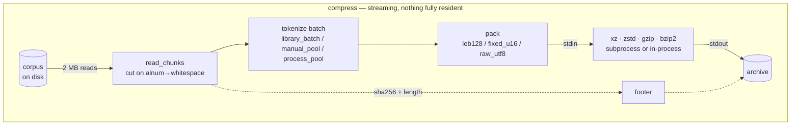
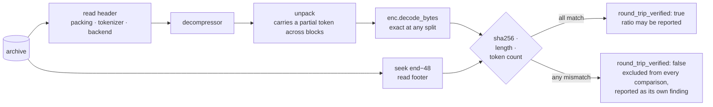
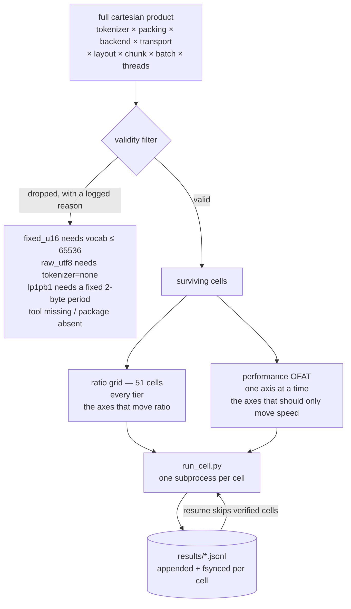

<div align="center">

<pre>
██████   █████  ██████  ███    ███  █████  ██████  
██   ██ ██   ██ ██   ██ ████  ████ ██   ██ ██   ██ 
██████  ███████ ██████  ██ ████ ██ ███████ ██████  
██      ██   ██ ██   ██ ██  ██  ██ ██   ██ ██   ██ 
██      ██   ██ ██   ██ ██      ██ ██   ██ ██   ██ 
</pre>

  <a href="../../LICENSE"></a>
  <a href="../../report/summary.md"></a>
  <a href="../../results/README.md"></a>
  <a href="../../corpus/README.md"></a>
  <a href="https://deepwiki.com/shallowbyte/parmar"></a>
  <a href="https://www.python.org/"></a>

</div>

<p align="center">
  <a href="../../README.md">English</a> ·
  <a href="README.zh-CN.md">简体中文</a> ·
  <a href="README.es.md">Español</a> ·
  <a href="README.pt-BR.md">Português</a> ·
  <a href="README.ru.md">Русский</a> ·
  <a href="README.ja.md">日本語</a> ·
  <a href="README.de.md">Deutsch</a> ·
  <b>Français</b> ·
  <a href="README.ko.md">한국어</a>
</p>

> Ce document est une traduction fournie pour votre confort de lecture.
> **[Le README anglais](../../README.md) fait foi** — en cas de divergence entre les
> deux, la version anglaise est correcte. Le code, les commandes, les noms de
> fichiers, les identifiants et toutes les valeurs numériques ne sont pas traduits.

Un préfiltre de tokenisation en sous-mots pour les codeurs entropiques au niveau
octet, ainsi que le harnais de tests de résistance construit pour déterminer s'il
fonctionne réellement.

> **Visite guidée du code :** une visite architecturale générée automatiquement
> pour ce dépôt est disponible sur
> **[deepwiki.com/shallowbyte/parmar](https://deepwiki.com/shallowbyte/parmar)**.
> Ce README est la source normative pour les *résultats* ; DeepWiki est le
> moyen le plus simple de naviguer dans le *code*.

**Réponse courte : cela fonctionne, pour une raison plus étroite que ce que
l'hypothèse affirmait.** La pré-tokenisation du texte apporte un gain de **+7% à
+9.6%** de taux de compression par rapport aux octets bruts, avec les meilleurs
réglages de LZMA2 ; l'avantage **s'élargit effectivement avec la taille du
corpus** — et il **atteint un plateau** une fois que le corpus dépasse largement
la fenêtre du dictionnaire du compresseur, plutôt que de croître sans limite. Sur
la fenêtre de 32 KiB de `gzip`, l'avantage est important (+15%) et totalement
plat, ce qui sépare les deux effets auparavant confondus : la *densité de
représentation* et l'*expansion de fenêtre*. Sur `bzip2`, la pré-tokenisation
constitue une **perte** constante (−3.9%).

**Et ce n'est pas un compromis taille contre vitesse :** sur 5 des 7
backends, parmar est à la fois plus petit *et* **plus rapide** que les octets
bruts, à tous les paliers — le compresseur reçoit ~45% d'octets en moins, ce qui
fait gagner plus de temps que n'en coûte la tokenisation. Les chiffres et la
méthode suivent ; chacun d'eux provient d'une configuration dont la
décompression a réellement été exécutée et dont le sha256 a réellement
correspondu.

<picture>
  <source media="(prefers-color-scheme: dark)" srcset="../../report/ratio_gap_vs_corpus_size_dark.png">
  
</picture>

## Ce que c'est

Les compresseurs standards repèrent des répétitions à l'intérieur d'une fenêtre
de dictionnaire glissante de taille fixe, mesurée en **octets**. Le postulat de
parmar : remplacer la prose UTF-8 par des identifiants de tokens BPE (la
même tokenisation que celle utilisée pour alimenter les LLM) avant la
compression. Le flux de tokens est environ 45% plus petit que le texte, si bien
qu'un dictionnaire LZMA2 de 64 MiB, qui couvre normalement ~64 MB de prose, peut
couvrir ~120 MB de prose une fois celle-ci préalablement réduite.

**L'affirmation ne devient testable qu'à grande échelle.** Sur un fichier de 5
MB, l'intégralité de l'entrée tient déjà dans le dictionnaire ; il n'y a
donc aucune fenêtre à étendre, et la pré-tokenisation n'apporte pratiquement
rien. Le livrable n'est donc pas ici un unique chiffre de taux de compression —
c'est la **courbe de (taux parmar − taux du backend brut) en fonction de la
taille du corpus**, et la question de savoir si cette courbe augmente.

Le format d'archive fonctionne en flux continu de bout en bout : les blocs
sont lus depuis le descripteur d'entrée, tokenisés, empaquetés, puis transmis
directement par tube à un sous-processus `xz`/`zstd` dont le stdout constitue le
fichier de sortie. Ni le tableau de tokens ni la charge utile compressée ne
résident jamais entièrement en mémoire. Chaque décompression recalcule le
hachage des octets reconstruits et le compare au sha256 stocké dans le pied de
l'archive ; **aucun taux n'est rapporté comme donnée valide tant que cette
vérification n'a pas réussi.**

## Fonctionnement

Rien de plus volumineux qu'un seul lot ne reste jamais en mémoire. Les blocs
s'écoulent depuis le descripteur d'entrée, sont tokenisés, empaquetés, puis vont
directement dans le stdin du compresseur — dont le stdout *est* le fichier de
sortie, si bien que la charge utile compressée ne passe jamais par Python.



La décompression suit le même chemin en sens inverse, et **s'exécute
systématiquement** : chaque configuration mesurée est décompressée et
vérifiée avant que son taux ne soit autorisé à compter.



### L'archive

| décalage | champ |
|---|---|
| `0` | nombre magique `PRMR`, version, code d'empaquetage |
| `6…` | nom du tokenizer préfixé par sa longueur, nom du backend, transport |
| … | charge utile compressée |
| `EOF−48` | `orig_len` (u64), `token_count` (u64), `sha256` (32 B) |

Le pied est placé à la fin car `orig_len`, `token_count` et le hachage ne sont
connus qu'une fois que l'intégralité de l'entrée a été traitée en flux. La
décompression se positionne d'abord à `size−48`.

### Comment un balayage est construit



Un produit cartésien littéral donne **~8,100 cellules valides par palier** — des
semaines par palier au débit mesuré. La scission ci-dessus est l'écart
documenté : la grille de taux est ce qui produit la courbe d'échelle, et le
taux est tout de même enregistré pour chaque cellule OFAT, de sorte qu'un axe de
performance qui *modifie* effectivement le taux apparaît comme une contradiction
plutôt que d'être noyé dans une moyenne.


## Organisation

| fichier | ce que c'est |
|---|---|
| `parmar_core.py` | le pipeline : schémas d'empaquetage, backends, transports, dispositions de tokenisation, format d'archive, compression/décompression |
| `parmar.py` | CLI mono-pipeline (`compress` / `decompress` / `bench` / `selftest`) |
| `resources.py` | détection portable du CPU/RAM/disque/outils/bibliothèques |
| `build_corpus.py` | générateur du corpus PG-19, par paliers et reprenable |
| `verify_boundaries.py` | test différentiel des limites de blocs — **bloquant** |
| `matrix.py` | génération des cellules, filtrage de validité, exécution isolée en sous-processus, reprise |
| `run_cell.py` | une cellule de la matrice, dans son propre processus |
| `analyze.py` | tables de synthèse + le graphique taux vs taille du corpus |
| `test_regressions.py` | régressions pour les défauts trouvés dans le `parmar.py` d'origine |
| `test_axes.py` | valeur de chaque axe de la matrice vérifiée indépendamment par aller-retour |
| `FINDINGS.md` | **tout ce qui s'est révélé faux une fois que le code a pu être exécuté** |

## Installation

```bash
python -m venv venv
./venv/Scripts/python.exe -m pip install tiktoken numpy zstandard psutil matplotlib pandas
```

Outils externes utilisés lorsqu'ils sont présents : `xz` (≥5.2 pour `-T`),
`zstd`, `gzip`, `bzip2`. L'absence d'un outil ne modifie pas le comportement en
silence — les cellules de la matrice concernées sont ignorées, avec la raison
affichée. `resources.py` affiche exactement ce qu'il a détecté :

```bash
python resources.py
```

## Reproduction

```bash
# 1. Construire les paliers du corpus (idempotent ; une réexécution vérifie le sha256 et saute ce qui est déjà fait)
python build_corpus.py --tiers "64MB,256MB,1GB,4GB" --out ./corpus/

# 2. Test de fumée : une seule configuration, palier le plus petit, profil rapide
python matrix.py smoke --corpus ./corpus/pg19_64mb.txt

# 3. Test différentiel de sécurité des limites. BLOQUANT -- un échec ici signifie que le découpage
#    perturbe le flux de tokens et que tous les taux en aval sont contaminés.
python matrix.py verify-boundaries --corpus ./corpus/pg19_64mb.txt \
    --tokenizers "o200k_base,cl100k_base,r50k_base,p50k_base" \
    --chunk-sizes "1MB,2MB,4MB"

# 4. Test de propriété/fuzzing de l'empaquetage (s'exécute aussi automatiquement avant chaque balayage)
python matrix.py verify-leb128 --cases 50000

# 5. Balayage de boucle de développement : matrice complète, palier le plus petit, backends rapides seulement
python matrix.py sweep --corpus ./corpus/pg19_64mb.txt --profile fast --resume

# 6. Balayage complet à un palier, reprenable, derrière la porte d'estimation préalable
python matrix.py sweep --corpus ./corpus/pg19_1gb.txt --profile full \
    --resume --confirm-estimate

# 7. Analyse (fonctionne sur des résultats partiels -- aucun palier n'a besoin d'être terminé)
python analyze.py --results ./results/ --out ./report/

# 8. Réexécuter une cellule anormale par son identifiant de ligne
python matrix.py rerun-cell --results ./results/sweep_64mb.jsonl --row-id <id>

# ou exécuter tout le programme en séquence, reprenable à tout moment
bash run_all.sh
```

`matrix.py plan --corpus ... --profile full` affiche les cellules générées et
le journal complet des exclusions, sans rien exécuter.

## Forme de la matrice

les axes du cahier des charges pris comme un produit cartésien littéral donnent
**~8,100 cellules valides par palier de corpus**, ce qui, au débit mesuré sur
cette machine, représente des semaines par palier. Le produit est scindé en
deux :

* **grille de taux** — croisement complet des axes qui déterminent le taux
  (tokenizer × empaquetage × backend), avec des réglages de performance de base
  fixes. **51 cellules.** Produit la courbe taux-vs-échelle.
* **OFAT de performance** — un facteur à la fois autour de la même base, sur les
  axes qui ne devraient affecter que la vitesse (threads, disposition,
  transport, taille de bloc, taille de lot), sur des backends représentatifs.

Le taux est tout de même enregistré pour chaque cellule OFAT, de sorte qu'un axe
de performance qui *modifie* effectivement le taux apparaît comme une
contradiction plutôt que d'être noyé dans une moyenne.

## Résultats

Tables complètes dans `report/summary.md` ; graphiques dans
`report/ratio_vs_corpus_size.png` et `report/ratio_gap_vs_corpus_size.png`.
Corpus : PG-19, quatre paliers (64MB / 256MB / 1GB / 4GB), 10,629
documents.

**452 cellules de matrice, 452 vérifiées par aller-retour, 0 échec — 21.4
heures de temps de cellule mesuré.** Chaque chiffre ci-dessous provient d'une
configuration dont la décompression a réellement été exécutée et dont le
sha256, la longueur en octets et le nombre de tokens correspondaient tous. Les
cellules qui échouent à la vérification sont exclues des comparaisons et
listées bien en évidence dans leur propre section du résumé ; il n'y en
avait aucune. Blocs coupés à une limite sans point de coupure sûr pour le
tokenizer : **0**, sur les 452 cellules.

### Q1. L'écart de taux entre parmar et le backend brut augmente-t-il avec la taille du corpus ?

**Oui — mais uniquement pour les backends dont la fenêtre est assez grande pour
s'étendre, et cela atteint un plateau une fois que le corpus dépasse cette
fenêtre de quelques multiples.**

Écart de taux exprimé en pourcentage du taux en octets bruts du même backend,
pipeline maintenu fixe à `p50k_base + fixed_u16` :

| backend | fenêtre effective | 64MB | 256MB | 1GB | 4GB | forme |
|---|---|---|---|---|---|---|
| `gzip_9` | 32 KiB | +15.38% | +15.24% | +15.34% | +15.30% | **plate** |
| `bz2_9` | bloc de 900 KiB | −3.87% | −3.90% | −3.83% | −3.85% | **plate, négative** |
| `zstd_12` | 128 MiB | +6.12% | +6.40% | +6.54% | +6.53% | monte, puis plateau |
| `zstd_19` | 128 MiB | +5.04% | +5.43% | +5.57% | +5.58% | monte, puis plateau |
| `lzma_fast` | 32 MiB | +8.16% | +8.87% | +9.22% | +9.21% | monte, puis plateau |
| `lzma_extreme` | 64 MiB | +7.55% | +8.56% | +8.94% | +9.08% | monte, puis plateau |
| `lzma_tuned_lp1pb1` | 64 MiB | +8.22% | +9.08% | +9.44% | +9.58% | monte |
| `zstd_22_long` | 2 GiB | +3.65% | +4.35% | +4.91% | +5.19% | **monte encore** |

Sur l'ensemble des 44 combinaisons backend/pipeline : **32 s'élargissent,
12 sont plates, 0 se rétrécit.** Les 12 combinaisons plates sont exactement les
six combinaisons `gzip_9` et les six combinaisons `bz2_9`.

Le mécanisme est visible dans la forme, pas seulement dans le signe :

* La fenêtre de 32 KiB de `gzip_9` est saturée à chaque palier, si bien que son
  gain (important, +15%) est de la **pure densité de représentation** et ne
  croît pas du tout. C'est le témoin qui sépare les deux effets — et il montre
  qu'une grande partie de l'avantage de parmar à petite échelle n'a jamais eu
  de rapport avec les fenêtres.
* Les backends LZMA montent de 64MB à 1GB puis s'aplatissent : une fois que le
  corpus atteint ~16x la taille du dictionnaire, le flux tokenisé et le flux
  brut sont tous deux également « sortis de la fenêtre », et l'avantage cesse
  de croître.
* `zstd_22_long`, avec une fenêtre de 2 GiB, est le seul backend **qui monte
  encore à 4GB** — parce que 4GB ne représente que 2x sa fenêtre,
  c'est-à-dire qu'il se trouve encore dans le régime que les autres ont déjà
  quitté.

**Le point de plateau suit la taille de fenêtre de chaque backend.** C'est
l'hypothèse d'expansion de fenêtre qui se confirme elle-même, et c'est un
véritable affinement : l'affirmation d'origine impliquait une croissance
sans limite avec la taille du corpus, et cette partie **n'est pas** ce qui se
produit.

Meilleurs taux absolus (parmar contre le meilleur backend brut au même
palier) :

| palier | meilleur parmar | meilleur brut | avantage |
|---|---|---|---|
| 64MB | **3.9304** (`p50k+fixed_u16` / `lzma_tuned_lp1pb1`) | 3.6318 (`lzma_extreme`) | +8.22% |
| 256MB | **4.0488** | 3.7198 (`zstd_22_long`) | +8.84% |
| 1GB | **4.0855** | 3.7817 (`zstd_22_long`) | +8.03% |
| 4GB | **4.0785** | 3.8027 (`zstd_22_long`) | +7.25% |

Les taux absolus ne sont pas parfaitement monotones d'un palier à l'autre, car
chaque palier correspond à un ensemble de documents différent ; l'écart
par backend ci-dessus constitue la comparaison contrôlée.


<picture>
  <source media="(prefers-color-scheme: dark)" srcset="../../report/ratio_vs_corpus_size_dark.png">
  
</picture>

### Q2. `fixed_u16` + `lp=1,pb=1` bat-il `LEB128` + `lc=3,lp=0,pb=0` ?

**Oui, clairement — mais surtout pour une raison différente de celle avancée
par la théorie.**

À 64MB, sur les tokenizers où les deux empaquetages sont valides :

| tokenizer | LEB128 + lc3/lp0/pb0 | fixed_u16 + lc3/lp0/pb0 | fixed_u16 + lc1/lp1/pb1 | ajusté vs LEB128 |
|---|---|---|---|---|
| `r50k_base` | 3.6856 | 3.8975 | 3.9214 | **+6.40%** |
| `p50k_base` | 3.6915 | 3.9060 | 3.9304 | **+6.47%** |

En décomposant ces +6.4% : passer de LEB128 à `fixed_u16` à lc/lp/pb
*inchangés* vaut **+5.7%**, et l'ajustement d'alignement `lp=1,pb=1` ajouté
par-dessus vaut **+0.61%** de plus. La théorie de l'alignement est donc juste
dans sa direction et paie effectivement — mais ~90% du gain provient de la
régularité de la largeur fixe elle-même, et non de l'ajustement de position
littérale qui avait été argumenté à partir de principes premiers.
`lzma_tuned_lp1pb1` reste néanmoins la configuration offrant le meilleur taux
à chaque palier testé.


<picture>
  <source media="(prefers-color-scheme: dark)" srcset="../../report/packing_decomposition_dark.png">
  
</picture>

### Q3. `manual_pool` bat-il un jour `library_batch` ?

**Non. C'est un résultat négatif net — l'hypothèse ne s'est pas vérifiée.**

Sur les deux paliers où la comparaison est disponible, `manual_pool` a battu
`library_batch` dans **exactement 8 des 16** configurations comparables. C'est
le hasard. Les écarts individuels oscillent de −6.8% à +44%, dans les deux
sens, sans motif cohérent selon le nombre de threads, la taille de bloc, le
backend ou la taille du corpus.

Ces oscillations sont importantes en pourcentage parce que la quantité mesurée
est petite et bruitée : la tokenisation représente ~0.7–3.4 s sur une
cellule qui dure de 20 s à 60 min, et deux exécutions de `library_batch`
nominalement identiques, portant sur le *même travail*, diffèrent jusqu'à 0.71
s contre 1.24 s. L'effet mesuré est du même ordre de grandeur que le bruit de
mesure, ce qui constitue en soi le résultat.

**Conclusion : le pool de workers écrit à la main ne vaut pas sa
complexité.** La fonction `encode_ordinary_batch` de tiktoken libère déjà le
GIL et se parallélise en interne en Rust ; il ne reste aucune marge
au-dessus pour que la coordination côté Python puisse en tirer profit.
`process_pool` paie en outre le coût de démarrage de processus sous Windows
(~1–2 s et ~100 MB par worker) sans aucun retour. Le cahier des charges avait
raison de signaler ce point comme une question empirique ouverte plutôt que
comme un choix de conception arrêté — et la réponse est que l'option simple
l'emporte.

### Q4. Quelle est la véritable courbe d'accélération de `xz -T`, et où le plancher entre-t-il en jeu ?

**Le plancher de 2x le dictionnaire prévu par le cahier des charges est réel,
et l'accélération au-delà de ce plancher est régie par le nombre de blocs —
que la pré-tokenisation réduit.**

La quantité qui importe est la taille du flux *envoyé à xz* (le flux de tokens
empaqueté), et non le corpus ni la sortie compressée. Blocs = `fed / (2 x
dict)` :

| palier | pipeline | backend | envoyé à xz | blocs | T4 | T20 | coût de taux |
|---|---|---|---|---|---|---|---|
| 64MB | raw | `lzma_extreme` | 64 MB | **1** | 1.01× | 1.01× | **0.00%** |
| 64MB | `r50k+fixed_u16` | `lzma_extreme` | 36 MB | **1** | 1.12× | 1.13× | **0.00%** |
| 64MB | `o200k+leb128` | `lzma_fast` | <64 MB | **1** | 1.17× | 1.22× | **0.00%** |
| 1GB | `r50k+fixed_u16` | `lzma_extreme` | 579 MB | **5** | 3.61× | **4.97×** | −1.30% |
| 1GB | raw | `lzma_extreme` | 1025 MB | **8** | 3.78× | **7.49×** | −1.16% |
| 1GB | `r50k+fixed_u16` | `lzma_fast` | 579 MB | **9** | 3.26× | **7.94×** | −1.38% |
| 1GB | raw | `lzma_fast` | 1025 MB | **16** | 4.10× | **11.76×** | −1.35% |

À 4GB, le nombre de blocs dépasse le nombre de cœurs, et la contrainte
change :

| palier | pipeline | backend | envoyé à xz | blocs | T4 | T20 | coût de taux |
|---|---|---|---|---|---|---|---|
| 4GB | `r50k+fixed_u16` | `lzma_extreme` | 2315 MB | 18 | 3.96× | 9.43× | −1.29% |
| 4GB | raw | `lzma_extreme` | 4096 MB | 32 | 3.85× | 10.82× | −1.27% |
| 4GB | `r50k+fixed_u16` | `lzma_fast` | 2315 MB | 36 | 4.31× | 11.28× | −1.35% |
| 4GB | raw | `lzma_fast` | 4096 MB | 64 | 3.81× | 11.48× | −1.36% |

**Il existe trois régimes, et `-T` se comporte de façon totalement différente
dans chacun :**

**1. Sous le plancher (`fed < 2 x dict`) — un seul bloc.** `-T` n'apporte rien
(0.99–1.22×) et ne coûte rien. Le taux est identique bit à bit entre
T1/T4/T20, ce qui *confirme* qu'aucun découpage n'a eu lieu plutôt que de le
déduire simplement. C'est le régime dans lequel se trouve le palier 64MB, et
c'est pourquoi les expériences originales à 5 MB n'ont observé aucun bénéfice
du multithreading.

**2. Blocs < cœurs — l'accélération suit le nombre de blocs presque 1:1.** À
1GB : 5 blocs → 4.97×, 8 → 7.49×, 9 → 7.94×, 16 → 11.76×. Les threads
au-delà du nombre de blocs ne font rien.

**3. Blocs > cœurs — l'accélération sature sur le matériel.** À 4GB, 18 à 64
blocs se retrouvent tous entre 9.4–11.5× sur 20 cœurs (~50% d'efficacité
parallèle). Ajouter des blocs cesse d'aider.

Le nombre de threads utile est donc approximativement **`min(fed_bytes / (2 x
dict_size), cores)`**.

**La pré-tokenisation a un coût caché en parallélisme qui n'avait pas été
signalé.** Parce que parmar réduit l'entrée du compresseur d'environ 45%, elle
réduit aussi le nombre de blocs à taille de bloc fixe. Sur le même corpus 1GB
et le même backend, les octets bruts obtiennent 8 blocs et 7.49× tandis que
`fixed_u16` obtient 5 blocs et 4.97× — parmar cède **~34% de l'accélération
multithread disponible** pour son gain de taux. À 4GB, cela disparaît, car les
deux dépassent de toute façon le plafond du nombre de cœurs. C'est un
compromis réel uniquement dans le régime 2.

Le coût de taux dû au multithreading est **d'environ 1.3% pour LZMA à toutes
les échelles** et, notablement, **exactement 0.00% pour zstd** à tous les
niveaux et paliers testés — le multithreading de zstd ne réinitialise pas la
fenêtre entre les tâches comme le font les blocs indépendants de xz. Si vous
avez besoin de multithreading sans pénalité de taux, c'est une raison concrète
de préférer zstd à xz ici.

<picture>
  <source media="(prefers-color-scheme: dark)" srcset="../../report/thread_scaling_dark.png">
  
</picture>

### Quelle configuration faut-il réellement utiliser ?

<picture>
  <source media="(prefers-color-scheme: dark)" srcset="../../report/ratio_vs_throughput_pareto_dark.png">
  
</picture>

La frontière s'étend de **3.18x à 79 MB/s** (raw + `zstd_12`) à **4.09x à 7.9
MB/s** (`p50k_base+fixed_u16` + `lzma_tuned_lp1pb1`) — soit une différence de
taille de 29% pour une différence de vitesse de 10x. `p50k_base+fixed_u16`
apparaît à presque chaque point de la frontière, ce qui constitue
l'enseignement pratique : le choix de l'empaquetage est presque gratuit,
et c'est le backend qui fait l'objet du compromis.

### Le résultat qui compte le plus en pratique

La pré-tokenisation n'est pas un compromis taille contre vitesse. Sur **5 des
7 backends, à chaque palier, parmar est à la fois plus petit *et* plus rapide
que les octets bruts, simultanément** — parce que le compresseur reçoit ~45%
d'octets en moins, et le temps gagné en les compressant dépasse le temps passé
à tokeniser.

| backend | brut | meilleur parmar | verdict |
|---|---|---|---|
| `lzma_extreme` @4GB | 3.7221x @ 11.6 MB/s | **4.0454x @ 16.9 MB/s** | plus petit **et** 1.5x plus rapide |
| `lzma_fast` @64MB | 3.6114x @ 0.45 MB/s | **3.9061x @ 2.93 MB/s** | plus petit **et** 6.5x plus rapide |
| `gzip_9` @1GB | 2.6928x @ 18.5 MB/s | **2.9413x @ 23.4 MB/s** | plus petit **et** plus rapide |
| `zstd_19` @4GB | 3.5714x @ 14.4 MB/s | **3.6765x @ 23.3 MB/s** | plus petit **et** 1.6x plus rapide |
| `zstd_22_long` @1GB | 3.7817x @ 1.6 MB/s | **3.9513x @ 2.3 MB/s** | plus petit **et** plus rapide |
| `zstd_12` @1GB | 3.1825x @ 79.0 MB/s | 3.3905x @ 39.0 MB/s | plus petit mais **2x plus lent** |
| `bz2_9` @1GB | **3.5659x** @ 19.8 MB/s | 3.4571x @ 17.2 MB/s | **le brut l'emporte nettement** |

Les deux exceptions sont instructives. `zstd_12` est suffisamment rapide pour
que la tokenisation devienne le goulot d'étranglement, si bien qu'au-delà de
256MB parmar gagne en taille au prix réel de la vitesse. `bz2_9` perd sur les
deux tableaux — la transformée de Burrows-Wheeler de bzip2 exploite une
structure du texte au niveau octet que la tokenisation détruit.

## Cas d'usage

Fondés sur les mesures ci-dessus, et non sur la spéculation :

- **Archivage de grands corpus de prose.** Le cas le plus solide : avec
  `lzma` ou un `zstd` de haut niveau, on obtient à la fois une archive plus
  petite et une compression plus rapide à exécuter.
- **Tout ce qui est bloqué sur gzip/deflate.** `gzip_9` gagne **+15%** et,
  fait inhabituel, le gagne à *toutes* les tailles de corpus — parce que la
  fenêtre de 32 KiB de gzip est toujours saturée, si bien que le bénéfice est
  de la pure densité de représentation, sans seuil d'échelle. Si vous ne
  pouvez pas changer le compresseur mais pouvez changer ce que vous lui donnez
  à compresser, c'est le gain le plus net ici, et il fonctionne aussi sur les
  petites entrées.
- **Stocker du texte qui sera de toute façon tokenisé** — fragments
  d'entraînement de LLM, jeux d'évaluation, corpus de récupération
  (retrieval). Les tokens *sont* la charge utile, si bien qu'un lecteur évite
  entièrement la retokenisation au moment de la relecture. C'est un gain
  systémique en plus du gain de taux.
- **Stockage froid où la fréquence de lecture est faible.** La décompression
  comporte un coût de détokenisation que la compression n'a pas, si bien que
  l'asymétrie favorise l'écriture unique et la lecture rare.

## Périmètre et non-objectifs

- **Ce n'est pas un archiveur généraliste.** Une archive n'est pas autonome :
  elle enregistre le *nom* du tokenizer, pas son vocabulaire, si bien que la
  décompression a besoin exactement du même encodage `tiktoken` disponible.
  Considérez les archives comme couplées à leur version de tokenizer.
- **Ce n'est pas un format sécurisé.** Ni chiffrement ni authentification. Le
  sha256 du pied de l'archive est un contrôle d'intégrité contre la
  corruption, stocké en clair à côté des données qu'il décrit — ce n'est pas
  un MAC. Voir [`SECURITY.md`](../../SECURITY.md).
- **Non validé sur du non-prose.** Chaque chiffre ici provient de prose
  anglaise (PG-19). Le code, le JSON, les logs et le balisage n'ont pas été
  testés et pourraient se comporter différemment, dans un sens ou dans
  l'autre.
- **Ce n'est pas un choix de vitesse à l'extrémité rapide.** Si vous êtes déjà
  sur `zstd -12` ou en dessous pour le débit, la pré-tokenisation vous coûte
  de la vitesse au-delà de 256MB.
- **Pas pour bzip2.** Mesuré comme une perte constante ; ne les utilisez
  pas ensemble.

## Limites

Liste honnête, chaque point étant mesuré ou documenté plutôt que simplement
soupçonné :

- **La règle de limite de bloc exige un caractère alphanumérique ASCII suivi
  d'un espace.** Les suites de chiffres ininterrompues, les blocs de pure
  ponctuation et les écritures sans espaces telles que le CJK n'ont aucun
  point de coupure sûr. Le découpeur revient alors à une coupure simplement
  sûre pour l'UTF-8 et **la comptabilise** dans `unsafe_boundary_cuts`,
  reporté dans chaque ligne de résultats. Sur PG-19, ce compte est nul à
  chaque palier et chaque taille de bloc — sur un corpus chinois ou japonais,
  il ne le serait pas.
- **`fixed_u16` — l'empaquetage le plus performant — ne fonctionne que pour
  des vocabulaires ≤ 65,536**, c'est-à-dire `r50k_base` et `p50k_base`. Les
  tokenizers modernes à grand vocabulaire ne peuvent pas l'utiliser et restent
  bloqués sur LEB128, d'où provenait pourtant l'essentiel du gain de taux.
- **La pré-tokenisation réduit le parallélisme multithread.** Moins d'octets
  envoyés à `xz` signifie moins de blocs ; à 1GB, cela coûte ~34% de
  l'accélération `-T` disponible.
- **Toutes les mesures de temps proviennent d'une seule machine** (20 cœurs,
  Windows). Les taux sont indépendants de la plateforme ; les chiffres
  de débit et de mise à l'échelle des threads ne le sont pas.
- **La borne du plateau n'est établie que jusqu'à 4GB.** `zstd_22_long` était
  encore en hausse au palier le plus élevé, donc son plafond n'est pas mesuré.

## Travaux futurs

Classés par ce que chacun apprendrait réellement :

1. **Balayer la taille du dictionnaire plutôt que la taille du corpus.** Le
   plateau suit la *fenêtre*, pas le corpus, donc faire varier `dict_size` à
   corpus fixe de 1GB isolerait le mécanisme bien plus économiquement que ne
   l'a fait l'échelle de corpus — et permettrait de prédire le point de
   plateau pour n'importe quel backend plutôt que de l'observer backend par
   backend.
2. **Renuméroter les identifiants de tokens par fréquence avant
   l'empaquetage.** LEB128 dépense 3 octets pour tout identifiant supérieur à
   16,383, et `o200k_base` place la majeure partie de son vocabulaire à cet
   endroit. Renuméroter les identifiants selon leur fréquence dans le corpus
   déplacerait les tokens courants dans la plage de 1 à 2 octets. C'est
   l'idée non testée la plus prometteuse pour combler l'écart entre LEB128 et
   `fixed_u16` sur les tokenizers à grand vocabulaire.
3. **Corpus non-prose**, en commençant par le code source — il est fortement
   répétitif au niveau des tokens, et son comportement à la pré-tokenisation
   est très différent de celui de la prose.
4. **Une règle de coupure pour les écritures sans espaces**, ce qui rendrait
   la technique utilisable sur du texte CJK.
5. **Un palier de 8GB+**, dans le seul but de trouver où plafonne la fenêtre
   de 2 GiB de `zstd_22_long`.
6. **Les tokenizers SentencePiece / Gemma**, volontairement exclus de cette
   itération car ils nécessitent le téléchargement d'un modèle à accès
   restreint et compromettraient la propriété d'exécution partout
   (run-anywhere).


## Corpus

`deepmind/pg19` (Apache 2.0) — Rae et al. 2019, *Compressive Transformers for
Long-Range Sequence Modelling*, arXiv:1911.05507.

Notez que `datasets.load_dataset("deepmind/pg19", streaming=True)` **ne peut
pas fonctionner** : le dépôt du Hub ne contient qu'un script de
chargement et des listes de fichiers, n'a pas de parquet, et sa branche
`refs/convert/parquet` n'a pas non plus de données — tandis que les scripts de
chargement ont été supprimés dans `datasets` 3.0. `build_corpus.py` récupère
les livres directement depuis le bucket GCS public que pointe le script. Voir
`FINDINGS.md` §1.

<sub>Traduit depuis <code>README.md</code> au commit <code>4af1fd0</code>. En cas de divergence entre ce document et le README anglais, le README anglais fait foi.</sub>
