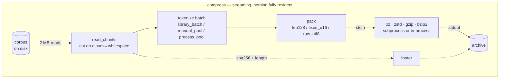
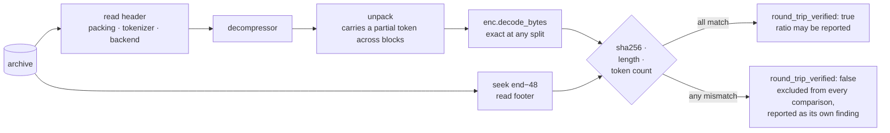
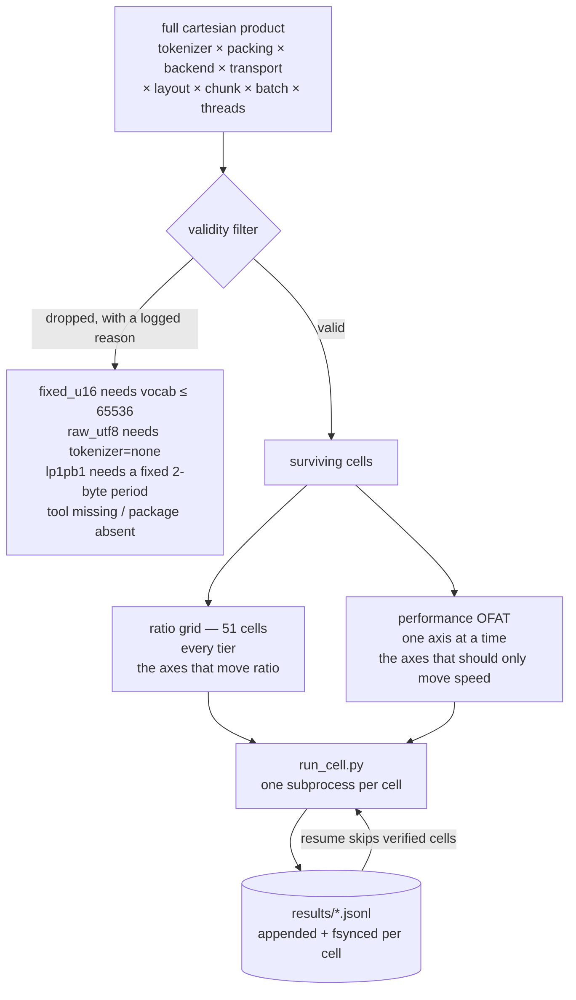

<div align="center">

<pre>
██████   █████  ██████  ███    ███  █████  ██████  
██   ██ ██   ██ ██   ██ ████  ████ ██   ██ ██   ██ 
██████  ███████ ██████  ██ ████ ██ ███████ ██████  
██      ██   ██ ██   ██ ██  ██  ██ ██   ██ ██   ██ 
██      ██   ██ ██   ██ ██      ██ ██   ██ ██   ██ 
</pre>

  <a href="../../LICENSE"></a>
  <a href="../../report/summary.md"></a>
  <a href="../../results/README.md"></a>
  <a href="../../corpus/README.md"></a>
  <a href="https://deepwiki.com/shallowbyte/parmar"></a>
  <a href="https://www.python.org/"></a>

</div>

<p align="center">
  <a href="../../README.md">English</a> ·
  <a href="README.zh-CN.md">简体中文</a> ·
  <a href="README.es.md">Español</a> ·
  <a href="README.pt-BR.md">Português</a> ·
  <a href="README.ru.md">Русский</a> ·
  <b>日本語</b> ·
  <a href="README.de.md">Deutsch</a> ·
  <a href="README.fr.md">Français</a> ·
  <a href="README.ko.md">한국어</a>
</p>

> 本書は読みやすさのために提供された翻訳版である。**[英語版 README](../../README.md) が規範版であり**、
> 両者の間に相違がある場合は英語版が正しい。コード、コマンド、ファイル名、識別子、
> および数値はすべて未翻訳のまま原文どおりとしている。

バイトレベルのエントロピー符号器のためのサブワード分割前処理フィルタ、および、
それが本当に効果があるかを検証するために構築されたストレステスト用ハーネス。

> **コードウォークスルー:** 本リポジトリの自動生成されたアーキテクチャ概観は
> **[deepwiki.com/shallowbyte/parmar](https://deepwiki.com/shallowbyte/parmar)** で閲覧できる。
> 本 README は*結果*に関する規範的な情報源であり、DeepWiki は*コード*を
> たどるためのより簡便な手段である。

**短く言えば、効果はある。ただし仮説が主張していたものより狭い理由による。**
テキストを事前トークン化することで、LZMA2 の最良設定において生バイトに対して
**+7% から +9.6%** の圧縮率向上が得られ、この優位性は**コーパス規模とともに実際に拡大する** ——
そして、コーパスが圧縮器の辞書ウィンドウを大きく超えたところで、無際限に伸び続けるのではなく
**頭打ちになる**。`gzip` の 32 KiB ウィンドウでは、この優位性は大きく（+15%）、
かつ完全に横ばいであり、これによって従来混同されていた二つの効果 ——
*表現密度* と *ウィンドウ拡張* —— が分離される。`bzip2` では、事前トークン化は
一貫して圧縮率が悪化する（**loss**、−3.9%）。

**そして、これはサイズと速度のトレードオフではない。** 7 つのバックエンドのうち 5 つでは、
全てのティアにおいて、parmar は生バイトよりも小さく *かつ* **高速** —— 同時に両方 —— である。
圧縮器に渡すバイト数が約 45% 減ることで、トークン化にかかるコストを上回る時間の節約が生まれる。
以下に数値と手法を示す。そのいずれもが、実際に解凍が実行され、sha256 が実際に一致した
構成から得られたものである。

<picture>
  <source media="(prefers-color-scheme: dark)" srcset="../../report/ratio_gap_vs_corpus_size_dark.png">
  
</picture>

## これは何か

標準的な圧縮器は、**バイト**単位で測った固定サイズのスライディング辞書ウィンドウの内側で
繰り返しを探す。parmar の前提はこうだ。圧縮の前に、UTF-8 の文章を BPE トークン ID
（LLM に入力するのと同じトークン化）に置き換える。トークン列は元の文章よりおよそ 45%
小さいため、通常であれば約 64 MB の文章しかカバーできない 64 MiB の LZMA2 辞書が、
文章を事前に縮小しておけば約 120 MB の文章をカバーできるようになる。

**この主張は、規模が大きくなって初めて検証可能になる。** 5 MB のファイルでは、入力全体が
すでに辞書の中に収まってしまうため、拡張すべきウィンドウが存在せず、事前トークン化は
実質的に何ももたらさない。したがって、ここでの成果物は単一の圧縮率の数値ではなく、
**（parmar の圧縮率 − 生バックエンドの圧縮率）をコーパス規模の関数として描いた曲線**、
そしてその曲線が上昇するかどうかである。

アーカイブ形式は端から端まで完全にストリーミングである。チャンクは入力ハンドルから読み出され、
トークン化され、パッキングされて、そのまま `xz`/`zstd` のサブプロセスへパイプ経由で渡される。
そのサブプロセスの stdout がそのまま出力ファイルとなる。トークン配列も圧縮後のペイロードも、
完全にメモリ上に常駐することはない。解凍のたびに、復元されたバイト列は再度ハッシュ化され、
アーカイブのフッターに格納された sha256 と照合される。**その検証を通過しない限り、
どの圧縮率も有効なデータとしては報告されない。**

## 仕組み

1 バッチより大きなものがメモリ上に常駐することは一度もない。チャンクは入力ハンドルから
ストリーミングで流れ出し、トークン化され、パッキングされて、そのまま圧縮器の stdin へ
渡される —— その stdout が*そのまま*出力ファイルであるため、圧縮後のペイロードが
Python を経由することは決してない。



解凍はこれと同じ経路を逆にたどったものであり、**常に実行される**。測定された
すべての構成は、その圧縮率が集計対象として認められる前に、解凍と検証を受ける。



### アーカイブ

| オフセット | フィールド |
|---|---|
| `0` | `PRMR` マジックナンバー、バージョン、パッキングコード |
| `6…` | 長さプレフィックス付きのトークナイザ名、バックエンド名、転送方式 |
| … | 圧縮後のペイロード |
| `EOF−48` | `orig_len` (u64)、`token_count` (u64)、`sha256` (32 B) |

フッターが末尾にあるのは、`orig_len`、`token_count`、そしてハッシュ値が、
入力全体がストリーミングを終えるまで判明しないためである。解凍時にはまず `size−48` へ
シークする。

### スイープはどう構築されるか



文字通りの直積を取ると、**1 ティアあたり約 8,100 個の有効なセル**となり ——
実測のスループットでは 1 ティアあたり数週間を要する。上記の分割は文書化された逸脱であり、
規模曲線を生み出すのは圧縮率グリッドの方であるが、OFAT の各セルについても圧縮率は
引き続き記録される。そのため、本来速度だけに影響するはずの性能軸が*実際には*圧縮率を
動かしていた場合、それは平均化されて隠れてしまうのではなく、矛盾として表面化する。

## レイアウト

| ファイル | 内容 |
|---|---|
| `parmar_core.py` | パイプライン本体：パッキング方式、バックエンド、転送方式、トークン化レイアウト、アーカイブ形式、圧縮／解凍 |
| `parmar.py` | 単一パイプライン CLI（`compress` / `decompress` / `bench` / `selftest`） |
| `resources.py` | 可搬な CPU/RAM/ディスク/ツール/ライブラリ検出 |
| `build_corpus.py` | PG-19 コーパスビルダー。ティア分割済みで再開可能 |
| `verify_boundaries.py` | チャンク境界の差分テスト —— **ブロッキング** |
| `matrix.py` | セル生成、有効性フィルタリング、サブプロセス分離実行、再開 |
| `run_cell.py` | マトリクスの 1 セルを、それ専用のプロセスで実行 |
| `analyze.py` | サマリーテーブル + 圧縮率対コーパス規模のプロット |
| `test_regressions.py` | 元の `parmar.py` で見つかった不具合に対する回帰テスト |
| `test_axes.py` | マトリクスの各軸の値を個別に往復検証 |
| `FINDINGS.md` | **コードが実際に実行できるようになって初めて判明した、誤っていた点のすべて** |

## セットアップ

```bash
python -m venv venv
./venv/Scripts/python.exe -m pip install tiktoken numpy zstandard psutil matplotlib pandas
```

存在する場合に利用される外部ツール：`xz`（`-T` には ≥5.2 が必要）、`zstd`、
`gzip`、`bzip2`。ツールが不足していても挙動が黙って変わることはない ——
影響を受けるマトリクスのセルはスキップされ、理由が表示される。`resources.py` は
検出した内容をそのまま出力する：

```bash
python resources.py
```

## 再現手順

```bash
# 1. コーパスのティアを構築する（べき等；再実行時は sha256 を検証しスキップする）
python build_corpus.py --tiers "64MB,256MB,1GB,4GB" --out ./corpus/

# 2. スモークテスト：単一構成、最小ティア、高速プロファイル
python matrix.py smoke --corpus ./corpus/pg19_64mb.txt

# 3. 境界安全性の差分テスト。ブロッキング —— ここで失敗するとチャンク分割が
#    トークン列を乱しており、以降のすべての圧縮率が汚染されていることを意味する。
python matrix.py verify-boundaries --corpus ./corpus/pg19_64mb.txt \
    --tokenizers "o200k_base,cl100k_base,r50k_base,p50k_base" \
    --chunk-sizes "1MB,2MB,4MB"

# 4. パッキングのプロパティ／ファズテスト（スイープの実行前にも自動的に実行される）
python matrix.py verify-leb128 --cases 50000

# 5. 開発ループ用スイープ：フルマトリクス、最小ティア、高速バックエンドのみ
python matrix.py sweep --corpus ./corpus/pg19_64mb.txt --profile fast --resume

# 6. あるティアでのフルスイープ、再開可能、事前見積もりゲート付き
python matrix.py sweep --corpus ./corpus/pg19_1gb.txt --profile full \
    --resume --confirm-estimate

# 7. 分析（部分的な結果に対しても動作する —— どのティアも完了している必要はない）
python analyze.py --results ./results/ --out ./report/

# 8. 異常な 1 セルを行 ID で再実行する
python matrix.py rerun-cell --results ./results/sweep_64mb.jsonl --row-id <id>

# あるいは、プログラム全体を順に実行する（任意の時点で再開可能）
bash run_all.sh
```

`matrix.py plan --corpus ... --profile full` は、何も実行せずに、
生成されるセルと完全な却下ログを表示する。

## マトリクスの形状

設計仕様の軸を文字通りの直積として取ると、**コーパスの 1 ティアあたり約 8,100 個の
有効なセル**となり、この機材で実測したスループットでは 1 ティアあたり数週間を要する。
この積は次の 2 つに分割される。

* **圧縮率グリッド** —— 圧縮率を決定する軸（トークナイザ × パッキング × バックエンド）の
  完全なクロスを、性能に関するベースライン設定は固定したまま取る。**51 セル。**
  規模対圧縮率の曲線を生成する。
* **性能 OFAT** —— 同じベースラインの周りで、本来速度にのみ影響するはずの軸
  （スレッド数、レイアウト、転送方式、チャンクサイズ、バッチサイズ）を、
  代表的なバックエンド上で 1 因子ずつ変化させる。

OFAT の各セルについても圧縮率は引き続き記録されるため、性能軸が*実際には*圧縮率を
動かしていた場合、それは平均化されて隠れるのではなく、矛盾として表面化する。

## 結果

完全な表は `report/summary.md` に、プロットは `report/ratio_vs_corpus_size.png` および
`report/ratio_gap_vs_corpus_size.png` にある。コーパス：PG-19、4 つのティア
（64MB / 256MB / 1GB / 4GB）、10,629 文書。

**452 個のマトリクスセル、452 個が往復検証済み、失敗 0 件 —— 実測セル時間 21.4 時間。**
以下の数値はすべて、実際に解凍が実行され、sha256、バイト長、トークン数のすべてが
一致した構成から得られたものである。検証に失敗したセルは比較から除外され、
サマリーの専用セクションで明示的に一覧化される仕組みだが、該当するものは無かった。
トークナイザにとって安全な分割点が無い境界で切られたチャンク数：全 452 セル中
**0**。

### Q1. parmar と生バックエンドの圧縮率差はコーパス規模とともに拡大するか？

**拡大する —— ただし、拡張できるだけの大きさのウィンドウを持つバックエンドに限られ、
コーパスがそのウィンドウの数倍を超えたところで頭打ちになる。**

同一バックエンドの生バイト圧縮率に対する割合として表した圧縮率差。パイプラインは
`p50k_base + fixed_u16` に固定：

| バックエンド | 有効ウィンドウ | 64MB | 256MB | 1GB | 4GB | 形態 |
|---|---|---|---|---|---|---|
| `gzip_9` | 32 KiB | +15.38% | +15.24% | +15.34% | +15.30% | **横ばい** |
| `bz2_9` | 900 KiB ブロック | −3.87% | −3.90% | −3.83% | −3.85% | **横ばい、かつ負** |
| `zstd_12` | 128 MiB | +6.12% | +6.40% | +6.54% | +6.53% | 上昇後、頭打ち |
| `zstd_19` | 128 MiB | +5.04% | +5.43% | +5.57% | +5.58% | 上昇後、頭打ち |
| `lzma_fast` | 32 MiB | +8.16% | +8.87% | +9.22% | +9.21% | 上昇後、頭打ち |
| `lzma_extreme` | 64 MiB | +7.55% | +8.56% | +8.94% | +9.08% | 上昇後、頭打ち |
| `lzma_tuned_lp1pb1` | 64 MiB | +8.22% | +9.08% | +9.44% | +9.58% | 上昇中 |
| `zstd_22_long` | 2 GiB | +3.65% | +4.35% | +4.91% | +5.19% | **なお上昇中** |

全 44 個のバックエンド／パイプラインの組み合わせのうち：**32 個が拡大、12 個が
横ばい、0 個が縮小。** その 12 個の横ばいの組み合わせは、正確に `gzip_9` の 6 通りと
`bz2_9` の 6 通りに一致する。

このメカニズムは、符号だけでなく形態にも現れている。

* `gzip_9` の 32 KiB ウィンドウはどのティアでも既に飽和しているため、その（+15% という
  大きな）利得は**純粋な表現密度**によるものであり、まったく拡大しない。これは
  二つの効果を分離する対照群であり、小規模における parmar の利得の大部分が、
  実はウィンドウとは無関係だったことを示している。
* LZMA 系のバックエンドは 64MB から 1GB にかけて上昇し、その後横ばいになる。
  コーパスが辞書の 16x に達すると、トークン化されたストリームも生のストリームも
  等しく「ウィンドウを使い切った」状態になり、優位性の拡大が止まる。
* 2 GiB のウィンドウを持つ `zstd_22_long` は、**4GB でもなお上昇し続けている**唯一の
  バックエンドである —— 4GB はそのウィンドウの 2x にすぎず、他のバックエンドが
  すでに抜け出した領域に、まだとどまっているからである。

**頭打ちになる位置は、各バックエンドのウィンドウサイズに追随する。** これは
ウィンドウ拡張仮説がそれ自体を裏付けている形であり、かつ本質的な修正でもある。
元の主張はコーパス規模に伴う無際限な増大を含意していたが、その部分は
実際には起こら**ない**。

絶対圧縮率の最良値（同一ティアにおける parmar 対最良の生バックエンド）：

| ティア | 最良の parmar | 最良の生バックエンド | 優位性 |
|---|---|---|---|
| 64MB | **3.9304**（`p50k+fixed_u16` / `lzma_tuned_lp1pb1`） | 3.6318（`lzma_extreme`） | +8.22% |
| 256MB | **4.0488** | 3.7198（`zstd_22_long`） | +8.84% |
| 1GB | **4.0855** | 3.7817（`zstd_22_long`） | +8.03% |
| 4GB | **4.0785** | 3.8027（`zstd_22_long`） | +7.25% |

絶対圧縮率がティアをまたいで完全には単調でないのは、各ティアがそれぞれ異なる文書の
集合だからである。上記のバックエンドごとの差こそが、制御された比較である。

<picture>
  <source media="(prefers-color-scheme: dark)" srcset="../../report/ratio_vs_corpus_size_dark.png">
  
</picture>

### Q2. `fixed_u16` + `lp=1,pb=1` は `LEB128` + `lc=3,lp=0,pb=0` に勝るか？

**はい、明確に勝る —— ただし主な理由は、理論が与えたものとは異なる。**

64MB において、両方のパッキング方式が有効なトークナイザについて：

| トークナイザ | LEB128 + lc3/lp0/pb0 | fixed_u16 + lc3/lp0/pb0 | fixed_u16 + lc1/lp1/pb1 | 調整後 vs LEB128 |
|---|---|---|---|---|
| `r50k_base` | 3.6856 | 3.8975 | 3.9214 | **+6.40%** |
| `p50k_base` | 3.6915 | 3.9060 | 3.9304 | **+6.47%** |

この +6.4% を分解すると、lc/lp/pb を*変えずに* LEB128 から `fixed_u16` へ
切り替えるだけで **+5.7%** の価値があり、その上に `lp=1,pb=1` のアラインメント調整を
加えるとさらに **+0.61%** の価値が上乗せされる。つまり、アラインメント理論は方向として
正しく、実際に効果もあるが —— その利得の約 90% は固定幅であること自体の規則性によるものであり、
第一原理から論じられていたリテラル位置の調整によるものではない。とはいえ、
`lzma_tuned_lp1pb1` は、検証したすべてのティアにおいて圧縮率が最良の構成である。

<picture>
  <source media="(prefers-color-scheme: dark)" srcset="../../report/packing_decomposition_dark.png">
  
</picture>

### Q3. `manual_pool` が `library_batch` に勝ることはあるか？

**勝らない。これは正当な知見としての明確なネガティブな結果である —— 仮説は成立しなかった。**

比較が可能な両方のティアを通じて、`manual_pool` が `library_batch` に勝ったのは、
比較可能な 16 構成のうち**ちょうど 8 個**であった。これは偶然の水準である。
個々の差は −6.8% から +44% まで両方向に振れており、スレッド数、チャンクサイズ、
バックエンド、コーパス規模のいずれについても、一貫したパターンは見られない。

パーセンテージで見た振れ幅が大きいのは、測定対象の量そのものが小さく、かつノイズが
大きいためである。トークン化にかかる時間は、20 秒から 60 分かかる 1 セルのうち
約 0.7–3.4 秒にすぎず、名目上まったく同一の*同じ作業*を行う 2 回の `library_batch`
実行でも、0.71 秒対 1.24 秒という差が生じる。測定しようとしている効果は、測定ノイズと
同程度の桁であり、それ自体がひとつの知見である。

**結論：自前実装のワーカープールは、その複雑さに見合わない。** tiktoken の
`encode_ordinary_batch` はすでに GIL を解放し、Rust 内部で並列化を行っている。
その上に Python 側で協調処理を行っても、取り戻せる余地は残っていない。`process_pool`
はさらに Windows のプロセス起動コスト（ワーカーあたり約 1–2 秒、約 100 MB）を
払うが、見返りは無い。設計仕様がこれを確定した設計判断ではなく未解決の実証的な
問いとして扱っていたのは正しく —— その答えは、単純な選択肢が勝る、というものである。

### Q4. `xz -T` の実際の高速化曲線はどうなっており、下限はどこで効き始めるか？

**設計仕様にある「辞書の 2 倍」という下限は実在し、その上での高速化はブロック数に
支配されている —— そしてそのブロック数を事前トークン化が減らす。**

重要なのは*xz に送り込まれるストリーム*（パッキングされたトークン列）のサイズであり、
コーパスのサイズでも圧縮後の出力サイズでもない。ブロック数 = `fed / (2 x dict)`：

| ティア | パイプライン | バックエンド | xz への入力 | ブロック数 | T4 | T20 | 圧縮率コスト |
|---|---|---|---|---|---|---|---|
| 64MB | raw | `lzma_extreme` | 64 MB | **1** | 1.01× | 1.01× | **0.00%** |
| 64MB | `r50k+fixed_u16` | `lzma_extreme` | 36 MB | **1** | 1.12× | 1.13× | **0.00%** |
| 64MB | `o200k+leb128` | `lzma_fast` | <64 MB | **1** | 1.17× | 1.22× | **0.00%** |
| 1GB | `r50k+fixed_u16` | `lzma_extreme` | 579 MB | **5** | 3.61× | **4.97×** | −1.30% |
| 1GB | raw | `lzma_extreme` | 1025 MB | **8** | 3.78× | **7.49×** | −1.16% |
| 1GB | `r50k+fixed_u16` | `lzma_fast` | 579 MB | **9** | 3.26× | **7.94×** | −1.38% |
| 1GB | raw | `lzma_fast` | 1025 MB | **16** | 4.10× | **11.76×** | −1.35% |

4GB になると、ブロック数はコア数を超えて増加し、制約の性質が変わる：

| ティア | パイプライン | バックエンド | xz への入力 | ブロック数 | T4 | T20 | 圧縮率コスト |
|---|---|---|---|---|---|---|---|
| 4GB | `r50k+fixed_u16` | `lzma_extreme` | 2315 MB | 18 | 3.96× | 9.43× | −1.29% |
| 4GB | raw | `lzma_extreme` | 4096 MB | 32 | 3.85× | 10.82× | −1.27% |
| 4GB | `r50k+fixed_u16` | `lzma_fast` | 2315 MB | 36 | 4.31× | 11.28× | −1.35% |
| 4GB | raw | `lzma_fast` | 4096 MB | 64 | 3.81× | 11.48× | −1.36% |

**3 つの領域が存在し、`-T` はそれぞれでまったく異なる振る舞いをする：**

**1. 下限未満（`fed < 2 x dict`）—— ブロック 1 個。** `-T` は何も
もたらさず（0.99–1.22×）、コストも生じない。T1/T4/T20 で圧縮率がビット単位で同一
であることは、分割が起きていないことを単なる推測ではなく*確認*している。64MB の
ティアはこの領域にあり、これが最初の 5 MB 実験でマルチスレッドの効果が見られなかった
理由である。

**2. ブロック数 < コア数 —— 高速化はブロック数にほぼ 1:1 で追随する。** 1GB では：
5 ブロック → 4.97×、8 → 7.49×、9 → 7.94×、16 → 11.76×。ブロック数を超える
スレッドは何ももたらさない。

**3. ブロック数 > コア数 —— 高速化はハードウェアの上限で頭打ちになる。** 4GB では、
18 から 64 のブロックがすべて 20 コア上で 9.4–11.5×（並列効率約 50%）に収まる。
ブロック数をさらに増やしても、もはや効果はない。

したがって、有効なスレッド数はおおよそ **`min(fed_bytes / (2 x dict_size), cores)`**
である。

**事前トークン化には、これまで指摘されてこなかった並列性の隠れたコストがある。**
parmar は圧縮器への入力を約 45% 縮小するため、固定のブロックサイズにおいてブロック数も
縮小する。同一の 1GB コーパス・同一バックエンドにおいて、生バイトは 8 ブロックで 7.49×
となるのに対し、`fixed_u16` は 5 ブロックで 4.97× にとどまる —— parmar は圧縮率の
利得と引き換えに、**利用可能なマルチスレッド高速化の約 34%** を手放していることになる。
4GB ではこの差は消える。両者ともいずれにせよコア数の上限を超えてしまっているためである。
これが実質的なトレードオフとなるのは、領域 2 においてのみである。

マルチスレッド化による圧縮率コストは、**LZMA ではどの規模でも約 1.3%** であり、
注目すべきことに、検証したすべてのレベル・ティアにおいて**zstd では正確に 0.00%**
である —— zstd のマルチスレッド化は、xz の独立ブロックのようにジョブ間でウィンドウを
リセットすることがない。圧縮率のペナルティなしにマルチスレッド化が必要なのであれば、
これはここで xz より zstd を選ぶべき具体的な理由となる。

<picture>
  <source media="(prefers-color-scheme: dark)" srcset="../../report/thread_scaling_dark.png">
  
</picture>

### 実際にはどの構成を使うべきか？

<picture>
  <source media="(prefers-color-scheme: dark)" srcset="../../report/ratio_vs_throughput_pareto_dark.png">
  
</picture>

このフロンティアは **79 MB/s での 3.18x**（raw + `zstd_12`）から **7.9 MB/s での 4.09x**
（`p50k_base+fixed_u16` + `lzma_tuned_lp1pb1`）まで広がっている —— 10x の速度差に対して
29% のサイズ差である。`p50k_base+fixed_u16` はこのフロンティア上のほぼすべての点に
現れており、これが実務上の要点である。パッキングの選択はほぼ無償であり、
トレードオフが生じるのはバックエンドの選択においてである。

### 実務上もっとも重要な結果

事前トークン化はサイズと速度のトレードオフではない。**7 つのバックエンドのうち 5 つでは、
全てのティアにおいて、parmar は生バイトよりも小さく *かつ* 高速 —— 同時に両方 ——
である。** これは、圧縮器に渡すバイト数が約 45% 減り、その圧縮にかかる時間の節約が、
トークン化に費やす時間を上回るためである。

| バックエンド | raw | 最良の parmar | 判定 |
|---|---|---|---|
| `lzma_extreme` @4GB | 3.7221x @ 11.6 MB/s | **4.0454x @ 16.9 MB/s** | より小さく **かつ** 1.5x 高速 |
| `lzma_fast` @64MB | 3.6114x @ 0.45 MB/s | **3.9061x @ 2.93 MB/s** | より小さく **かつ** 6.5x 高速 |
| `gzip_9` @1GB | 2.6928x @ 18.5 MB/s | **2.9413x @ 23.4 MB/s** | より小さく **かつ** 高速 |
| `zstd_19` @4GB | 3.5714x @ 14.4 MB/s | **3.6765x @ 23.3 MB/s** | より小さく **かつ** 1.6x 高速 |
| `zstd_22_long` @1GB | 3.7817x @ 1.6 MB/s | **3.9513x @ 2.3 MB/s** | より小さく **かつ** 高速 |
| `zstd_12` @1GB | 3.1825x @ 79.0 MB/s | 3.3905x @ 39.0 MB/s | より小さいが **2x 遅い** |
| `bz2_9` @1GB | **3.5659x** @ 19.8 MB/s | 3.4571x @ 17.2 MB/s | **raw の完全勝利** |

この 2 つの例外は示唆に富む。`zstd_12` はすでに十分高速であるため、
トークン化そのものがボトルネックとなり、256MB を超えると parmar は実際の速度コストと
引き換えにサイズを買うことになる。`bz2_9` は両方で負ける —— bzip2 の
Burrows-Wheeler 変換は、トークン化によって破壊されてしまうバイトレベルのテキスト構造を
利用しているためである。

## ユースケース

以下は憶測ではなく、上記の実測に基づくものである。

- **大規模な文章コーパスのアーカイブ。** もっとも強力なユースケース。`lzma` または
  高レベルの `zstd` を使えば、アーカイブが小さくなると同時に、圧縮にかかる時間も
  短くなる。
- **gzip/deflate から抜け出せない場合。** `gzip_9` は **+15%** の利得を得るが、
  珍しいことに、それを*あらゆる*コーパス規模で得る —— gzip の 32 KiB ウィンドウは
  常に飽和しているため、その利得は規模のしきい値を伴わない純粋な表現密度によるもの
  だからである。圧縮器そのものは変更できないが、渡すデータは変更できるという場合、
  これがもっとも明確な勝ち筋であり、小さな入力でも機能する。
- **どのみちトークン化されることになるテキストの保存** —— LLM の学習用シャード、
  評価セット、検索用コーパスなど。トークンそのものが*ペイロード*であるため、
  読み出し側は再トークン化を完全に省ける。これは圧縮率に加えたシステム上の利得である。
- **読み出し頻度の低いコールドストレージ。** 解凍にはデトークン化のコストが伴うが、
  圧縮側にはそれが無い。したがってこの非対称性は、書き込みは一度きりで読み出しは
  稀、という用途に有利に働く。

## 対象範囲と非目標

- **汎用アーカイバではない。** アーカイブは自己完結していない。記録されるのは
  トークナイザの*名前*であって語彙そのものではないため、解凍には同一の
  `tiktoken` エンコーディングが利用できる環境が必要である。アーカイブは、
  そのトークナイザのバージョンと結び付いたものとして扱うこと。
- **セキュアな形式ではない。** 暗号化も認証も無い。フッターの sha256 は破損に対する
  完全性チェックであり、それが記述するデータのすぐ横に平文で保存されている ——
  MAC ではない。[`SECURITY.md`](../../SECURITY.md) を参照。
- **文章以外での検証は行っていない。** ここでの数値はすべて英語の文章（PG-19）に
  基づく。コード、JSON、ログ、マークアップは未検証であり、どちらの方向にせよ
  異なる振る舞いをする可能性がある。
- **高速側での速度勝負を狙ったものではない。** すでにスループットを重視して
  `zstd -12` 以下を使っているのであれば、256MB を超えたところで事前トークン化は
  速度上のコストとなる。
- **bzip2 向けではない。** 一貫した悪化（loss）として測定されている。組み合わせて
  使わないこと。

## 制限事項

以下は憶測ではなく、いずれも実測または文書化された、正直なリストである。

- **チャンク境界の規則には、ASCII の英数字の直後に空白が続くことが必要である。**
  途切れない数字の連続、記号だけの塊、そして CJK のような単語間に空白の無い
  スクリプトには、安全な切断点が存在しない。チャンカーは単に UTF-8 として安全な
  切断へフォールバックし、それを `unsafe_boundary_cuts` として**カウント**し、
  すべての結果の行に持ち越す。PG-19 では、この値はどのティア・チャンクサイズでも
  ゼロである —— 中国語や日本語のコーパスであれば、そうはならないだろう。
- **もっとも高い性能を発揮するパッキングである `fixed_u16` は、語彙数 65,536 以下
  でしか機能しない。** すなわち `r50k_base` と `p50k_base` に限られる。現代の
  大語彙トークナイザはこれを利用できず、LEB128 に頼るしかないが、圧縮率の利得の
  大部分はまさにそこ（`fixed_u16`）から来ていた。
- **事前トークン化はマルチスレッドの並列度を下げる。** `xz` に送り込むバイト数が
  減るということは、ブロック数が減るということであり、1GB では利用可能な `-T`
  高速化の約 34% を失う。
- **すべての計測時間は 1 台のマシン**（20 コア、Windows）によるものである。
  圧縮率はプラットフォームに依存しないが、スループットとスレッドスケーリングの
  数値はそうではない。
- **頭打ちになる上限は 4GB までしか確立されていない。** `zstd_22_long` は最上位の
  ティアでもなお上昇し続けていたため、その天井は未測定である。

## 今後の課題

それぞれが実際にどれだけ多くを教えてくれるかの順に並べている：

1. **コーパス規模ではなく辞書サイズをスイープする。** 頭打ちになるのはコーパスでは
   なく*ウィンドウ*に追随している。したがって、1GB のコーパスを固定して
   `dict_size` を変化させれば、コーパスのはしごを用いるよりもはるかに安く
   このメカニズムを切り分けられ、しかも各バックエンドごとに観測するのではなく、
   任意のバックエンドについて頭打ちの位置を予測できるようになるはずである。
2. **パッキング前にトークン ID を頻度順に振り直す。** LEB128 は 16,383 を超える
   ID すべてに 3 バイトを費やしており、`o200k_base` はその語彙の大部分をそこに
   置いている。コーパス内の頻度に応じて ID を振り直せば、よく使われるトークンを
   1–2 バイトの範囲に移せる。これは、大語彙トークナイザにおける LEB128 と
   `fixed_u16` の差を縮めるための、もっとも有望な未検証のアイデアである。
3. **文章以外のコーパス**、まずはソースコードから。トークンレベルで非常に反復的
   であり、その事前トークン化の挙動は文章とは大きく異なる。
4. **単語間に空白の無いスクリプト向けの切断規則。** これによって、この技法が
   CJK テキストにもそもそも使えるようになる。
5. **8GB 以上のティア。** `zstd_22_long` の 2 GiB ウィンドウがどこで頭打ちに
   なるかを見出すためだけに。
6. **SentencePiece / Gemma のトークナイザ。** 今回意図的に除外した。これらは
   ゲート付きのモデルダウンロードを必要とし、どこでも実行できるという特性を
   損なってしまうためである。

## コーパス

`deepmind/pg19`（Apache 2.0）—— Rae 他、2019 年、*Compressive Transformers for
Long-Range Sequence Modelling*、arXiv:1911.05507。

`datasets.load_dataset("deepmind/pg19", streaming=True)` は**動作しない**ことに
注意すること。Hub 上のリポジトリにはローディングスクリプトとファイル一覧しか
無く、parquet も無く、その `refs/convert/parquet` ブランチにもデータは無い ——
そのうえ、ローディングスクリプトへの対応は `datasets` 3.0 で削除されている。
`build_corpus.py` は、そのスクリプトが参照している公開の GCS バケットから
直接書籍を取得する。詳細は `FINDINGS.md` §1 を参照。

<sub>これは <code>README.md</code> のコミット <code>4af1fd0</code> 時点の内容を翻訳したものである。
本書と英語版 README の間で内容が相違する場合は、英語版が正しい。</sub>
