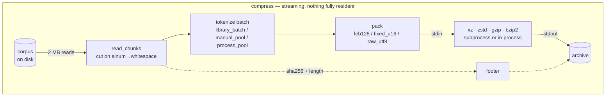
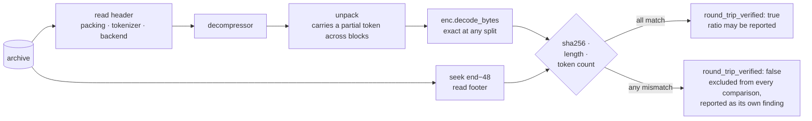
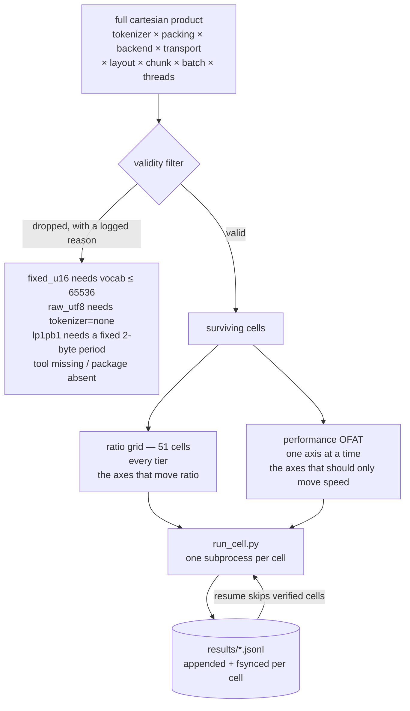

<div align="center">

<pre>
██████   █████  ██████  ███    ███  █████  ██████  
██   ██ ██   ██ ██   ██ ████  ████ ██   ██ ██   ██ 
██████  ███████ ██████  ██ ████ ██ ███████ ██████  
██      ██   ██ ██   ██ ██  ██  ██ ██   ██ ██   ██ 
██      ██   ██ ██   ██ ██      ██ ██   ██ ██   ██ 
</pre>

  <a href="../../LICENSE"></a>
  <a href="../../report/summary.md"></a>
  <a href="../../results/README.md"></a>
  <a href="../../corpus/README.md"></a>
  <a href="https://deepwiki.com/shallowbyte/parmar"></a>
  <a href="https://www.python.org/"></a>

</div>

<p align="center">
  <a href="../../README.md">English</a> ·
  <a href="README.zh-CN.md">简体中文</a> ·
  <a href="README.es.md">Español</a> ·
  <a href="README.pt-BR.md">Português</a> ·
  <a href="README.ru.md">Русский</a> ·
  <a href="README.ja.md">日本語</a> ·
  <a href="README.de.md">Deutsch</a> ·
  <a href="README.fr.md">Français</a> ·
  <b>한국어</b>
</p>

> 본 문서는 편의를 위해 제공되는 번역본입니다. **[영어 README](../../README.md)가 규범 버전입니다** ——
> 두 문서가 상충할 경우 영어판을 따릅니다. 코드, 명령어, 파일명, 식별자 및 모든 숫자는 번역하지 않고 원문 그대로 유지합니다.

바이트 수준 엔트로피 코더를 위한 서브워드 토큰화 사전 필터, 그리고 이것이 실제로 효과가 있는지 확인하기 위해 만든 스트레스 테스트 하네스.

> **코드 둘러보기:** 이 저장소의 자동 생성 아키텍처 투어는
> **[deepwiki.com/shallowbyte/parmar](https://deepwiki.com/shallowbyte/parmar)**에서 볼 수 있다.
> 이 README는 *결과*에 대한 규범적 출처이며, DeepWiki는 *코드*를
> 탐색하기에 더 쉬운 방법이다.

**짧게 답하면: 효과가 있다, 다만 가설이 주장했던 것보다 더 좁은 범위의 이유 때문이다.**
텍스트를 사전 토큰화하면 LZMA2의 최적 설정에서 원시 바이트 대비 **+7%에서 +9.6%**의
압축률을 얻는다. 이 우위는 **코퍼스 크기가 커짐에 따라 실제로 확대되며** — 코퍼스가
압축기의 사전 윈도우를 한참 넘어서면 무한히 커지는 대신 **평탄해진다**. `gzip`의
32 KiB 윈도우에서는 이 우위가 크면서(+15%) 완전히 평탄한데, 이는 그동안 뒤섞여
있던 두 가지 효과, 즉 *표현 밀도*와 *윈도우 확장*을 분리해서 보여준다. `bzip2`에서는
사전 토큰화가 일관되게 **손해**다 (−3.9%).

**그리고 이것은 크기와 속도를 맞바꾸는 트레이드오프가 아니다:** 7개 백엔드 중 5개에서
parmar는 모든 티어에서 원시 바이트보다 동시에 더 작으면서 *그리고* **더 빠르다** —
압축기에 넘어가는 바이트 수가 약 45% 줄어들고, 그 절감분이 토큰화 비용보다 더 많은
시간을 절약해 준다. 구체적인 수치와 방법론은 아래에 있다; 그 각각은 실제로
해제(decompression)가 실행되었고 sha256이 실제로 일치한 구성에서 나온 것이다.

<picture>
  <source media="(prefers-color-scheme: dark)" srcset="../../report/ratio_gap_vs_corpus_size_dark.png">
  
</picture>

## 이것이 무엇인가

표준 압축기는 **바이트** 단위로 측정되는 고정 크기의 슬라이딩 사전 윈도우 안에서
반복을 찾는다. parmar의 전제는: 압축하기 전에 UTF-8 산문을 BPE 토큰 ID(LLM에
입력할 때 쓰는 것과 동일한 토큰화)로 치환한다는 것이다. 토큰 스트림은 원문보다
약 45% 더 작으므로, 평소라면 산문 약 64 MB를 담는 64 MiB LZMA2 사전이, 산문이
미리 축소된 뒤에는 약 120 MB의 산문을 담을 수 있다.

**이 주장은 규모가 커져야만 비로소 검증 가능해진다.** 5 MB 파일에서는 입력 전체가
이미 사전 안에 다 들어가므로 확장할 윈도우가 없고, 사전 토큰화는 사실상 아무런
이득도 주지 않는다. 따라서 이 프로젝트의 결과물은 단일 압축률 수치가 아니라 —
**코퍼스 크기의 함수로서 (parmar 압축률 − 원시 백엔드 압축률)의 곡선**이며,
그 곡선이 상승하는지 여부다.

아카이브 포맷은 처음부터 끝까지 스트리밍 방식이다: 청크를 입력 핸들에서 읽어
들여 토큰화하고 패킹한 뒤, 곧바로 `xz`/`zstd` 서브프로세스로 파이프하며 그
서브프로세스의 stdout이 곧 출력 파일이 된다. 토큰 배열도 압축된 페이로드도
전체가 메모리에 상주하는 일이 없다. 모든 해제(decompression) 시 재구성된
바이트를 다시 해시하여 아카이브 푸터 안의 sha256과 대조한다; **그 검사를
통과하지 못하면 어떤 압축률도 유효한 데이터로 보고되지 않는다.**

## 작동 방식

한 배치보다 큰 것은 결코 메모리에 상주하지 않는다. 청크는 입력 핸들에서
흘러나와 토큰화, 패킹을 거쳐 곧바로 압축기의 stdin으로 들어간다 — 그 stdout이
*바로* 출력 파일이므로, 압축된 페이로드는 Python을 거치는 일이 전혀 없다.



해제(decompression)는 동일한 경로를 거꾸로 밟으며, **항상 실행된다**: 측정된
모든 구성은 그 압축률이 집계되기 전에 반드시 해제되고 검증된다.



### 아카이브

| 오프셋 | 필드 |
|---|---|
| `0` | `PRMR` 매직 넘버, 버전, 패킹 코드 |
| `6…` | 길이 접두사가 붙은 토크나이저 이름, 백엔드 이름, 전송 방식 |
| … | 압축된 페이로드 |
| `EOF−48` | `orig_len` (u64), `token_count` (u64), `sha256` (32 B) |

푸터가 맨 끝에 있는 이유는 `orig_len`, `token_count`, 해시 값이 입력 전체가
스트리밍을 마칠 때까지는 알 수 없기 때문이다. 해제 시에는 먼저 `size−48`
위치로 탐색(seek)한다.

### 스윕은 어떻게 구성되는가



곧이곧대로 카르테시안 곱을 취하면 **티어당 약 8,100개의 유효한 셀**이 나온다 —
실측 처리량 기준으로 티어당 몇 주가 걸린다. 위의 분리는 문서화된 의도적
이탈이다: 압축률 그리드가 규모 곡선을 만들어내고, 모든 OFAT 셀에서도 압축률이
여전히 기록되므로, 압축률을 *실제로* 움직이는 성능 축이 있다면 평균으로
뭉개지는 대신 모순의 형태로 드러난다.


## 레이아웃

| 파일 | 설명 |
|---|---|
| `parmar_core.py` | 파이프라인 본체: 패킹 방식, 백엔드, 전송 방식, 토큰화 레이아웃, 아카이브 포맷, 압축/해제 |
| `parmar.py` | 단일 파이프라인 CLI (`compress` / `decompress` / `bench` / `selftest`) |
| `resources.py` | 이식 가능한 CPU/RAM/디스크/도구/라이브러리 감지 |
| `build_corpus.py` | PG-19 코퍼스 빌더, 티어별 구성이며 재개 가능 |
| `verify_boundaries.py` | 청크 경계 차분(differential) 테스트 — **차단성(blocking)** |
| `matrix.py` | 셀 생성, 유효성 필터링, 서브프로세스로 격리된 실행, 재개 |
| `run_cell.py` | 매트릭스 셀 하나를 자신만의 프로세스에서 실행 |
| `analyze.py` | 요약 표 + 압축률 대 코퍼스 크기 플롯 |
| `test_regressions.py` | 원본 `parmar.py`에서 발견된 결함에 대한 회귀 테스트 |
| `test_axes.py` | 매트릭스의 모든 축 값을 독립적으로 왕복 검증 |
| `FINDINGS.md` | **코드를 실제로 실행해 보니 틀린 것으로 드러난 모든 것** |

## 설정

```bash
python -m venv venv
./venv/Scripts/python.exe -m pip install tiktoken numpy zstandard psutil matplotlib pandas
```

존재할 경우 사용되는 외부 도구: `xz`(`-T`를 쓰려면 ≥5.2), `zstd`, `gzip`, `bzip2`.
도구가 없다고 해서 동작이 조용히 바뀌지는 않는다 — 영향을 받는 매트릭스 셀은
이유를 출력하며 건너뛴다. `resources.py`는 자신이 감지한 내용을 그대로
출력한다:

```bash
python resources.py
```

## 재현하기

```bash
# 1. 코퍼스 티어 빌드 (멱등적; 재실행 시 sha256을 검증하고 건너뜀)
python build_corpus.py --tiers "64MB,256MB,1GB,4GB" --out ./corpus/

# 2. 스모크 테스트: 구성 하나, 최소 티어, fast 프로파일
python matrix.py smoke --corpus ./corpus/pg19_64mb.txt

# 3. 경계 안전성 차분 테스트. 차단성(BLOCKING) -- 여기서 실패하면 청킹이
#    토큰 스트림을 흐트러뜨리고 이후의 모든 압축률이 오염되었음을 의미한다.
python matrix.py verify-boundaries --corpus ./corpus/pg19_64mb.txt \
    --tokenizers "o200k_base,cl100k_base,r50k_base,p50k_base" \
    --chunk-sizes "1MB,2MB,4MB"

# 4. 패킹 속성/퍼징 테스트 (모든 스윕 전에 자동으로도 실행됨)
python matrix.py verify-leb128 --cases 50000

# 5. 개발 루프 스윕: 전체 매트릭스, 최소 티어, fast 백엔드만
python matrix.py sweep --corpus ./corpus/pg19_64mb.txt --profile fast --resume

# 6. 특정 티어에서의 전체 스윕, 재개 가능, 사전 추정 게이트 뒤에서 실행
python matrix.py sweep --corpus ./corpus/pg19_1gb.txt --profile full \
    --resume --confirm-estimate

# 7. 분석 (부분 결과에서도 동작함 -- 어떤 티어도 완료될 필요 없음)
python analyze.py --results ./results/ --out ./report/

# 8. 행 id로 이상 셀 하나를 재실행
python matrix.py rerun-cell --results ./results/sweep_64mb.jsonl --row-id <id>

# 또는 전체 프로그램을 순서대로 실행, 어느 지점에서든 재개 가능
bash run_all.sh
```

`matrix.py plan --corpus ... --profile full`은 아무것도 실행하지 않고
생성된 셀과 전체 드롭 로그를 출력한다.

## 매트릭스 형태

설계 사양의 축들을 곧이곧대로 카르테시안 곱으로 취하면 **코퍼스 티어당 약
8,100개의 유효한 셀**이 나오는데, 이는 이 머신의 실측 처리량 기준으로
티어당 몇 주에 해당한다. 이 곱은 둘로 분리된다:

* **압축률 그리드** — 압축률을 결정하는 축들(토크나이저 × 패킹 × 백엔드)의
  완전 교차, 성능 설정은 고정된 기준값으로 유지. **51개 셀.** 압축률 대
  규모 곡선을 만들어낸다.
* **성능 OFAT** — 동일한 기준값 주위에서, 속도에만 영향을 주어야 하는
  축들(스레드 수, 레이아웃, 전송 방식, 청크 크기, 배치 크기)에 대해
  대표적인 백엔드에서 한 번에 한 요인씩(one factor at a time) 변화시킨다.

모든 OFAT 셀에서도 압축률은 여전히 기록되므로, 압축률을 *실제로* 움직이는
성능 축이 있다면 평균으로 뭉개지는 대신 모순의 형태로 드러난다.

## 결과

전체 표는 `report/summary.md`에, 그래프는 `report/ratio_vs_corpus_size.png`와
`report/ratio_gap_vs_corpus_size.png`에 있다. 코퍼스: PG-19, 4개 티어(64MB /
256MB / 1GB / 4GB), 문서 10,629개.

**매트릭스 셀 452개, 왕복 검증 완료 452개, 실패 0건 — 실측 셀 시간 21.4시간.**
아래의 모든 수치는 실제로 해제(decompression)가 실행되었고 sha256, 바이트
길이, 토큰 수가 모두 일치한 구성에서 나온 것이다. 검증에 실패한 셀은 모든
비교에서 제외되며 요약의 별도 섹션에 눈에 띄게 나열된다; 이번에는 해당하는
셀이 없었다. 토크나이저 관점에서 안전한 분할 지점이 없는 경계에서 잘린
청크: 452개 셀 전체를 통틀어 **0개**.

### Q1. parmar와 원시 백엔드의 압축률 격차는 코퍼스 크기에 따라 커지는가?

**커진다 — 다만 확장할 만큼 충분히 큰 윈도우를 가진 백엔드에 한해서이며,
코퍼스가 그 윈도우의 몇 배를 넘어서면 평탄해진다.**

동일 백엔드의 원시 바이트 압축률 대비 백분율로 나타낸 압축률 격차,
파이프라인은 `p50k_base + fixed_u16`으로 고정:

| 백엔드 | 유효 윈도우 | 64MB | 256MB | 1GB | 4GB | 형태 |
|---|---|---|---|---|---|---|
| `gzip_9` | 32 KiB | +15.38% | +15.24% | +15.34% | +15.30% | **평탄** |
| `bz2_9` | 900 KiB 블록 | −3.87% | −3.90% | −3.83% | −3.85% | **평탄, 음수** |
| `zstd_12` | 128 MiB | +6.12% | +6.40% | +6.54% | +6.53% | 상승 후 평탄화 |
| `zstd_19` | 128 MiB | +5.04% | +5.43% | +5.57% | +5.58% | 상승 후 평탄화 |
| `lzma_fast` | 32 MiB | +8.16% | +8.87% | +9.22% | +9.21% | 상승 후 평탄화 |
| `lzma_extreme` | 64 MiB | +7.55% | +8.56% | +8.94% | +9.08% | 상승 후 평탄화 |
| `lzma_tuned_lp1pb1` | 64 MiB | +8.22% | +9.08% | +9.44% | +9.58% | 상승 |
| `zstd_22_long` | 2 GiB | +3.65% | +4.35% | +4.91% | +5.19% | **4GB에서도 계속 상승 중** |

44개 백엔드/파이프라인 조합 전체에서: **32개 확대, 12개 평탄, 0개 축소.**
이 12개의 평탄한 조합은 정확히 `gzip_9` 6개와 `bz2_9` 6개 조합이다.

이 메커니즘은 부호뿐 아니라 형태에서도 드러난다:

* `gzip_9`의 32 KiB 윈도우는 모든 티어에서 이미 포화 상태이므로, 그 (크지만
  +15%인) 이득은 **순전히 표현 밀도**에서 오는 것이며 전혀 커지지 않는다.
  이것이 두 효과를 분리해 주는 대조군이다 — 그리고 이는 작은 규모에서
  parmar가 얻는 이득 대부분이 애초에 윈도우와는 무관했음을 보여준다.
* LZMA 계열 백엔드는 64MB에서 1GB까지는 상승하다가 그 뒤 평탄해진다:
  코퍼스가 사전 윈도우의 약 16배가 되면, 토큰화된 스트림과 원시 스트림
  모두 똑같이 "윈도우를 다 써버린" 상태가 되어 우위가 더 이상 커지지
  않는다.
* 2 GiB 윈도우를 가진 `zstd_22_long`은 **4GB에서도 여전히 상승 중인** 유일한
  백엔드다 — 4GB가 그 윈도우의 겨우 2배밖에 안 되기 때문이며, 즉 다른
  백엔드들이 이미 벗어난 영역에 아직 머물러 있다는 뜻이다.

**평탄해지는 지점은 각 백엔드의 윈도우 크기를 그대로 따라간다.** 이는 윈도우
확장 가설이 스스로 입증되는 모습이며, 동시에 진정한 의미의 수정이기도
하다: 원래의 주장은 코퍼스 크기에 따라 무한히 증가한다는 것을 함축했지만,
그 부분은 실제로 일어나는 일이 **아니다**.

절대 압축률 최고값(같은 티어에서 parmar 대 최선의 원시 백엔드):

| 티어 | 최선의 parmar | 최선의 원시 백엔드 | 우위 |
|---|---|---|---|
| 64MB | **3.9304**(`p50k+fixed_u16` / `lzma_tuned_lp1pb1`) | 3.6318(`lzma_extreme`) | +8.22% |
| 256MB | **4.0488** | 3.7198(`zstd_22_long`) | +8.84% |
| 1GB | **4.0855** | 3.7817(`zstd_22_long`) | +8.03% |
| 4GB | **4.0785** | 3.8027(`zstd_22_long`) | +7.25% |

절대 압축률이 티어에 걸쳐 완전히 단조적이지 않은 이유는 각 티어가 서로
다른 문서 집합이기 때문이다; 위의 백엔드별 격차가 통제된 비교에 해당한다.


<picture>
  <source media="(prefers-color-scheme: dark)" srcset="../../report/ratio_vs_corpus_size_dark.png">
  
</picture>

### Q2. `fixed_u16` + `lp=1,pb=1`이 `LEB128` + `lc=3,lp=0,pb=0`을 능가하는가?

**그렇다, 명확하게 — 다만 대부분 이론이 제시한 것과는 다른 이유 때문이다.**

64MB에서, 두 패킹 방식이 모두 유효한 토크나이저들을 대상으로:

| 토크나이저 | LEB128 + lc3/lp0/pb0 | fixed_u16 + lc3/lp0/pb0 | fixed_u16 + lc1/lp1/pb1 | 튜닝 vs LEB128 |
|---|---|---|---|---|
| `r50k_base` | 3.6856 | 3.8975 | 3.9214 | **+6.40%** |
| `p50k_base` | 3.6915 | 3.9060 | 3.9304 | **+6.47%** |

그 +6.4%를 분해해 보면: lc/lp/pb를 *그대로 둔 채* LEB128 → `fixed_u16`으로
바꾸는 것만으로 **+5.7%**의 가치가 있고, 그 위에 `lp=1,pb=1` 정렬 튜닝을
더하면 추가로 **+0.61%**의 가치가 있다. 즉 정렬 이론은 방향은 맞고 실제로
이득도 있지만 — 그 이득의 약 90%는 원리적으로 논증되었던 리터럴 위치
튜닝이 아니라 고정 너비의 규칙성 그 자체에서 나온다. 그럼에도
`lzma_tuned_lp1pb1`은 테스트된 모든 티어에서 압축률이 가장 좋은 구성이다.


<picture>
  <source media="(prefers-color-scheme: dark)" srcset="../../report/packing_decomposition_dark.png">
  
</picture>

### Q3. `manual_pool`이 `library_batch`를 이긴 적이 있는가?

**아니다. 이는 깔끔한 부정적 결과다 — 가설은 성립하지 않았다.**

비교가 가능한 두 티어에 걸쳐, `manual_pool`은 비교 가능한 구성 16개 중
**정확히 8개**에서 `library_batch`를 이겼다. 이는 우연 수준이다. 개별
편차는 −6.8%에서 +44%까지 양방향으로 흔들리며, 스레드 수, 청크 크기,
백엔드, 코퍼스 크기 어느 것에도 일관된 패턴이 없다.

백분율로 보면 이 흔들림이 크게 나타나는 이유는 측정 대상 자체가 작고
노이즈가 크기 때문이다: 토큰화는 20초에서 60분이 걸리는 셀 중 약
0.7–3.4초에 불과하며, 명목상 동일한 두 번의 `library_batch` 실행이
*동일한 작업*을 처리하는데도 0.71초와 1.24초만큼 차이가 난다. 측정하려던
효과가 측정 노이즈와 같은 자릿수에 있으며, 그 자체가 바로 이번 발견이다.

**결론: 직접 만든 워커 풀은 그 복잡성만큼의 가치가 없다.** tiktoken의
`encode_ordinary_batch`는 이미 GIL을 해제하고 Rust 내부에서 병렬화를
수행하므로, Python 쪽 조정이 회복할 만한 여유가 그 위에 남아 있지 않다.
`process_pool`은 추가로 Windows의 프로세스 생성(spawn) 비용(워커당 약
1–2초, 약 100 MB)을 치르면서도 아무런 대가를 얻지 못한다. 설계 사양이
이를 확정된 설계 선택이 아니라 열린 실증적 질문으로 표시해 둔 것은
옳았다 — 그리고 그 답은 단순한 쪽이 이긴다는 것이다.

### Q4. 실제 `xz -T` 가속 곡선은 어떤 모양이며, 하한선은 어디서 작동하는가?

**설계 사양에서 말한 2배-사전 하한선은 실재하며, 그 위에서의 속도 향상은
블록 수에 의해 좌우된다 — 그리고 사전 토큰화는 이 블록 수를 줄인다.**

중요한 것은 코퍼스 크기도 압축된 출력 크기도 아니라, *xz에 실제로 입력되는*
스트림의 크기(패킹된 토큰 스트림)다. 블록 수 = `fed / (2 x dict)`:

| 티어 | 파이프라인 | 백엔드 | xz에 입력된 양 | 블록 수 | T4 | T20 | 압축률 대가 |
|---|---|---|---|---|---|---|---|
| 64MB | raw | `lzma_extreme` | 64 MB | **1** | 1.01× | 1.01× | **0.00%** |
| 64MB | `r50k+fixed_u16` | `lzma_extreme` | 36 MB | **1** | 1.12× | 1.13× | **0.00%** |
| 64MB | `o200k+leb128` | `lzma_fast` | <64 MB | **1** | 1.17× | 1.22× | **0.00%** |
| 1GB | `r50k+fixed_u16` | `lzma_extreme` | 579 MB | **5** | 3.61× | **4.97×** | −1.30% |
| 1GB | raw | `lzma_extreme` | 1025 MB | **8** | 3.78× | **7.49×** | −1.16% |
| 1GB | `r50k+fixed_u16` | `lzma_fast` | 579 MB | **9** | 3.26× | **7.94×** | −1.38% |
| 1GB | raw | `lzma_fast` | 1025 MB | **16** | 4.10× | **11.76×** | −1.35% |

4GB에서는 블록 수가 코어 수를 넘어서고, 제약 조건이 달라진다:

| 티어 | 파이프라인 | 백엔드 | xz에 입력된 양 | 블록 수 | T4 | T20 | 압축률 대가 |
|---|---|---|---|---|---|---|---|
| 4GB | `r50k+fixed_u16` | `lzma_extreme` | 2315 MB | 18 | 3.96× | 9.43× | −1.29% |
| 4GB | raw | `lzma_extreme` | 4096 MB | 32 | 3.85× | 10.82× | −1.27% |
| 4GB | `r50k+fixed_u16` | `lzma_fast` | 2315 MB | 36 | 4.31× | 11.28× | −1.35% |
| 4GB | raw | `lzma_fast` | 4096 MB | 64 | 3.81× | 11.48× | −1.36% |

**세 가지 영역이 있으며, `-T`는 각 영역에서 완전히 다르게 동작한다:**

**1. 하한선 아래(`fed < 2 x dict`) — 블록 하나.** `-T`는 아무 이득도 주지
않고(0.99–1.22×) 아무 대가도 없다. T1/T4/T20의 압축률이 비트 단위로
동일한데, 이는 분할이 일어나지 않았음을 단순히 추론하는 것이 아니라
*확인해* 준다. 64MB 티어가 바로 이 영역에 있으며, 이것이 애초 5 MB
실험에서 멀티스레딩 이득이 보이지 않았던 이유다.

**2. 블록 수 < 코어 수 — 속도 향상이 블록 수를 거의 1:1로 따라간다.**
1GB에서: 5블록 → 4.97×, 8블록 → 7.49×, 9블록 → 7.94×, 16블록 → 11.76×.
블록 수를 넘는 스레드는 아무 효과가 없다.

**3. 블록 수 > 코어 수 — 속도 향상이 하드웨어 한계에서 포화된다.** 4GB에서는
18에서 64블록까지 전부 20코어 기준 9.4–11.5×에 머문다(병렬 효율 약 50%).
블록을 더 늘려도 더 이상 도움이 되지 않는다.

따라서 유용한 스레드 수는 대략 **`min(fed_bytes / (2 x dict_size), cores)`**다.

**사전 토큰화에는 그동안 지적되지 않았던 숨은 병렬성 대가가 있다.** parmar가
압축기의 입력을 약 45% 줄이기 때문에, 고정된 블록 크기에서는 블록 수도
함께 줄어든다. 동일한 1GB 코퍼스와 백엔드에서, 원시 바이트는 8블록에
7.49×를 얻는 반면 `fixed_u16`은 5블록에 4.97×를 얻는다 — parmar는 압축률
이득을 위해 **사용 가능한 멀티스레드 속도 향상의 약 34%**를 포기하는
셈이다. 4GB에서는 어차피 둘 다 코어 수 상한을 넘어서기 때문에 이 대가가
사라진다. 이는 오직 영역 2에서만 실재하는 트레이드오프다.

멀티스레딩의 압축률 대가는 모든 규모에서 **LZMA는 약 1.3%**이며, 주목할
점은 테스트된 모든 레벨과 티어에서 **zstd는 정확히 0.00%**라는 것이다 —
zstd의 멀티스레딩은 xz의 독립 블록 방식과 달리 작업 사이에 윈도우를
재설정하지 않는다. 압축률 손해 없이 멀티스레딩이 필요하다면, 이것이
여기서 xz보다 zstd를 택할 구체적인 이유가 된다.

<picture>
  <source media="(prefers-color-scheme: dark)" srcset="../../report/thread_scaling_dark.png">
  
</picture>

### 실제로는 어떤 구성을 사용해야 하는가?

<picture>
  <source media="(prefers-color-scheme: dark)" srcset="../../report/ratio_vs_throughput_pareto_dark.png">
  
</picture>

이 프론티어는 **79 MB/s에서의 3.18x**(raw + `zstd_12`)부터 **7.9 MB/s에서의
4.09x**(`p50k_base+fixed_u16` + `lzma_tuned_lp1pb1`)까지 걸쳐 있다 — 10배의
속도 차이로 29%의 크기 차이를 얻는 셈이다. `p50k_base+fixed_u16`은 이
프론티어 위 거의 모든 지점에 등장하는데, 이것이 실무적인 요점이다: 패킹
방식의 선택은 거의 공짜에 가깝고, 실제로 트레이드오프가 발생하는 곳은
백엔드다.

### 실무에서 가장 중요한 결과

사전 토큰화는 크기와 속도를 맞바꾸는 트레이드오프가 아니다. **7개 백엔드
중 5개에서, 모든 티어에 걸쳐, parmar는 원시 바이트보다 더 작으면서
*동시에* 더 빠르다** — 압축기에 넘어가는 바이트 수가 약 45% 줄어들고, 그
압축 시간 절감이 토큰화에 드는 시간을 웃돌기 때문이다.

| 백엔드 | 원시 바이트 | 최선의 parmar | 판정 |
|---|---|---|---|
| `lzma_extreme` @4GB | 3.7221x @ 11.6 MB/s | **4.0454x @ 16.9 MB/s** | 더 작으면서 **동시에** 1.5배 빠름 |
| `lzma_fast` @64MB | 3.6114x @ 0.45 MB/s | **3.9061x @ 2.93 MB/s** | 더 작으면서 **동시에** 6.5배 빠름 |
| `gzip_9` @1GB | 2.6928x @ 18.5 MB/s | **2.9413x @ 23.4 MB/s** | 더 작으면서 **동시에** 빠름 |
| `zstd_19` @4GB | 3.5714x @ 14.4 MB/s | **3.6765x @ 23.3 MB/s** | 더 작으면서 **동시에** 1.6배 빠름 |
| `zstd_22_long` @1GB | 3.7817x @ 1.6 MB/s | **3.9513x @ 2.3 MB/s** | 더 작으면서 **동시에** 빠름 |
| `zstd_12` @1GB | 3.1825x @ 79.0 MB/s | 3.3905x @ 39.0 MB/s | 더 작지만 **2배 느림** |
| `bz2_9` @1GB | **3.5659x** @ 19.8 MB/s | 3.4571x @ 17.2 MB/s | **원시 바이트가 완승** |

이 두 예외는 시사하는 바가 있다. `zstd_12`는 이미 충분히 빨라서 토큰화가
병목이 되어 버리므로, 256MB를 넘어서면 parmar는 실제 속도 대가를 치르고
크기를 얻는다. `bz2_9`는 양쪽 모두에서 진다 — bzip2의 버로스-휠러
변환(Burrows-Wheeler transform)은 토큰화가 파괴해 버리는 바이트 수준의
텍스트 구조를 활용하기 때문이다.

## 사용 사례

추측이 아니라 위의 측정치에 근거한 것이다:

- **대용량 산문 코퍼스 아카이빙.** 가장 강력한 사례: `lzma`나 고레벨
  `zstd`를 쓰면 더 작은 아카이브와 더 짧은 압축 실행 시간을 동시에 얻는다.
- **gzip/deflate에 묶여 있는 모든 경우.** `gzip_9`는 **+15%**의 이득을
  얻으며, 특이하게도 *모든* 코퍼스 크기에서 그 이득을 얻는다 — gzip의
  32 KiB 윈도우는 항상 포화 상태이므로, 이 이득은 규모 문턱값 없이
  순전히 표현 밀도에서 온다. 압축기 자체는 바꿀 수 없지만 그것에 무엇을
  먹일지는 바꿀 수 있다면, 이것이 여기서 가장 명확한 승리이며, 작은
  입력에서도 통한다.
- **어차피 토큰화될 텍스트를 저장하는 경우** — LLM 학습 샤드, 평가 세트,
  검색용 코퍼스. 토큰 자체가 *곧* 페이로드이므로, 읽어낼 때 재토큰화
  과정을 통째로 건너뛴다. 이는 압축률 위에 얹히는 시스템 차원의 이득이다.
- **읽기 빈도가 낮은 콜드 스토리지.** 해제(decompression)에는 압축에는
  없는 디토큰화(detokenization) 비용이 따라붙으므로, 이 비대칭성은 한 번
  쓰고 거의 읽지 않는(write-once/read-rarely) 용도에 유리하다.

## 범위와 비목표

- **범용 아카이버가 아니다.** 아카이브는 자기완결적이지 않다: 토크나이저의
  어휘(vocabulary)가 아니라 그 *이름*만 기록하므로, 해제하려면 정확히
  동일한 `tiktoken` 인코딩을 그대로 쓸 수 있어야 한다. 아카이브는 그
  토크나이저 버전에 종속되어 있다고 취급할 것.
- **보안 포맷이 아니다.** 암호화도 인증도 없다. 푸터의 sha256은 손상에
  대한 무결성 검사일 뿐이며, 그것이 설명하는 데이터 옆에 평문으로
  저장된다 — MAC이 아니다. [`SECURITY.md`](../../SECURITY.md) 참고.
- **산문이 아닌 데이터에 대해서는 검증되지 않았다.** 여기의 모든 수치는
  영어 산문(PG-19)에서 나온 것이다. 코드, JSON, 로그, 마크업은 테스트되지
  않았으며 어느 방향으로든 다르게 동작할 수 있다.
- **빠른 쪽 끝에서는 속도를 얻는 선택이 아니다.** 처리량을 위해 이미
  `zstd -12` 이하를 쓰고 있다면, 256MB를 넘는 지점부터 사전 토큰화는
  속도를 갉아먹는다.
- **bzip2에는 쓰지 말 것.** 일관된 손해로 측정되었으므로 둘을 함께
  쓰지 말 것.

## 한계

솔직한 목록이며, 전부 짐작이 아니라 실측되었거나 문서화된 것이다:

- **청크 경계 규칙은 ASCII 영숫자 뒤에 공백이 와야 성립한다.** 끊기지
  않는 숫자열, 순수 구두점 덩어리, 그리고 CJK처럼 띄어쓰기가 없는 문자
  체계에는 안전한 절단 지점이 없다. 청커는 단지 UTF-8 상으로만 안전한
  절단으로 대체(fallback)하며, 이를 모든 결과 행에 실리는
  `unsafe_boundary_cuts`에 **집계한다.** PG-19에서는 이 값이 모든 티어와
  청크 크기에서 0이지만 — 중국어나 일본어 코퍼스라면 0이 아닐 것이다.
- **가장 성능이 좋은 패킹 방식인 `fixed_u16`은 어휘 크기가 ≤ 65,536인
  경우에만 작동한다**, 즉 `r50k_base`와 `p50k_base`뿐이다. 현대의 대규모
  어휘 토크나이저는 이를 쓸 수 없어 LEB128에 묶이는데, 압축률 이득의
  대부분이 나온 곳이 바로 거기다.
- **사전 토큰화는 멀티스레드 병렬성을 줄인다.** `xz`에 입력되는 바이트가
  줄어들면 블록도 줄어든다; 1GB에서는 이것이 사용 가능한 `-T` 속도
  향상의 약 34%를 깎아 먹는다.
- **모든 시간 측정치는 단일 머신**(20코어, Windows)에서 나온 것이다.
  압축률은 플랫폼과 무관하지만, 처리량과 스레드 스케일링 수치는 그렇지
  않다.
- **평탄해지는 한계는 4GB까지만 확인되었다.** `zstd_22_long`은 최상위
  티어에서도 여전히 상승하고 있었으므로, 그 상한은 아직 측정되지
  않았다.

## 향후 작업

각 항목이 실제로 얼마나 많은 것을 알려줄지를 기준으로 정렬:

1. **코퍼스 크기 대신 사전 크기를 스윕한다.** 평탄해지는 지점은 코퍼스가
   아니라 *윈도우*를 따라가므로, 1GB로 고정된 코퍼스에서 `dict_size`를
   바꿔 가며 실험하면 코퍼스 사다리 방식보다 훨씬 저렴하게 메커니즘을
   분리해 낼 수 있고 — 백엔드별로 관찰하는 대신 임의의 백엔드에 대한
   평탄화 지점을 예측할 수 있게 될 것이다.
2. **패킹 전에 토큰 ID를 빈도 기준으로 재매핑한다.** LEB128은 16,383을
   넘는 모든 ID에 3바이트를 쓰는데, `o200k_base`는 어휘 대부분을 그
   범위에 두고 있다. 코퍼스 내 빈도에 따라 ID를 재부여하면 흔한 토큰을
   1–2바이트 범위로 옮길 수 있다. 대규모 어휘 토크나이저에서 LEB128과
   `fixed_u16`의 격차를 좁힐, 아직 테스트되지 않은 가장 유망한
   아이디어다.
3. **산문이 아닌 코퍼스**, 우선 소스 코드부터 — 소스 코드는 토큰
   수준에서 반복성이 매우 높고, 사전 토큰화 시의 거동도 산문과는 크게
   다르다.
4. **띄어쓰기가 없는 문자 체계를 위한 절단 규칙**, 이것이 있어야 이
   기법을 CJK 텍스트에도 아예 적용할 수 있게 된다.
5. **8GB 이상의 티어**, 순전히 `zstd_22_long`의 2 GiB 윈도우가 어디서
   평탄해지는지 찾기 위해서다.
6. **SentencePiece / Gemma 토크나이저**, 게이트가 걸린 모델 다운로드가
   필요하여 어디서나 실행 가능하다는 속성을 깨뜨리기 때문에 이번
   라운드에서는 의도적으로 제외했다.


## 코퍼스

`deepmind/pg19`(Apache 2.0) — Rae 외, 2019, *Compressive Transformers for
Long-Range Sequence Modelling*, arXiv:1911.05507.

`datasets.load_dataset("deepmind/pg19", streaming=True)`는 **작동하지
않는다는 점**에 유의: Hub 저장소에는 로딩 스크립트와 파일 목록만 있을 뿐
parquet가 없고, 그 `refs/convert/parquet` 브랜치에도 데이터가 없다 —
게다가 로딩 스크립트 지원은 `datasets` 3.0에서 제거되었다.
`build_corpus.py`는 그 스크립트가 가리키는 공개 GCS 버킷에서 책을 직접
가져온다. `FINDINGS.md` §1 참고.

<sub>Translated from <code>README.md</code> at commit <code>4af1fd0</code>. Where this
and the English README disagree, the English one is correct.</sub>
