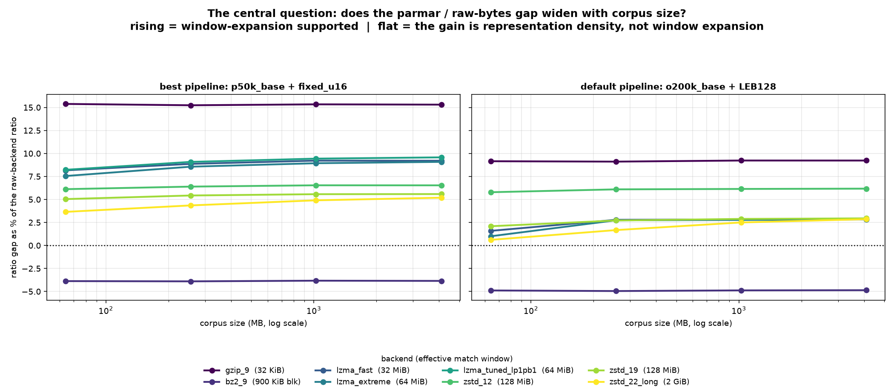
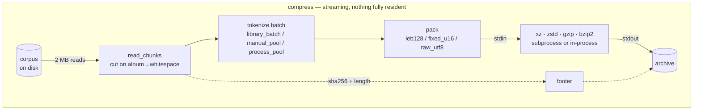
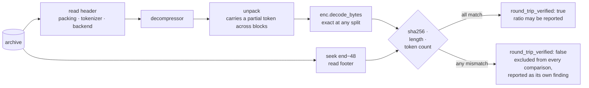
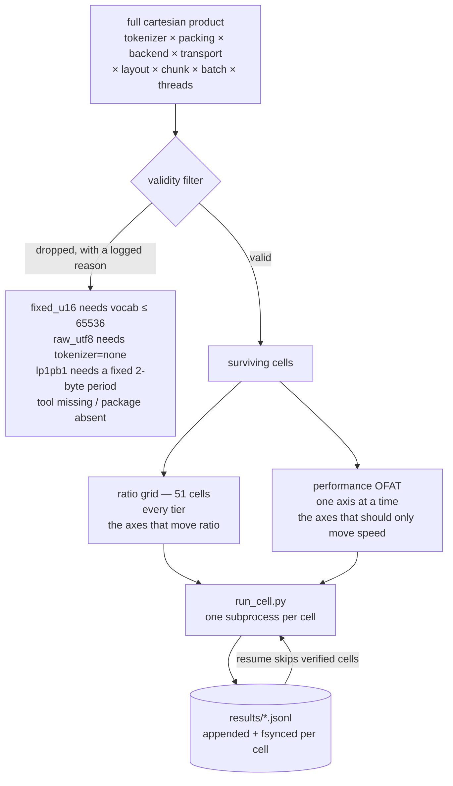
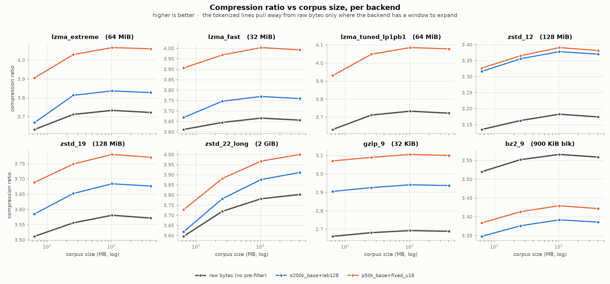
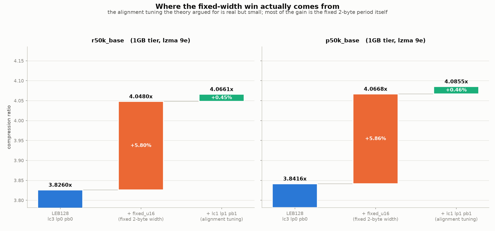
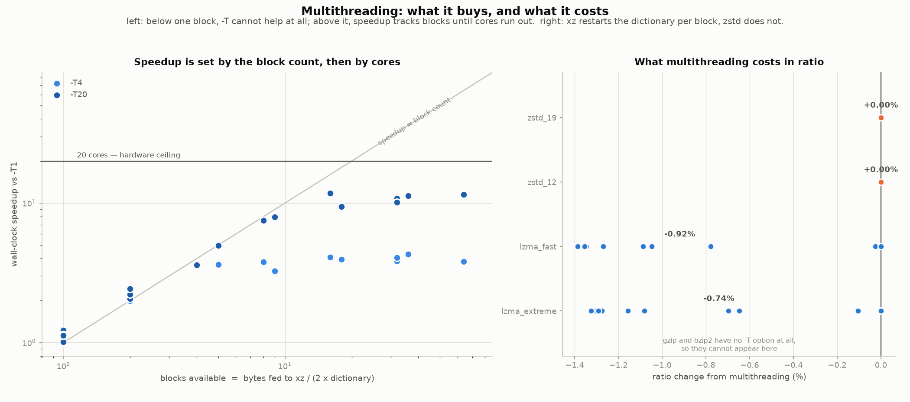
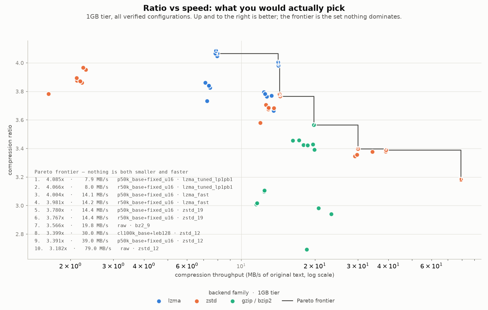

<div align="center">

<pre>
██████   █████  ██████  ███    ███  █████  ██████  
██   ██ ██   ██ ██   ██ ████  ████ ██   ██ ██   ██ 
██████  ███████ ██████  ██ ████ ██ ███████ ██████  
██      ██   ██ ██   ██ ██  ██  ██ ██   ██ ██   ██ 
██      ██   ██ ██   ██ ██      ██ ██   ██ ██   ██ 
</pre>

  <a href="../../LICENSE"></a>
  <a href="../../report/summary.md"></a>
  <a href="../../results/README.md"></a>
  <a href="../../corpus/README.md"></a>
  <a href="https://deepwiki.com/shallowbyte/parmar"></a>
  <a href="https://www.python.org/"></a>

</div>

<p align="center">
  <a href="../../README.md">English</a> ·
  <a href="README.zh-CN.md">简体中文</a> ·
  <a href="README.es.md">Español</a> ·
  <b>Português</b> ·
  <a href="README.ru.md">Русский</a> ·
  <a href="README.ja.md">日本語</a> ·
  <a href="README.de.md">Deutsch</a> ·
  <a href="README.fr.md">Français</a> ·
  <a href="README.ko.md">한국어</a>
</p>

> Este documento é uma tradução, fornecida por conveniência. O **[README em inglês](../../README.md)
> é a versão normativa** — onde este documento e o inglês divergirem, o inglês está correto.
> Código, comandos, nomes de arquivo, identificadores e todos os números permanecem sem tradução.

Um pré-filtro de tokenização em subpalavras para codificadores de entropia em nível de byte,
além do framework de testes de estresse construído para descobrir se ele realmente funciona.

> **Tour pelo código:** um tour arquitetural gerado automaticamente para este repositório
> está disponível em **[deepwiki.com/shallowbyte/parmar](https://deepwiki.com/shallowbyte/parmar)**.
> Este README é a fonte normativa para os *resultados*; o DeepWiki é a forma mais fácil de
> navegar pelo *código*.

**Resposta curta: funciona, por um motivo mais restrito do que a hipótese afirmava.**
Pré-tokenizar o texto rende **+7% a +9.6%** de taxa de compressão em relação aos bytes brutos
nas melhores configurações do LZMA2; essa vantagem **de fato aumenta com o tamanho do
corpus** — e **atinge um platô** quando o corpus fica bem além da janela do dicionário do
compressor, em vez de crescer sem limite. Na janela de 32 KiB do `gzip` a vantagem é grande
(+15%) e completamente plana, o que separa dois efeitos que antes eram confundidos entre si:
*densidade de representação* e *expansão de janela*. No `bzip2`, a pré-tokenização representa
um **prejuízo** consistente (−3.9%).

**E não é uma troca de tamanho por velocidade:** em 5 dos 7 backends, o parmar é menor *e*
**mais rápido** que os bytes brutos ao mesmo tempo, em toda camada — o compressor recebe
~45% menos bytes, e isso economiza mais tempo do que a tokenização custa. Números e método
abaixo; cada um deles vem de uma configuração cuja descompressão foi de fato executada e cujo
sha256 de fato bateu.

<picture>
  <source media="(prefers-color-scheme: dark)" srcset="../../report/ratio_gap_vs_corpus_size_dark.png">
  
</picture>

## O que é

Compressores padrão encontram repetições dentro de uma janela do dicionário deslizante de
tamanho fixo, medida em **bytes**. A premissa do parmar: substituir a prosa em UTF-8 por IDs
de tokens BPE (a mesma tokenização usada para alimentar LLMs) antes de comprimir. O fluxo de
tokens é cerca de 45% menor que o texto, de modo que um dicionário LZMA2 de 64 MiB, que
normalmente cobre ~64 MB de prosa, passa a cobrir ~120 MB de prosa depois que a prosa é
pré-encolhida.

**A afirmação só se torna testável em escala.** Em um arquivo de 5 MB, toda a entrada já cabe
dentro do dicionário, então não há janela para expandir e a pré-tokenização não rende
essencialmente nada. O produto entregue aqui, portanto, não é um único número de taxa de
compressão — é a **curva de (taxa do parmar − taxa do backend bruto) em função do tamanho do
corpus**, e se essa curva sobe.

O formato de arquivo é streaming de ponta a ponta: os blocos são lidos do identificador de
entrada, tokenizados, empacotados e enviados diretamente por pipe para um subprocesso
`xz`/`zstd` cujo stdout é o arquivo de saída. Nem o array de tokens nem o payload comprimido
ficam totalmente residentes em memória. Toda descompressão recalcula o hash dos bytes
reconstruídos e o verifica contra um sha256 no rodapé do arquivo; **nenhuma taxa é reportada
como dado válido a menos que essa verificação tenha passado.**

## Como funciona

Nada maior que um batch fica residente em memória. Os blocos saem do identificador de
entrada em streaming, são tokenizados, empacotados e vão direto para o stdin do compressor —
cujo stdout *é* o arquivo de saída, de modo que o payload comprimido nunca passa pelo Python.



A descompressão é o mesmo caminho em sentido inverso, e **sempre é executada**: toda
configuração medida é descomprimida e verificada antes que sua taxa possa contar.



### O arquivo

| deslocamento | campo |
|---|---|
| `0` | número mágico `PRMR`, versão, código de empacotamento |
| `6…` | nome do tokenizador com prefixo de tamanho, nome do backend, transporte |
| … | payload comprimido |
| `EOF−48` | `orig_len` (u64), `token_count` (u64), `sha256` (32 B) |

O rodapé fica no final porque `orig_len`, `token_count` e o hash só são conhecidos depois que
toda a entrada tiver passado em streaming. A descompressão primeiro faz seek até `size−48`.

### Como uma varredura é construída



Um produto cartesiano literal resulta em **~8,100 células válidas por camada** — semanas por
camada na vazão medida. A divisão acima é o desvio documentado: a grade de taxa é o que
produz a curva de escala, e a taxa continua sendo registrada para cada célula OFAT, de modo
que um eixo de desempenho que *de fato* move a taxa aparece como uma contradição em vez de
ser diluído pela média.


## Estrutura

| arquivo | o que é |
|---|---|
| `parmar_core.py` | o pipeline: esquemas de empacotamento, backends, transportes, layouts de tokenização, formato de arquivo, compressão/descompressão |
| `parmar.py` | CLI de pipeline único (`compress` / `decompress` / `bench` / `selftest`) |
| `resources.py` | detecção portátil de CPU/RAM/disco/ferramentas/bibliotecas |
| `build_corpus.py` | construtor do corpus PG-19, em camadas e retomável |
| `verify_boundaries.py` | teste diferencial de limite de bloco — **bloqueante** |
| `matrix.py` | geração de células, filtragem de validade, execução isolada em subprocessos, retomada |
| `run_cell.py` | uma célula da matriz, em seu próprio processo |
| `analyze.py` | tabelas de resumo + o gráfico de taxa versus tamanho do corpus |
| `test_regressions.py` | regressões para os defeitos encontrados no `parmar.py` original |
| `test_axes.py` | cada valor de eixo da matriz verificado de forma independente quanto ao round-trip |
| `FINDINGS.md` | **tudo que se revelou incorreto depois que o código pôde ser executado** |

## Configuração

```bash
python -m venv venv
./venv/Scripts/python.exe -m pip install tiktoken numpy zstandard psutil matplotlib pandas
```

Ferramentas externas usadas quando presentes: `xz` (≥5.2 para `-T`), `zstd`, `gzip`, `bzip2`.
Ferramentas ausentes não alteram o comportamento silenciosamente — as células de matriz
afetadas são puladas com um motivo impresso. O `resources.py` imprime exatamente o que
encontrou:

```bash
python resources.py
```

## Reprodução

```bash
# 1. Construir as camadas do corpus (idempotente; reexecutar verifica o sha256 e pula)
python build_corpus.py --tiers "64MB,256MB,1GB,4GB" --out ./corpus/

# 2. Teste de fumaça: uma configuração, menor camada, perfil rápido
python matrix.py smoke --corpus ./corpus/pg19_64mb.txt

# 3. Teste diferencial de segurança de limite. BLOQUEANTE -- uma falha aqui significa que
#    o chunking perturbou o fluxo de tokens e toda taxa subsequente está contaminada.
python matrix.py verify-boundaries --corpus ./corpus/pg19_64mb.txt \
    --tokenizers "o200k_base,cl100k_base,r50k_base,p50k_base" \
    --chunk-sizes "1MB,2MB,4MB"

# 4. Teste de propriedade/fuzz do empacotamento (também roda automaticamente antes de cada varredura)
python matrix.py verify-leb128 --cases 50000

# 5. Varredura de ciclo de desenvolvimento: matriz completa, menor camada, apenas backends rápidos
python matrix.py sweep --corpus ./corpus/pg19_64mb.txt --profile fast --resume

# 6. Varredura completa em uma camada, retomável, atrás do portão de estimativa pré-execução
python matrix.py sweep --corpus ./corpus/pg19_1gb.txt --profile full \
    --resume --confirm-estimate

# 7. Análise (funciona com resultados parciais -- nenhuma camada precisa estar concluída)
python analyze.py --results ./results/ --out ./report/

# 8. Reexecutar uma célula anômala pelo seu row id
python matrix.py rerun-cell --results ./results/sweep_64mb.jsonl --row-id <id>

# ou executar todo o programa em sequência, retomável a qualquer ponto
bash run_all.sh
```

`matrix.py plan --corpus ... --profile full` imprime as células geradas e o log completo de
descartes sem executar nada.

## Formato da matriz

os eixos da especificação de design, como produto cartesiano literal, geram **~8,100 células
válidas por camada de corpus**, o que, na vazão medida nesta máquina, equivale a semanas por
camada. O produto é dividido em dois:

* **grade de taxa** — cruzamento completo dos eixos que determinam a taxa (tokenizador ×
  empacotamento × backend), com as configurações de desempenho de linha de base fixas. **51
  células.** Produz a curva de taxa versus escala.
* **OFAT de desempenho** — um fator de cada vez em torno da mesma linha de base, sobre os
  eixos que deveriam afetar apenas a velocidade (threads, layout, transporte, tamanho de
  chunk, tamanho de batch), em backends representativos.

A taxa continua sendo registrada para cada célula OFAT, de modo que um eixo de desempenho que
*de fato* move a taxa aparece como uma contradição em vez de ser diluído pela média.

## Resultados

Tabelas completas em `report/summary.md`; gráficos em `report/ratio_vs_corpus_size.png` e
`report/ratio_gap_vs_corpus_size.png`. Corpus: PG-19, quatro camadas (64MB / 256MB / 1GB /
4GB), 10,629 documentos.

**452 células de matriz, 452 verificadas por round-trip, 0 falhas — 21.4 horas de tempo de
célula medido.** Todo número abaixo vem de uma configuração cuja descompressão foi de fato
executada e cujo sha256, comprimento em bytes e contagem de tokens todos bateram. Células que
falham na verificação são excluídas das comparações e listadas com destaque em sua própria
seção do resumo; não houve nenhuma. Blocos cortados em um limite sem ponto de corte seguro
para o tokenizador: **0**, em todas as 452 células.

### P1. A diferença de taxa de compressão entre o parmar e o backend bruto cresce com o tamanho do corpus?

**Sim — mas apenas para backends que têm uma janela grande o suficiente para se expandir, e a
vantagem atinge um platô quando o corpus fica alguns múltiplos além dessa janela.**

Diferença de taxa de compressão como percentual da taxa de bytes brutos do mesmo backend, com
o pipeline fixo em `p50k_base + fixed_u16`:

| backend | janela efetiva | 64MB | 256MB | 1GB | 4GB | forma |
|---|---|---|---|---|---|---|
| `gzip_9` | 32 KiB | +15.38% | +15.24% | +15.34% | +15.30% | **plana** |
| `bz2_9` | bloco de 900 KiB | −3.87% | −3.90% | −3.83% | −3.85% | **plana, negativa** |
| `zstd_12` | 128 MiB | +6.12% | +6.40% | +6.54% | +6.53% | sobe, atinge um platô |
| `zstd_19` | 128 MiB | +5.04% | +5.43% | +5.57% | +5.58% | sobe, atinge um platô |
| `lzma_fast` | 32 MiB | +8.16% | +8.87% | +9.22% | +9.21% | sobe, atinge um platô |
| `lzma_extreme` | 64 MiB | +7.55% | +8.56% | +8.94% | +9.08% | sobe, atinge um platô |
| `lzma_tuned_lp1pb1` | 64 MiB | +8.22% | +9.08% | +9.44% | +9.58% | sobe |
| `zstd_22_long` | 2 GiB | +3.65% | +4.35% | +4.91% | +5.19% | **ainda subindo** |

Nas 44 combinações de backend/pipeline: **32 aumentam, 12 são planas, 0 diminuem.** As 12
planas são exatamente as seis combinações de `gzip_9` e as seis de `bz2_9`.

O mecanismo é visível na forma da curva, não apenas no sinal:

* A janela de 32 KiB do `gzip_9` está saturada em toda camada, então seu ganho (grande, +15%)
  é **densidade de representação pura** e não cresce nada. Esse é o controle que separa os
  dois efeitos — e mostra que boa parte do benefício do parmar em pequena escala nunca teve
  relação com janelas.
* Os backends LZMA sobem de 64MB para 1GB e depois se estabilizam: uma vez que o corpus é
  ~16x o dicionário, tanto o fluxo tokenizado quanto o bruto ficam igualmente "esgotados pela
  janela" e a vantagem para de crescer.
* O `zstd_22_long`, com janela de 2 GiB, é o único backend **ainda subindo em 4GB** — porque
  4GB é apenas 2x sua janela, ou seja, ele ainda está no regime que os outros já deixaram para
  trás.

**O ponto de platô acompanha o tamanho da janela de cada backend.** Essa é a hipótese de
expansão de janela se confirmando, e é um refinamento genuíno: a afirmação original insinuava
crescimento sem limite com o tamanho do corpus, e essa parte **não** é o que acontece.

Melhores taxas absolutas (parmar comparado ao melhor backend bruto na mesma camada):

| camada | melhor parmar | melhor bruto | vantagem |
|---|---|---|---|
| 64MB | **3.9304** (`p50k+fixed_u16` / `lzma_tuned_lp1pb1`) | 3.6318 (`lzma_extreme`) | +8.22% |
| 256MB | **4.0488** | 3.7198 (`zstd_22_long`) | +8.84% |
| 1GB | **4.0855** | 3.7817 (`zstd_22_long`) | +8.03% |
| 4GB | **4.0785** | 3.8027 (`zstd_22_long`) | +7.25% |

As taxas absolutas não são perfeitamente monótonas entre as camadas porque cada camada é um
conjunto diferente de documentos; a diferença por backend acima é a comparação controlada.


<picture>
  <source media="(prefers-color-scheme: dark)" srcset="../../report/ratio_vs_corpus_size_dark.png">
  
</picture>

### P2. O `fixed_u16` + `lp=1,pb=1` supera o `LEB128` + `lc=3,lp=0,pb=0`?

**Sim, claramente — mas principalmente por um motivo diferente do que a teoria apresentava.**

Em 64MB, nos tokenizadores em que os dois empacotamentos são válidos:

| tokenizador | LEB128 + lc3/lp0/pb0 | fixed_u16 + lc3/lp0/pb0 | fixed_u16 + lc1/lp1/pb1 | ajustado vs LEB128 |
|---|---|---|---|---|
| `r50k_base` | 3.6856 | 3.8975 | 3.9214 | **+6.40%** |
| `p50k_base` | 3.6915 | 3.9060 | 3.9304 | **+6.47%** |

Decompondo esse +6.4%: trocar LEB128 → `fixed_u16` com lc/lp/pb *inalterados* vale **+5.7%**,
e o ajuste de alinhamento `lp=1,pb=1` por cima disso vale mais **+0.61%**. Ou seja, a teoria
de alinhamento está direcionalmente certa e de fato compensa — mas ~90% do ganho vem da
própria regularidade de largura fixa, não do ajuste de posição literal que foi defendido a
partir de primeiros princípios. Ainda assim, o `lzma_tuned_lp1pb1` é a configuração de melhor
taxa em toda camada testada.


<picture>
  <source media="(prefers-color-scheme: dark)" srcset="../../report/packing_decomposition_dark.png">
  
</picture>

### P3. O `manual_pool` chega a superar o `library_batch`?

**Não. Este é um resultado negativo claro — a hipótese não se sustentou.**

Nas duas camadas em que a comparação está disponível, o `manual_pool` superou o
`library_batch` em **exatamente 8 das 16** configurações comparáveis. Isso é puro acaso. Os
deltas individuais oscilam entre −6.8% e +44%, em ambas as direções, sem um padrão consistente
por número de threads, tamanho de chunk, backend ou tamanho de corpus.

As oscilações são grandes em termos percentuais porque a quantidade medida é pequena e
ruidosa: a tokenização representa ~0.7–3.4 s de uma célula que leva de 20 s a 60 min, e duas
execuções nominalmente idênticas de `library_batch` do *mesmo trabalho* diferem em até 0.71 s
contra 1.24 s. O efeito medido é da mesma ordem de grandeza que o ruído de medição, o que em
si já é o resultado.

**Conclusão: o pool de workers feito à mão não vale a complexidade que traz.** O
`encode_ordinary_batch` do tiktoken já libera o GIL e paraleliza internamente em Rust; não há
margem acima disso para a coordenação do lado Python recuperar. O `process_pool` ainda paga o
custo de spawn do Windows (~1–2 s e ~100 MB por worker) sem nenhum retorno. A especificação de
design estava certa ao marcar isso como uma questão empírica em aberto, em vez de uma decisão
de design já resolvida — e a resposta é que a opção simples vence.

### P4. Qual é a curva real de aceleração do `xz -T`, e onde entra em ação o piso?

**O piso de 2x o dicionário previsto na especificação de design é real, e a aceleração acima
dele é governada pelo número de blocos — que a pré-tokenização reduz.**

A quantidade que importa é o tamanho do fluxo *alimentado ao xz* (o fluxo de tokens
empacotado), não o corpus e nem a saída comprimida. Blocos = `alimentado / (2 x dicionário)`:

| camada | pipeline | backend | alimentado ao xz | blocos | T4 | T20 | custo de taxa |
|---|---|---|---|---|---|---|---|
| 64MB | raw | `lzma_extreme` | 64 MB | **1** | 1.01× | 1.01× | **0.00%** |
| 64MB | `r50k+fixed_u16` | `lzma_extreme` | 36 MB | **1** | 1.12× | 1.13× | **0.00%** |
| 64MB | `o200k+leb128` | `lzma_fast` | <64 MB | **1** | 1.17× | 1.22× | **0.00%** |
| 1GB | `r50k+fixed_u16` | `lzma_extreme` | 579 MB | **5** | 3.61× | **4.97×** | −1.30% |
| 1GB | raw | `lzma_extreme` | 1025 MB | **8** | 3.78× | **7.49×** | −1.16% |
| 1GB | `r50k+fixed_u16` | `lzma_fast` | 579 MB | **9** | 3.26× | **7.94×** | −1.38% |
| 1GB | raw | `lzma_fast` | 1025 MB | **16** | 4.10× | **11.76×** | −1.35% |

Em 4GB, o número de blocos ultrapassa o número de núcleos, e a restrição muda:

| camada | pipeline | backend | alimentado ao xz | blocos | T4 | T20 | custo de taxa |
|---|---|---|---|---|---|---|---|
| 4GB | `r50k+fixed_u16` | `lzma_extreme` | 2315 MB | 18 | 3.96× | 9.43× | −1.29% |
| 4GB | raw | `lzma_extreme` | 4096 MB | 32 | 3.85× | 10.82× | −1.27% |
| 4GB | `r50k+fixed_u16` | `lzma_fast` | 2315 MB | 36 | 4.31× | 11.28× | −1.35% |
| 4GB | raw | `lzma_fast` | 4096 MB | 64 | 3.81× | 11.48× | −1.36% |

**Há três regimes, e o `-T` se comporta de forma completamente diferente em cada um:**

**1. Abaixo do piso (`alimentado < 2 x dicionário`) — um bloco.** O `-T` não rende nada
(0.99–1.22×) e não custa nada. A taxa é bit a bit idêntica entre T1/T4/T20, o que *confirma*
que nenhuma divisão ocorreu, em vez de apenas inferir isso. É o regime em que a camada de
64MB se encontra, e é por isso que os experimentos originais de 5 MB não viram nenhum
benefício de multithreading.

**2. Blocos < núcleos — a aceleração acompanha o número de blocos quase 1:1.** Em 1GB: 5
blocos → 4.97×, 8 → 7.49×, 9 → 7.94×, 16 → 11.76×. Threads além do número de blocos não fazem
nada.

**3. Blocos > núcleos — a aceleração satura no hardware.** Em 4GB, de 18 a 64 blocos, todos
caem entre 9.4–11.5× em 20 núcleos (~50% de eficiência paralela). Mais blocos deixam de
ajudar.

Portanto, o número útil de threads é aproximadamente
**`min(fed_bytes / (2 x dict_size), cores)`**.

**A pré-tokenização tem um custo oculto de paralelismo que não havia sido apontado.** Como o
parmar reduz a entrada do compressor em ~45%, ele também reduz o número de blocos para um
tamanho de bloco fixo. No mesmo corpus e backend de 1GB, os bytes brutos obtêm 8 blocos e
7.49× enquanto o `fixed_u16` obtém 5 blocos e 4.97× — o parmar abre mão de **~34% da
aceleração multithread disponível** em troca de seu ganho de taxa. Em 4GB isso desaparece,
porque ambos já estão além do teto de número de núcleos de qualquer forma. É uma troca real
apenas no regime 2.

O custo de taxa do multithreading é de **~1.3% para o LZMA em toda escala** e, notavelmente,
**exatamente 0.00% para o zstd** em todo nível e camada testados — o multithreading do zstd
não reinicia a janela entre jobs da forma como os blocos independentes do xz fazem. Se você
precisa de multithreading sem penalidade de taxa, essa é uma razão concreta para preferir o
zstd em vez do xz aqui.

<picture>
  <source media="(prefers-color-scheme: dark)" srcset="../../report/thread_scaling_dark.png">
  
</picture>

### Qual configuração você deveria realmente usar?

<picture>
  <source media="(prefers-color-scheme: dark)" srcset="../../report/ratio_vs_throughput_pareto_dark.png">
  
</picture>

A fronteira vai de **3.18x a 79 MB/s** (raw + `zstd_12`) a **4.09x a 7.9 MB/s**
(`p50k_base+fixed_u16` + `lzma_tuned_lp1pb1`) — uma diferença de tamanho de 29% para uma
diferença de velocidade de 10x. O `p50k_base+fixed_u16` aparece em quase todo ponto dela, o
que é a lição prática: a escolha do empacotamento é quase gratuita, e é no backend que está a
troca.

### O resultado que mais importa na prática

Pré-tokenizar não é uma troca de tamanho por velocidade. Em **5 dos 7 backends, em toda
camada, o parmar é menor *e* mais rápido que os bytes brutos simultaneamente** — porque o
compressor recebe ~45% menos bytes, e o tempo economizado ao comprimi-los excede o tempo
gasto na tokenização.

| backend | bruto | melhor parmar | veredito |
|---|---|---|---|
| `lzma_extreme` @4GB | 3.7221x @ 11.6 MB/s | **4.0454x @ 16.9 MB/s** | menor **e** 1.5x mais rápido |
| `lzma_fast` @64MB | 3.6114x @ 0.45 MB/s | **3.9061x @ 2.93 MB/s** | menor **e** 6.5x mais rápido |
| `gzip_9` @1GB | 2.6928x @ 18.5 MB/s | **2.9413x @ 23.4 MB/s** | menor **e** mais rápido |
| `zstd_19` @4GB | 3.5714x @ 14.4 MB/s | **3.6765x @ 23.3 MB/s** | menor **e** 1.6x mais rápido |
| `zstd_22_long` @1GB | 3.7817x @ 1.6 MB/s | **3.9513x @ 2.3 MB/s** | menor **e** mais rápido |
| `zstd_12` @1GB | 3.1825x @ 79.0 MB/s | 3.3905x @ 39.0 MB/s | menor, mas **2x mais lento** |
| `bz2_9` @1GB | **3.5659x** @ 19.8 MB/s | 3.4571x @ 17.2 MB/s | **o bruto vence de longe** |

As duas exceções são informativas. O `zstd_12` é rápido o suficiente para que a tokenização se
torne o gargalo, então acima de 256MB o parmar compra tamanho a um custo real de velocidade. O
`bz2_9` perde nos dois quesitos — a transformada de Burrows-Wheeler do bzip2 explora uma
estrutura de texto em nível de byte que a tokenização destrói.

## Casos de uso

Baseados nas medições acima, não em especulação:

- **Arquivamento de grandes corpora de prosa.** O caso mais forte: com `lzma` ou `zstd` em
  nível alto, você ganha ao mesmo tempo um arquivo menor e uma execução de compressão mais
  curta.
- **Qualquer coisa presa ao gzip/deflate.** O `gzip_9` ganha **+15%** e, de forma incomum,
  ganha isso em *todo* tamanho de corpus — porque a janela de 32 KiB do gzip está sempre
  saturada, então o benefício é densidade de representação pura, sem limiar de escala. Se
  você não pode trocar o compressor, mas pode mudar o que alimenta a ele, esse é o ganho mais
  claro aqui, e funciona também em entradas pequenas.
- **Armazenamento de texto que de qualquer forma será tokenizado** — shards de treinamento de
  LLM, conjuntos de avaliação, corpora de recuperação. Os tokens *são* o payload, então um
  leitor pula inteiramente a retokenização na saída. Esse é um ganho de sistema além do ganho
  de taxa.
- **Armazenamento frio, com baixa frequência de leitura.** A descompressão carrega um custo
  de destokenização que a compressão não tem, então a assimetria favorece o padrão de gravar
  uma vez e ler raramente.

## Escopo e não objetivos

- **Não é um arquivador de uso geral.** Um arquivo não é autocontido: ele registra o *nome*
  do tokenizador, não seu vocabulário, então a descompressão precisa da exata mesma
  codificação `tiktoken` disponível. Trate os arquivos como acoplados à sua versão de
  tokenizador.
- **Não é um formato seguro.** Sem criptografia e sem autenticação. O sha256 do rodapé é uma
  verificação de integridade contra corrupção, armazenado em claro ao lado dos dados que
  descreve — não é um MAC. Veja [`SECURITY.md`](../../SECURITY.md).
- **Não validado em texto que não seja prosa.** Todo número aqui é prosa em inglês (PG-19).
  Código, JSON, logs e marcação não foram testados e poderiam se comportar de forma diferente
  em qualquer direção.
- **Não é uma jogada de velocidade na ponta rápida.** Se você já está em `zstd -12` ou abaixo
  por causa da vazão, pré-tokenizar custa velocidade acima de 256MB.
- **Não serve para o bzip2.** Medido como um prejuízo consistente; não use os dois juntos.

## Limitações

Lista honesta, todas medidas ou documentadas, não apenas suspeitadas:

- **A regra de limite de chunk exige um alfanumérico ASCII seguido de espaço em branco.**
  Sequências ininterruptas de dígitos, blocos de pontuação pura e escritas sem espaçamento
  como CJK não têm ponto de corte seguro. O chunker recai para um corte apenas seguro em
  UTF-8 e **conta isso** em `unsafe_boundary_cuts`, carregado em cada linha de resultado. No
  PG-19, essa contagem é zero em toda camada e tamanho de chunk — em um corpus chinês ou
  japonês não seria.
- **O `fixed_u16` — o empacotamento de melhor desempenho — só funciona para vocabulários ≤
  65,536**, ou seja, `r50k_base` e `p50k_base`. Os tokenizadores modernos de vocabulário
  grande não podem usá-lo e ficam presos ao LEB128, de onde veio a maior parte do ganho de
  taxa.
- **A pré-tokenização reduz o paralelismo multithread.** Menos bytes alimentados ao `xz`
  significa menos blocos; em 1GB isso custa ~34% da aceleração `-T` disponível.
- **Todas as medições de tempo vêm de uma única máquina** (20 núcleos, Windows). As taxas são
  independentes de plataforma; os números de vazão e de escala de threads não são.
- **O limite do platô só está estabelecido até 4GB.** O `zstd_22_long` ainda estava subindo
  na camada mais alta, então seu teto não foi medido.

## Trabalho futuro

Ordenado por quanto cada um realmente ensinaria:

1. **Varrer o tamanho do dicionário em vez do tamanho do corpus.** O platô acompanha a
   *janela*, não o corpus, então variar `dict_size` em um corpus fixo de 1GB isolaria o
   mecanismo de forma muito mais barata do que a escada de corpus fez — e previria o ponto de
   platô para qualquer backend, em vez de observá-lo backend por backend.
2. **Remapear os IDs de token por frequência antes do empacotamento.** O LEB128 gasta 3 bytes
   em qualquer ID acima de 16,383, e o `o200k_base` coloca a maior parte de seu vocabulário
   ali. Renumerar os IDs por frequência no corpus moveria os tokens comuns para a faixa de
   1–2 bytes. Esta é a ideia não testada mais promissora para fechar a diferença entre
   LEB128 e `fixed_u16` em tokenizadores de vocabulário grande.
3. **Corpora que não são prosa**, código-fonte em primeiro lugar — ele é altamente repetitivo
   em nível de token e seu comportamento de pré-tokenização é muito diferente do da prosa.
4. **Uma regra de corte para escritas sem espaçamento**, o que tornaria a técnica utilizável
   em texto CJK.
5. **Uma camada de 8GB+**, puramente para encontrar onde a janela de 2 GiB do `zstd_22_long`
   atinge o platô.
6. **Tokenizadores SentencePiece / Gemma**, deliberadamente excluídos desta rodada porque
   exigem download de modelo com acesso restrito e quebrariam a propriedade de funcionar em
   qualquer lugar.


## Corpus

`deepmind/pg19` (Apache 2.0) — Rae et al. 2019, *Compressive Transformers for Long-Range
Sequence Modelling*, arXiv:1911.05507.

Observe que `datasets.load_dataset("deepmind/pg19", streaming=True)` **não funciona**: o
repositório no Hub carrega apenas um script de carregamento e listas de arquivos, não tem
parquet, e seu branch `refs/convert/parquet` também não tem dados — enquanto os scripts de
carregamento foram removidos no `datasets` 3.0. O `build_corpus.py` busca os livros
diretamente do bucket GCS público para o qual o script aponta. Veja `FINDINGS.md` §1.

<sub>Traduzido a partir de <code>README.md</code> no commit <code>4af1fd0</code>. Onde este e o README em inglês divergirem, o inglês está correto.</sub>
