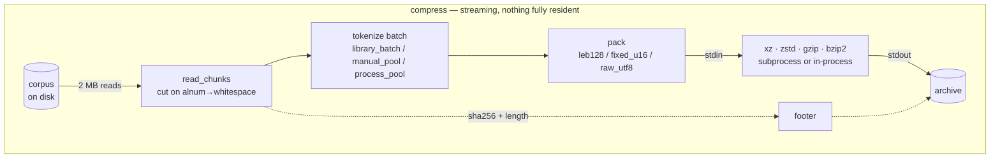
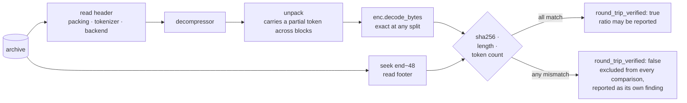
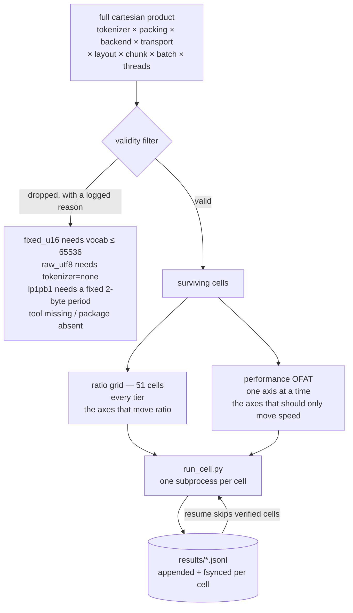

<div align="center">

<pre>
██████   █████  ██████  ███    ███  █████  ██████  
██   ██ ██   ██ ██   ██ ████  ████ ██   ██ ██   ██ 
██████  ███████ ██████  ██ ████ ██ ███████ ██████  
██      ██   ██ ██   ██ ██  ██  ██ ██   ██ ██   ██ 
██      ██   ██ ██   ██ ██      ██ ██   ██ ██   ██ 
</pre>

  <a href="../../LICENSE"></a>
  <a href="../../report/summary.md"></a>
  <a href="../../results/README.md"></a>
  <a href="../../corpus/README.md"></a>
  <a href="https://deepwiki.com/shallowbyte/parmar"></a>
  <a href="https://www.python.org/"></a>

</div>

<p align="center">
  <a href="../../README.md">English</a> ·
  <a href="README.zh-CN.md">简体中文</a> ·
  <a href="README.es.md">Español</a> ·
  <a href="README.pt-BR.md">Português</a> ·
  <b>Русский</b> ·
  <a href="README.ja.md">日本語</a> ·
  <a href="README.de.md">Deutsch</a> ·
  <a href="README.fr.md">Français</a> ·
  <a href="README.ko.md">한국어</a>
</p>

> Этот документ является переводом и предоставлен для удобства чтения.
> **[Английский README](../../README.md) является нормативной версией** —
> при расхождениях между версиями следует руководствоваться английским текстом.
> Код, команды, имена файлов, идентификаторы и все числовые значения оставлены без перевода.

Предфильтр на основе субсловной токенизации для байт-ориентированных энтропийных
кодеров, а также стресс-тестовый стенд, созданный, чтобы выяснить, действительно ли
он работает.

> **Обзор кода:** автоматически сгенерированный архитектурный обзор этого репозитория
> доступен по адресу **[deepwiki.com/shallowbyte/parmar](https://deepwiki.com/shallowbyte/parmar)**.
> Этот README является нормативным источником для *результатов*; DeepWiki — более
> удобный способ ориентироваться в *коде*.

**Короткий ответ: это работает, но по более узкой причине, чем утверждала гипотеза.**
Предварительная токенизация текста даёт выигрыш в коэффициенте сжатия **от +7% до
+9.6%** по сравнению с сырыми байтами при наилучших настройках LZMA2; это преимущество
**действительно расширяется с ростом размера корпуса** — и **выходит на плато**, как
только размер корпуса значительно превышает окно словаря компрессора, вместо того
чтобы расти без ограничений. На окне `gzip` размером 32 KiB преимущество велико (+15%)
и совершенно плоское, что разделяет два эффекта, ранее смешивавшихся: *плотность
представления* и *расширение окна*. На `bzip2` предварительная токенизация стабильно
**проигрывает** (−3.9%).

**И это не компромисс «размер за скорость»:** на 5 из 7 бэкендов parmar одновременно
меньше *и* **быстрее**, чем сырые байты, на каждом уровне — компрессору передаётся
примерно на 45% меньше байт, и это экономит больше времени, чем стоит токенизация.
Цифры и методика — ниже; каждая из них получена из конфигурации, для которой
распаковка была реально выполнена, а sha256 реально совпал.

<picture>
  <source media="(prefers-color-scheme: dark)" srcset="../../report/ratio_gap_vs_corpus_size_dark.png">
  
</picture>

## Что это такое

Стандартные компрессоры ищут повторы внутри скользящего словарного окна фиксированного
размера, измеряемого в **байтах**. Идея parmar: перед сжатием заменить UTF-8-прозу на
идентификаторы BPE-токенов (та же токенизация, что используется для подачи данных в
LLM). Поток токенов примерно на 45% меньше исходного текста, поэтому словарь LZMA2
размером 64 MiB, который обычно покрывает ~64 MB прозы, после предварительного сжатия
прозы может покрыть ~120 MB прозы.

**Это утверждение становится проверяемым только на больших масштабах.** На файле
размером 5 MB весь вход уже целиком помещается в словарь, поэтому расширять окно
нечем, и предварительная токенизация практически ничего не даёт. Поэтому итоговым
результатом здесь является не одно число коэффициента сжатия — а **кривая
(коэффициент parmar − коэффициент raw-backend) как функция размера корпуса**, и то,
растёт ли эта кривая.

Формат архива потоковый от начала до конца: чанки читаются из входного дескриптора,
токенизируются, упаковываются и передаются напрямую в подпроцесс `xz`/`zstd`, чей
stdout и есть выходной файл. Ни массив токенов, ни сжатая полезная нагрузка никогда не
находятся в памяти целиком. Каждая распаковка заново вычисляет хеш восстановленных
байт и сверяет его с sha256 в футере архива; **ни один коэффициент сжатия не
публикуется как достоверные данные, пока эта проверка не пройдена.**

## Как это работает

В памяти никогда не находится больше одного батча. Чанки потоком идут из входного
дескриптора, токенизируются, упаковываются и сразу попадают в stdin компрессора — чей
stdout *и есть* выходной файл, поэтому сжатая полезная нагрузка никогда не проходит
через Python.



Распаковка — тот же путь в обратном направлении, и она **выполняется всегда**: каждая
измеренная конфигурация распаковывается и проверяется прежде, чем её коэффициент
сжатия разрешается учитывать.



### Архив

| смещение | поле |
|---|---|
| `0` | магическое число `PRMR`, версия, код упаковки |
| `6…` | имя токенизатора, имя бэкенда, транспорт (с префиксом длины) |
| … | сжатая полезная нагрузка |
| `EOF−48` | `orig_len` (u64), `token_count` (u64), `sha256` (32 B) |

Футер расположен в конце, потому что `orig_len`, `token_count` и хеш неизвестны до тех
пор, пока весь вход не пройдёт через поток целиком. Распаковка сначала переходит
(seek) к позиции `size−48`.

### Как строится sweep



Буквальное декартово произведение даёт **~8,100 допустимых ячеек на уровень** — при
измеренной пропускной способности это недели работы на каждый уровень. Разделение,
показанное выше, — задокументированное отклонение от этого подхода: именно сетка
коэффициентов сжатия (ratio grid) формирует кривую зависимости от масштаба, а
коэффициент сжатия по-прежнему фиксируется для каждой ячейки OFAT, поэтому ось
производительности, которая *действительно* влияет на коэффициент сжатия, проявляется
как противоречие, а не усредняется и теряется.


## Структура

| файл | что это такое |
|---|---|
| `parmar_core.py` | конвейер: схемы упаковки, бэкенды, транспорты, схемы токенизации, формат архива, сжатие/распаковка |
| `parmar.py` | CLI для одного конвейера (`compress` / `decompress` / `bench` / `selftest`) |
| `resources.py` | переносимое определение CPU/RAM/диска/инструментов/библиотек |
| `build_corpus.py` | построитель корпуса PG-19, по уровням и с возможностью возобновления |
| `verify_boundaries.py` | дифференциальный тест границ чанков — **блокирующий** |
| `matrix.py` | генерация ячеек, фильтрация допустимости, выполнение с изоляцией по подпроцессам, возобновление |
| `run_cell.py` | одна ячейка матрицы, в собственном процессе |
| `analyze.py` | сводные таблицы + график коэффициента сжатия в зависимости от размера корпуса |
| `test_regressions.py` | регрессионные тесты для дефектов, найденных в исходном `parmar.py` |
| `test_axes.py` | независимая проверка round-trip для каждого значения каждой оси матрицы |
| `FINDINGS.md` | **всё, что оказалось неверным после того, как код действительно удалось запустить** |

## Установка

```bash
python -m venv venv
./venv/Scripts/python.exe -m pip install tiktoken numpy zstandard psutil matplotlib pandas
```

Внешние инструменты, используемые при наличии: `xz` (≥5.2 для `-T`), `zstd`, `gzip`,
`bzip2`. Отсутствие инструмента не меняет поведение незаметно — соответствующие ячейки
матрицы пропускаются с выводом причины. `resources.py` печатает именно то, что было
обнаружено:

```bash
python resources.py
```

## Воспроизведение

```bash
# 1. Построение уровней корпуса (идемпотентно; повторный запуск проверяет sha256 и пропускает готовое)
python build_corpus.py --tiers "64MB,256MB,1GB,4GB" --out ./corpus/

# 2. Дымовой тест: одна конфигурация, наименьший уровень, быстрый профиль
python matrix.py smoke --corpus ./corpus/pg19_64mb.txt

# 3. Дифференциальный тест безопасности границ. БЛОКИРУЮЩИЙ -- сбой здесь означает,
#    что разбиение на чанки искажает поток токенов, и все последующие коэффициенты
#    сжатия заражены.
python matrix.py verify-boundaries --corpus ./corpus/pg19_64mb.txt \
    --tokenizers "o200k_base,cl100k_base,r50k_base,p50k_base" \
    --chunk-sizes "1MB,2MB,4MB"

# 4. Тест свойств/fuzz-тест упаковки (также автоматически запускается перед каждым sweep)
python matrix.py verify-leb128 --cases 50000

# 5. Sweep для цикла разработки: полная матрица, наименьший уровень, только быстрые бэкенды
python matrix.py sweep --corpus ./corpus/pg19_64mb.txt --profile fast --resume

# 6. Полный sweep на одном уровне, с возможностью возобновления, за порогом предварительной оценки
python matrix.py sweep --corpus ./corpus/pg19_1gb.txt --profile full \
    --resume --confirm-estimate

# 7. Анализ (работает и на частичных результатах -- ни один уровень не обязан быть завершён)
python analyze.py --results ./results/ --out ./report/

# 8. Повторный запуск одной аномальной ячейки по идентификатору строки
python matrix.py rerun-cell --results ./results/sweep_64mb.jsonl --row-id <id>

# или запустить всю программу последовательно, с возможностью возобновления в любой точке
bash run_all.sh
```

`matrix.py plan --corpus ... --profile full` выводит сгенерированные ячейки и полный
журнал отбраковки, ничего не выполняя.

## Форма матрицы

Оси спецификации дизайна в виде буквального декартова произведения дают **~8,100
допустимых ячеек на уровень корпуса**, что при измеренной на этой машине пропускной
способности составляет недели на уровень. Это произведение разбивается на две части:

* **сетка коэффициентов сжатия (ratio grid)** — полное перекрёстное произведение осей,
  определяющих коэффициент сжатия (токенизатор × упаковка × бэкенд), при фиксированных
  базовых настройках производительности. **51 ячейка.** Формирует кривую зависимости
  коэффициента от масштаба.
* **OFAT-перебор производительности** — по одному фактору за раз вокруг той же базовой
  конфигурации, по осям, которые должны влиять только на скорость (число потоков,
  схема токенизации, транспорт, размер чанка, размер батча), на репрезентативных
  бэкендах.

Коэффициент сжатия по-прежнему фиксируется для каждой ячейки OFAT, поэтому ось
производительности, которая *действительно* влияет на коэффициент сжатия, проявляется
как противоречие, а не усредняется и теряется.

## Результаты

Полные таблицы — в `report/summary.md`; графики — в `report/ratio_vs_corpus_size.png`
и `report/ratio_gap_vs_corpus_size.png`. Корпус: PG-19, четыре уровня (64MB / 256MB /
1GB / 4GB), 10,629 документов.

**452 ячейки матрицы, 452 прошли round-trip-проверку, 0 сбоев — 21.4 часа измеренного
времени по ячейкам.** Каждое число ниже получено из конфигурации, для которой
распаковка была реально выполнена, а sha256, длина в байтах и количество токенов — все
совпали. Ячейки, не прошедшие проверку, исключаются из сравнений и явно перечисляются
в отдельном разделе сводки; таких не было. Число чанков, разрезанных на границе без
токенизатор-безопасной точки разреза: **0**, среди всех 452 ячеек.

### Вопрос 1. Растёт ли разрыв коэффициентов сжатия между parmar и raw-backend с ростом размера корпуса?

**Да — но только для тех бэкендов, чьё окно достаточно велико, чтобы расширяться, и по
мере того как размер корпуса превышает это окно в несколько раз, разрыв выходит на
плато.**

Разрыв коэффициентов сжатия в процентах от коэффициента сжатия того же бэкенда на
сырых байтах; конвейер зафиксирован как `p50k_base + fixed_u16`:

| бэкенд | эффективное окно | 64MB | 256MB | 1GB | 4GB | форма |
|---|---|---|---|---|---|---|
| `gzip_9` | 32 KiB | +15.38% | +15.24% | +15.34% | +15.30% | **плоская** |
| `bz2_9` | 900 KiB блок | −3.87% | −3.90% | −3.83% | −3.85% | **плоская, отрицательная** |
| `zstd_12` | 128 MiB | +6.12% | +6.40% | +6.54% | +6.53% | растёт, выходит на плато |
| `zstd_19` | 128 MiB | +5.04% | +5.43% | +5.57% | +5.58% | растёт, выходит на плато |
| `lzma_fast` | 32 MiB | +8.16% | +8.87% | +9.22% | +9.21% | растёт, выходит на плато |
| `lzma_extreme` | 64 MiB | +7.55% | +8.56% | +8.94% | +9.08% | растёт, выходит на плато |
| `lzma_tuned_lp1pb1` | 64 MiB | +8.22% | +9.08% | +9.44% | +9.58% | растёт |
| `zstd_22_long` | 2 GiB | +3.65% | +4.35% | +4.91% | +5.19% | **всё ещё растёт** |

Среди всех 44 комбинаций бэкенд/конвейер: **32 расширяются, 12 плоские, 0 сужаются.**
Эти 12 плоских — это ровно шесть комбинаций `gzip_9` и шесть комбинаций `bz2_9`.

Механизм виден по форме кривой, а не только по знаку:

* Окно `gzip_9` размером 32 KiB насыщено на каждом уровне, поэтому его (крупный, +15%)
  выигрыш — это **чистая плотность представления**, и он вообще не растёт. Это
  контрольный случай, который разделяет два эффекта — и он показывает, что бОльшая
  часть выигрыша parmar на малом масштабе никогда не была связана с окнами.
* Бэкенды LZMA растут с 64MB до 1GB, а затем выходят на плато: как только корпус
  достигает ~16-кратного размера словаря, и токенизированный, и сырой поток одинаково
  «упираются в окно», и преимущество перестаёт расти.
* `zstd_22_long`, с окном 2 GiB, — единственный бэкенд, **всё ещё растущий на 4GB** —
  потому что 4GB составляет лишь 2-кратный размер его окна, то есть он всё ещё
  находится в том режиме, который остальные уже покинули.

**Точка выхода на плато следует за размером окна каждого бэкенда.** Это гипотеза
расширения окна, подтверждающая саму себя, и это реальное уточнение: исходное
утверждение подразумевало неограниченный рост с размером корпуса, и именно этого
**не** происходит.

Лучшие абсолютные коэффициенты сжатия (parmar против лучшего raw-бэкенда на том же
уровне):

| уровень | лучший parmar | лучший raw | преимущество |
|---|---|---|---|
| 64MB | **3.9304** (`p50k+fixed_u16` / `lzma_tuned_lp1pb1`) | 3.6318 (`lzma_extreme`) | +8.22% |
| 256MB | **4.0488** | 3.7198 (`zstd_22_long`) | +8.84% |
| 1GB | **4.0855** | 3.7817 (`zstd_22_long`) | +8.03% |
| 4GB | **4.0785** | 3.8027 (`zstd_22_long`) | +7.25% |

Абсолютные коэффициенты сжатия не строго монотонны по уровням, потому что каждый
уровень — это другой набор документов; разрыв по бэкендам выше — это контролируемое
сравнение.


<picture>
  <source media="(prefers-color-scheme: dark)" srcset="../../report/ratio_vs_corpus_size_dark.png">
  
</picture>

### Вопрос 2. Превосходит ли `fixed_u16` + `lp=1,pb=1` `LEB128` + `lc=3,lp=0,pb=0`?

**Да, явно превосходит — но в основном по иной причине, чем давала теория.**

На уровне 64MB, для токенизаторов, где обе схемы упаковки допустимы:

| токенизатор | LEB128 + lc3/lp0/pb0 | fixed_u16 + lc3/lp0/pb0 | fixed_u16 + lc1/lp1/pb1 | tuned против LEB128 |
|---|---|---|---|---|
| `r50k_base` | 3.6856 | 3.8975 | 3.9214 | **+6.40%** |
| `p50k_base` | 3.6915 | 3.9060 | 3.9304 | **+6.47%** |

Разложение этих +6.4%: переход с LEB128 на `fixed_u16` при *неизменных* lc/lp/pb даёт
**+5.7%**, а настройка выравнивания `lp=1,pb=1` сверху добавляет ещё **+0.61%**. То
есть теория выравнивания верна по направлению и действительно приносит пользу — но
около 90% выигрыша даёт сама регулярность фиксированной ширины, а не настройка позиции
литералов, обоснованная из первых принципов. Тем не менее `lzma_tuned_lp1pb1`
остаётся конфигурацией с наилучшим коэффициентом сжатия на каждом протестированном
уровне.


<picture>
  <source media="(prefers-color-scheme: dark)" srcset="../../report/packing_decomposition_dark.png">
  
</picture>

### Вопрос 3. Превосходит ли когда-либо `manual_pool` `library_batch`?

**Нет. Это чистый отрицательный результат — гипотеза не подтвердилась.**

На обоих уровнях, где сравнение доступно, `manual_pool` превзошёл `library_batch`
ровно в **8 из 16** сопоставимых конфигураций. Это уровень случайности. Отдельные
отклонения колеблются от −6.8% до +44%, в обе стороны, без устойчивой закономерности
по числу потоков, размеру чанка, бэкенду или размеру корпуса.

Колебания велики в процентном выражении потому, что измеряемая величина мала и
зашумлена: токенизация занимает ~0.7–3.4 с в ячейке, которая целиком занимает от 20 с
до 60 мин, а два номинально идентичных прогона `library_batch` над *одной и той же
работой* отличаются вплоть до 0.71 с против 1.24 с. Измеряемый эффект — того же
порядка, что и шум измерения, и это само по себе и есть находка.

**Вывод: самописный пул воркеров не стоит своей сложности.** `encode_ordinary_batch`
из tiktoken уже освобождает GIL и распараллеливается внутри на Rust; над ним нет
запаса, который координация на стороне Python могла бы отыграть. `process_pool`
дополнительно платит за Windows-специфичную стоимость spawn (~1–2 с и ~100 MB на
воркер), не получая ничего взамен. Спецификация дизайна была права, пометив этот
вопрос как открытый эмпирический, а не как устоявшееся решение — и ответ таков, что
побеждает простой вариант.

### Вопрос 4. Какова реальная кривая ускорения `xz -T` и где начинает действовать нижний порог?

**Нижний порог в 2 размера словаря из спецификации дизайна реален, а ускорение выше
этого порога определяется числом блоков — которое предварительная токенизация
уменьшает.**

Значение имеет размер потока, *подаваемого на вход xz* (упакованный поток токенов), а
не размер корпуса и не размер сжатого вывода. Число блоков = `fed / (2 x dict)`:

| уровень | конвейер | бэкенд | подано на xz | блоков | T4 | T20 | цена по коэффициенту |
|---|---|---|---|---|---|---|---|
| 64MB | raw | `lzma_extreme` | 64 MB | **1** | 1.01× | 1.01× | **0.00%** |
| 64MB | `r50k+fixed_u16` | `lzma_extreme` | 36 MB | **1** | 1.12× | 1.13× | **0.00%** |
| 64MB | `o200k+leb128` | `lzma_fast` | <64 MB | **1** | 1.17× | 1.22× | **0.00%** |
| 1GB | `r50k+fixed_u16` | `lzma_extreme` | 579 MB | **5** | 3.61× | **4.97×** | −1.30% |
| 1GB | raw | `lzma_extreme` | 1025 MB | **8** | 3.78× | **7.49×** | −1.16% |
| 1GB | `r50k+fixed_u16` | `lzma_fast` | 579 MB | **9** | 3.26× | **7.94×** | −1.38% |
| 1GB | raw | `lzma_fast` | 1025 MB | **16** | 4.10× | **11.76×** | −1.35% |

На уровне 4GB число блоков превышает число ядер, и ограничение меняется:

| уровень | конвейер | бэкенд | подано на xz | блоков | T4 | T20 | цена по коэффициенту |
|---|---|---|---|---|---|---|---|
| 4GB | `r50k+fixed_u16` | `lzma_extreme` | 2315 MB | 18 | 3.96× | 9.43× | −1.29% |
| 4GB | raw | `lzma_extreme` | 4096 MB | 32 | 3.85× | 10.82× | −1.27% |
| 4GB | `r50k+fixed_u16` | `lzma_fast` | 2315 MB | 36 | 4.31× | 11.28× | −1.35% |
| 4GB | raw | `lzma_fast` | 4096 MB | 64 | 3.81× | 11.48× | −1.36% |

**Существует три режима, и в каждом из них `-T` ведёт себя совершенно по-разному:**

**1. Ниже порога (`fed < 2 x dict`) — один блок.** `-T` ничего не даёт (0.99–1.22×) и
ничего не стоит. Коэффициент сжатия побитово идентичен на T1/T4/T20, что *подтверждает*
отсутствие разбиения, а не просто позволяет его предположить. Именно в этом режиме
находится уровень 64MB, и именно поэтому исходные эксперименты на 5 MB не показывали
никакой выгоды от многопоточности.

**2. Блоков меньше, чем ядер — ускорение почти 1:1 следует за числом блоков.** На 1GB:
5 блоков → 4.97×, 8 → 7.49×, 9 → 7.94×, 16 → 11.76×. Потоки сверх числа блоков ничего
не дают.

**3. Блоков больше, чем ядер — ускорение насыщается аппаратно.** На 4GB от 18 до 64
блоков — все дают 9.4–11.5× на 20 ядрах (~50% эффективности параллелизма). Дальнейшее
увеличение числа блоков перестаёт помогать.

Таким образом, полезное число потоков составляет приблизительно
**`min(fed_bytes / (2 x dict_size), cores)`**.

**У предварительной токенизации есть скрытая цена в виде снижения параллелизма,
которая ранее не отмечалась.** Поскольку parmar уменьшает вход компрессора примерно на
45%, при фиксированном размере блока это уменьшает и число блоков. На одном и том же
корпусе 1GB и том же бэкенде сырые байты получают 8 блоков и 7.49×, а `fixed_u16` — 5
блоков и 4.97× — parmar отдаёт **~34% доступного многопоточного ускорения** ради
своего выигрыша в коэффициенте сжатия. На 4GB это исчезает, потому что оба варианта в
любом случае уже за потолком по числу ядер. Это реальный компромисс только в режиме 2.

Цена многопоточности по коэффициенту сжатия составляет **~1.3% для LZMA на любом
масштабе**, и, что примечательно, **ровно 0.00% для zstd** на каждом уровне сжатия и
каждом уровне корпуса из протестированных — многопоточность zstd не сбрасывает окно
между заданиями так, как это делают независимые блоки xz. Если вам нужна
многопоточность без потерь в коэффициенте сжатия, это конкретная причина предпочесть
здесь zstd вместо xz.

<picture>
  <source media="(prefers-color-scheme: dark)" srcset="../../report/thread_scaling_dark.png">
  
</picture>

### Какую конфигурацию использовать на практике?

<picture>
  <source media="(prefers-color-scheme: dark)" srcset="../../report/ratio_vs_throughput_pareto_dark.png">
  
</picture>

Граница Парето простирается от **3.18x при 79 MB/s** (raw + `zstd_12`) до **4.09x при
7.9 MB/s** (`p50k_base+fixed_u16` + `lzma_tuned_lp1pb1`) — разница в размере 29% за
разницу в скорости 10x. `p50k_base+fixed_u16` встречается почти в каждой точке этой
границы, и в этом практический вывод: выбор схемы упаковки почти ничего не стоит, а
компромисс приходится делать по бэкенду.

### Результат, наиболее важный на практике

Предварительная токенизация — это не компромисс «размер за скорость». На **5 из 7
бэкендов, на каждом уровне, parmar одновременно меньше *и* быстрее сырых байт** —
потому что компрессору передаётся примерно на 45% меньше байт, и время, сэкономленное
на их сжатии, превышает время, потраченное на токенизацию.

| бэкенд | raw | лучший parmar | вердикт |
|---|---|---|---|
| `lzma_extreme` @4GB | 3.7221x @ 11.6 MB/s | **4.0454x @ 16.9 MB/s** | меньше **и** в 1.5 раза быстрее |
| `lzma_fast` @64MB | 3.6114x @ 0.45 MB/s | **3.9061x @ 2.93 MB/s** | меньше **и** в 6.5 раз быстрее |
| `gzip_9` @1GB | 2.6928x @ 18.5 MB/s | **2.9413x @ 23.4 MB/s** | меньше **и** быстрее |
| `zstd_19` @4GB | 3.5714x @ 14.4 MB/s | **3.6765x @ 23.3 MB/s** | меньше **и** в 1.6 раза быстрее |
| `zstd_22_long` @1GB | 3.7817x @ 1.6 MB/s | **3.9513x @ 2.3 MB/s** | меньше **и** быстрее |
| `zstd_12` @1GB | 3.1825x @ 79.0 MB/s | 3.3905x @ 39.0 MB/s | меньше, но **в 2 раза медленнее** |
| `bz2_9` @1GB | **3.5659x** @ 19.8 MB/s | 3.4571x @ 17.2 MB/s | **raw побеждает безоговорочно** |

Эти два исключения показательны. `zstd_12` достаточно быстр, чтобы токенизация стала
узким местом, поэтому выше 256MB parmar покупает выигрыш в размере ценой реальной
потери скорости. `bz2_9` проигрывает по обоим показателям — преобразование
Барроуза-Уилера в bzip2 использует байт-уровневую структуру текста, которую
токенизация разрушает.

## Варианты использования

Основано на приведённых выше измерениях, а не на предположениях:

- **Архивирование крупных прозаических корпусов.** Самый убедительный случай: с `lzma`
  или высокоуровневым `zstd` вы получаете одновременно и меньший архив, и более
  короткое время сжатия.
- **Всё, что застряло на gzip/deflate.** `gzip_9` даёт выигрыш **+15%** и, необычным
  образом, получает его при *любом* размере корпуса — потому что окно gzip в 32 KiB
  всегда насыщено, поэтому выигрыш — это чистая плотность представления без порога по
  масштабу. Если вы не можете изменить компрессор, но можете изменить то, что ему
  подаётся, это самый очевидный выигрыш здесь, и он работает и на малых входах тоже.
- **Хранение текста, который в любом случае будет токенизирован** — обучающие шарды
  для LLM, наборы для eval, корпуса для retrieval. Токены *и есть* полезная нагрузка,
  поэтому читатель полностью пропускает повторную токенизацию на обратном пути. Это
  системный выигрыш поверх выигрыша в коэффициенте сжатия.
- **Холодное хранилище с низкой частотой чтения.** Распаковка несёт стоимость
  детокенизации, которой нет у сжатия, поэтому эта асимметрия благоприятствует
  сценарию «записал один раз — читаешь редко».

## Область применения и не-цели

- **Не универсальный архиватор общего назначения.** Архив не самодостаточен: в нём
  записано *имя* токенизатора, а не его словарь, поэтому для распаковки нужна точно та
  же кодировка `tiktoken`. Считайте архивы жёстко привязанными к версии токенизатора.
- **Не защищённый формат.** Нет ни шифрования, ни аутентификации. sha256 в футере — это
  проверка целостности от повреждения, хранящаяся открытым текстом рядом с данными,
  которые она описывает, — это не MAC. См. [`SECURITY.md`](../../SECURITY.md).
- **Не проверено на не-прозаических данных.** Каждое число здесь получено на английской
  прозе (PG-19). Код, JSON, логи и разметка не тестировались и могут вести себя иначе —
  в любую сторону.
- **Не ставка на скорость в быстром сегменте.** Если вы уже используете `zstd -12` или
  ниже ради пропускной способности, предварительная токенизация будет стоить вам
  скорости выше 256MB.
- **Не для bzip2.** Измерено как стабильный проигрыш; не используйте их вместе.

## Ограничения

Честный список; все пункты измерены или задокументированы, а не просто предполагаются:

- **Правило границы чанка требует ASCII буквенно-цифрового символа, за которым следует
  пробельный символ.** Непрерывные последовательности цифр, блоки чистой пунктуации и
  письменности без пробелов, такие как CJK, не имеют безопасной точки разреза. Чанкер
  откатывается к разрезу, безопасному лишь на уровне UTF-8, и **учитывает это** в
  `unsafe_boundary_cuts`, которое переносится в каждую строку результатов. На PG-19 это
  число равно нулю на каждом уровне и при каждом размере чанка — на китайском или
  японском корпусе это было бы не так.
- **`fixed_u16` — упаковка с наилучшей производительностью — работает только для
  словарей ≤ 65,536**, то есть для `r50k_base` и `p50k_base`. Современные токенизаторы
  с большим словарём не могут её использовать и вынуждены оставаться на LEB128, откуда
  и пришла бОльшая часть выигрыша в коэффициенте сжатия.
- **Предварительная токенизация снижает многопоточный параллелизм.** Меньше байт,
  подаваемых на `xz`, означает меньше блоков; на 1GB это стоит ~34% доступного
  ускорения `-T`.
- **Все замеры времени сделаны на одной машине** (20 ядер, Windows). Коэффициенты
  сжатия платформонезависимы; цифры пропускной способности и масштабирования по
  потокам — нет.
- **Граница плато установлена только вплоть до 4GB.** `zstd_22_long` всё ещё рос на
  верхнем уровне, поэтому его потолок не измерен.

## Дальнейшая работа

Упорядочено по тому, сколько нового каждый пункт реально дал бы узнать:

1. **Варьировать размер словаря вместо размера корпуса.** Плато следует за *окном*, а
   не за корпусом, поэтому варьирование `dict_size` при фиксированном корпусе 1GB
   изолировало бы механизм гораздо дешевле, чем это сделала лестница размеров корпуса
   — и позволило бы предсказывать точку плато для любого бэкенда, а не наблюдать её
   отдельно для каждого.
2. **Перенумеровать идентификаторы токенов по частоте перед упаковкой.** LEB128 тратит
   3 байта на любой идентификатор выше 16,383, а `o200k_base` помещает туда бОльшую
   часть своего словаря. Перенумерация идентификаторов по частоте в корпусе перенесла
   бы частые токены в диапазон 1–2 байта. Это самая многообещающая непроверенная идея
   для сокращения разрыва между LEB128 и `fixed_u16` на токенизаторах с большим
   словарём.
3. **Не-прозаические корпуса**, в первую очередь исходный код — он сильно избыточен на
   уровне токенов, и его поведение при предтокенизации сильно отличается от прозы.
4. **Правило разреза для письменностей без пробелов**, которое сделало бы технику
   вообще применимой к тексту CJK.
5. **Уровень 8GB+**, исключительно чтобы найти, где выходит на плато окно
   `zstd_22_long` размером 2 GiB.
6. **Токенизаторы SentencePiece / Gemma**, намеренно исключённые в этом раунде,
   поскольку они требуют скачивания модели с ограниченным доступом и нарушили бы
   свойство «запускается где угодно».


## Корпус

`deepmind/pg19` (Apache 2.0) — Rae et al. 2019, *Compressive Transformers for
Long-Range Sequence Modelling*, arXiv:1911.05507.

Обратите внимание, что `datasets.load_dataset("deepmind/pg19", streaming=True)` **не
может работать**: репозиторий на Hub содержит только скрипт загрузки и списки файлов,
не содержит parquet, и его ветка `refs/convert/parquet` тоже не содержит данных — при
этом поддержка скриптов загрузки была удалена в `datasets` 3.0. `build_corpus.py`
получает книги напрямую из публичного GCS-бакета, на который указывает этот скрипт.
См. `FINDINGS.md` §1.

<sub>Переведено из <code>README.md</code> по состоянию на коммит <code>4af1fd0</code>. Если этот
документ и английский README расходятся, верным считается английский.</sub>
