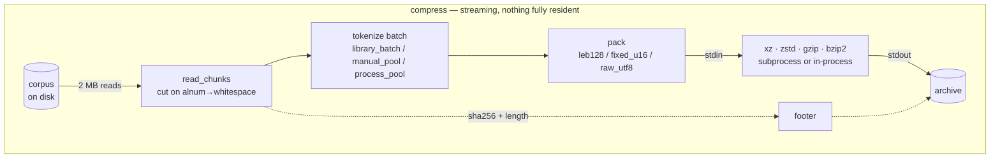
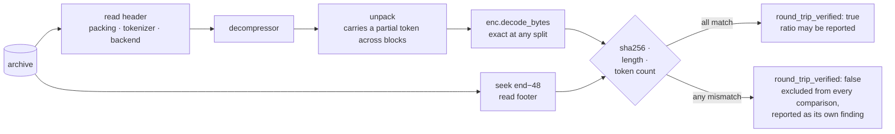
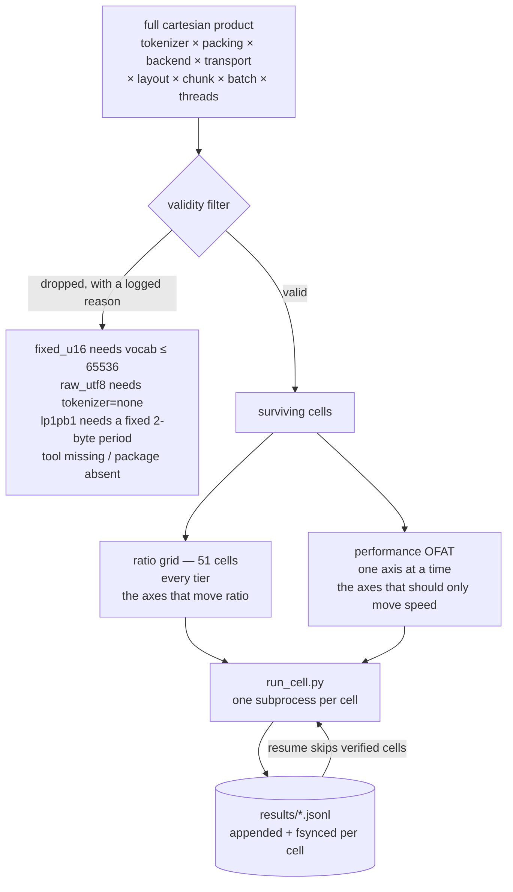

<div align="center">

<pre>
█████    ████   █████   █    █   ████   █████ 
█    █  █    █  █    █  ██  ██  █    █  █    █
█    █  █    █  █    █  █ ██ █  █    █  █    █
█████   ██████  █████   █    █  ██████  █████ 
█       █    █  █   █   █    █  █    █  █   █ 
█       █    █  █    █  █    █  █    █  █    █
</pre>

  <a href="../../LICENSE"></a>
  <a href="../../report/summary.md"></a>
  <a href="../../results/README.md"></a>
  <a href="../../corpus/README.md"></a>
  <a href="https://deepwiki.com/shallowbyte/parmar"></a>

</div>

<p align="center">
  <a href="../../README.md">English</a> ·
  <b>简体中文</b> ·
  <a href="README.es.md">Español</a> ·
  <a href="README.pt-BR.md">Português</a> ·
  <a href="README.ru.md">Русский</a> ·
  <a href="README.ja.md">日本語</a> ·
  <a href="README.de.md">Deutsch</a> ·
  <a href="README.fr.md">Français</a> ·
  <a href="README.ko.md">한국어</a>
</p>

> 本文档为翻译版本，仅供阅读方便。**[英文 README](../../README.md) 为规范版本** ——
> 若两者出现分歧，请以英文版为准。代码、命令、文件名、标识符与全部数值均保持原样未翻译。

一个用于字节级熵编码器的**子词分词预处理器**，以及为验证其是否真正有效而构建的压力测试框架。

> **代码导览：** 本仓库的自动生成架构导览见
> **[deepwiki.com/shallowbyte/parmar](https://deepwiki.com/shallowbyte/parmar)**。
> 本 README 是*实验结果*的规范来源；DeepWiki 更适合浏览*代码*。

**简短结论：它有效，但原因比原假设所声称的更狭窄。** 在 LZMA2 的最佳设置下，
预分词相比原始字节可带来 **+7% 到 +9.6%** 的压缩率提升；这一优势**确实随语料规模增大而扩大** ——
但当语料规模远超压缩器的字典窗口后便会**趋于平稳**，而非无上限地持续增长。
在 `gzip` 的 32 KiB 窗口下，该优势很大（+15%）却完全平坦，
这恰好分离出以往被混为一谈的两种效应：*表示密度*与*窗口扩展*。
在 `bzip2` 上，预分词则是稳定的**负收益**（−3.9%）。
下文给出全部数据与方法；每一个数字都来自一个**实际执行过解压缩且 sha256 校验通过**的配置。

<picture>
  <source media="(prefers-color-scheme: dark)" srcset="../../report/ratio_gap_vs_corpus_size_dark.png">
  
</picture>

## 这是什么

标准压缩器在一个以**字节**为单位的固定大小滑动字典窗口内寻找重复。parmar 的前提是：
在压缩之前，把 UTF-8 文本替换为 BPE 词元 ID（即用于喂给大语言模型的同一套分词）。
词元流比原文本约小 45%，因此一个通常只能覆盖约 64 MB 文本的 64 MiB LZMA2 字典，
在文本被预先压缩为词元后可以覆盖约 120 MB 的文本。

**这一主张只有在大规模下才可被检验。** 对于一个 5 MB 的文件，整个输入本就完全落在字典之内，
没有窗口可供扩展，预分词几乎毫无收益。因此本项目的交付物并不是单个压缩率数字 ——
而是**（parmar 压缩率 − 原始后端压缩率）随语料规模变化的曲线**，以及该曲线是否上升。

归档格式全程流式处理：数据块从输入文件句柄读出、分词、打包，
然后直接管道送入 `xz`/`zstd` 子进程，而该子进程的 stdout 就是输出文件。
词元数组与压缩后的负载都不会完整驻留内存。每一次解压缩都会对重建出的字节重新计算哈希，
并与归档尾部的 sha256 比对；**除非该校验通过，任何压缩率都不会被记录为有效数据。**

## 工作原理

任何时刻驻留内存的数据都不超过一个批次。数据块从输入句柄流出，经分词、打包，
直接进入压缩器的 stdin —— 而它的 stdout *就是*输出文件，因此压缩后的负载从不经过 Python。



解压缩是同一路径的逆向过程，并且**总是会执行**：每一个被测配置都必须先完成解压缩与校验，
其压缩率才被允许计入结果。



### 归档结构

| 偏移 | 字段 |
|---|---|
| `0` | `PRMR` 魔数、版本号、打包模式码 |
| `6…` | 带长度前缀的分词器名、后端名、传输方式 |
| … | 压缩后的负载 |
| `EOF−48` | `orig_len` (u64)、`token_count` (u64)、`sha256` (32 字节) |

尾部之所以放在文件末尾，是因为 `orig_len`、`token_count` 与哈希值在整个输入流式处理完毕之前无法得知。
解压缩时会先定位到 `size−48`。

### 一次扫描是如何生成的



严格的笛卡尔积在每个规模层级上会产生**约 8,100 个有效单元** —— 按实测吞吐量计算，每层需要数周。
上图中的拆分是有据可查的偏离：压缩率网格负责产出规模曲线；同时每个 OFAT 单元仍然会记录压缩率，
因此若某个性能轴*确实*影响了压缩率，它会以矛盾的形式暴露出来，而不会被平均掉。

## 目录结构

| 文件 | 说明 |
|---|---|
| `parmar_core.py` | 核心流水线：打包方案、后端、传输方式、分词布局、归档格式、压缩/解压缩 |
| `parmar.py` | 单流水线命令行工具（`compress` / `decompress` / `bench` / `selftest`） |
| `resources.py` | 可移植的 CPU/内存/磁盘/工具/库探测 |
| `build_corpus.py` | PG-19 语料构建器，分层且可续传 |
| `verify_boundaries.py` | 分块边界差分测试 —— **阻塞性检查** |
| `matrix.py` | 单元生成、有效性过滤、子进程隔离执行、断点续跑 |
| `run_cell.py` | 在独立进程中执行单个矩阵单元 |
| `analyze.py` | 汇总表格 + 压缩率随语料规模变化图 |
| `plots.py` | 全部图表（浅色与深色两版） |
| `folder_docs.py` | 重新生成各目录下的 README |
| `test_regressions.py` | 针对原始 `parmar.py` 中已发现缺陷的回归测试 |
| `test_axes.py` | 独立验证每个矩阵轴取值的往返正确性 |
| `FINDINGS.md` | **代码真正可运行之后被证明有误的全部内容** |

## 环境准备

```bash
python -m venv venv
./venv/Scripts/python.exe -m pip install tiktoken numpy zstandard psutil matplotlib pandas
```

存在时会用到的外部工具：`xz`（`-T` 需 ≥5.2）、`zstd`、`gzip`、`bzip2`。
缺少工具不会静默改变行为 —— 受影响的矩阵单元会被跳过，并打印原因。
`resources.py` 会准确列出探测到的内容：

```bash
python resources.py
```

## 复现步骤

```bash
# 1. 构建语料层级（幂等；重跑会校验 sha256 并跳过已完成的层级）
python build_corpus.py --tiers "64MB,256MB,1GB,4GB" --out ./corpus/

# 2. 冒烟测试：单个配置、最小层级、快速档
python matrix.py smoke --corpus ./corpus/pg19_64mb.txt

# 3. 分块边界差分测试。阻塞性 —— 此处失败意味着分块扰动了词元流，
#    并且会污染其后所有的压缩率数据。
python matrix.py verify-boundaries --corpus ./corpus/pg19_64mb.txt \
    --tokenizers "o200k_base,cl100k_base,r50k_base,p50k_base" \
    --chunk-sizes "1MB,2MB,4MB"

# 4. 打包方案属性/模糊测试（每次扫描前也会自动运行）
python matrix.py verify-leb128 --cases 50000

# 5. 开发循环扫描：完整矩阵、最小层级、仅快速后端
python matrix.py sweep --corpus ./corpus/pg19_64mb.txt --profile fast --resume

# 6. 指定层级的完整扫描，可续跑，并受预检估算门控
python matrix.py sweep --corpus ./corpus/pg19_1gb.txt --profile full \
    --resume --confirm-estimate

# 7. 分析（可基于部分结果运行 —— 无需任何层级已全部完成）
python analyze.py --results ./results/ --out ./report/

# 8. 按行 ID 重跑某个异常单元
python matrix.py rerun-cell --results ./results/sweep_64mb.jsonl --row-id <id>

# 或按顺序运行整个方案，任意时刻均可续跑
bash run_all.sh
```

`matrix.py plan --corpus ... --profile full` 会打印将要生成的单元与完整的丢弃日志，但不执行任何计算。

## 矩阵设计

把全部轴按字面做笛卡尔积，每个语料层级会得到**约 8,100 个有效单元**，
按本机实测吞吐量计算相当于每层数周。因此该乘积被拆为两部分：

* **压缩率网格** —— 对真正决定压缩率的轴做完整交叉（分词器 × 打包方案 × 后端），
  其余参数固定为基线。**51 个单元。** 由它产出规模曲线。
* **性能 OFAT** —— 围绕同一基线，对理应只影响速度的轴（线程数、布局、传输方式、
  块大小、批大小）做单因子变动，仅在代表性后端上进行。

每个 OFAT 单元依然会记录压缩率，因此若某个性能轴*确实*影响了压缩率，
它会作为矛盾暴露出来，而不是被平均掉。

## 结果

完整表格见 [`report/summary.md`](../../report/summary.md)；
图表见 [`report/`](../../report/README.md)。
语料：PG-19，四个层级（64MB / 256MB / 1GB / 4GB），共 10,629 篇文档。

**452 个矩阵单元，452 个通过往返校验，0 个失败 —— 实测单元耗时 21.4 小时。**
下文每一个数字都来自一个实际执行过解压缩、且 sha256、字节长度与词元数量三者全部匹配的配置。
未通过校验的行会被排除在所有对比之外，并在汇总中单独列出 —— 本次没有这样的行。
在无分词器安全切点处被切分的块数：**0**，452 个单元全部如此。

### 问题一：parmar 与原始后端的压缩率差距会随语料规模增大吗？

**会 —— 但仅限于本身具有足够大窗口可供扩展的后端；并且当语料规模超过该窗口若干倍后便趋于平稳。**

下表为压缩率差距占同一后端原始字节压缩率的百分比，流水线固定为 `p50k_base + fixed_u16`：

| 后端 | 有效匹配窗口 | 64MB | 256MB | 1GB | 4GB | 形态 |
|---|---|---|---|---|---|---|
| `gzip_9` | 32 KiB | +15.38% | +15.24% | +15.34% | +15.30% | **平坦** |
| `bz2_9` | 900 KiB 块 | −3.87% | −3.90% | −3.83% | −3.85% | **平坦且为负** |
| `zstd_12` | 128 MiB | +6.12% | +6.40% | +6.54% | +6.53% | 上升后趋平 |
| `zstd_19` | 128 MiB | +5.04% | +5.43% | +5.57% | +5.58% | 上升后趋平 |
| `lzma_fast` | 32 MiB | +8.16% | +8.87% | +9.22% | +9.21% | 上升后趋平 |
| `lzma_extreme` | 64 MiB | +7.55% | +8.56% | +8.94% | +9.08% | 上升后趋平 |
| `lzma_tuned_lp1pb1` | 64 MiB | +8.22% | +9.08% | +9.44% | +9.58% | 持续上升 |
| `zstd_22_long` | 2 GiB | +3.65% | +4.35% | +4.91% | +5.19% | **在 4GB 处仍在攀升** |

在全部 44 个后端/流水线组合中：**32 个扩大，12 个平坦，0 个缩小。**
而那 12 个平坦的组合，恰好就是 6 个 `gzip_9` 与 6 个 `bz2_9` 组合。

机制不只体现在符号上，更体现在曲线形态上：

* `gzip_9` 的 32 KiB 窗口在每个层级都已饱和，因此它那（很大的，+15%）收益**纯粹来自表示密度**，
  完全不随规模增长。这正是把两种效应区分开来的对照组 ——
  它同时说明 parmar 在小规模下的大部分收益从来都与窗口无关。
* LZMA 系后端从 64MB 到 1GB 持续攀升，随后趋平：一旦语料达到字典的约 16 倍，
  分词流与原始流都同等地"用尽了窗口"，优势便不再扩大。
* `zstd_22_long` 拥有 2 GiB 窗口，是唯一在 **4GB 处仍在攀升**的后端 ——
  因为 4GB 只是其窗口的 2 倍，也就是说它仍处在其他后端已经离开的那个区间。

**趋平的位置与各后端的窗口大小同步。** 这正是窗口扩展机制自我印证的方式；
同时也是对原假设的一次实质性修正：原主张暗示收益会随语料规模无上限增长，而这一部分**并未成立**。

绝对压缩率最优值（parmar 对比同层级最优的原始后端）：

| 层级 | 最优 parmar | 最优原始后端 | 优势 |
|---|---|---|---|
| 64MB | **3.9304**（`p50k+fixed_u16` / `lzma_tuned_lp1pb1`） | 3.6318（`lzma_extreme`） | +8.22% |
| 256MB | **4.0488** | 3.7198（`zstd_22_long`） | +8.84% |
| 1GB | **4.0855** | 3.7817（`zstd_22_long`） | +8.03% |
| 4GB | **4.0785** | 3.8027（`zstd_22_long`） | +7.25% |

绝对压缩率在各层级之间并非严格单调，因为每个层级都是一组不同的文档；
上文按后端计算的差距才是受控对比。

<picture>
  <source media="(prefers-color-scheme: dark)" srcset="../../report/ratio_vs_corpus_size_dark.png">
  
</picture>

### 问题二：`fixed_u16` + `lp=1,pb=1` 是否真的胜过 `LEB128` + `lc=3,lp=0,pb=0`？

**是的，优势明显 —— 但主要原因与该理论给出的并不相同。**

在 64MB 层级、两种打包方案均有效的分词器上：

| 分词器 | LEB128 + lc3/lp0/pb0 | fixed_u16 + lc3/lp0/pb0 | fixed_u16 + lc1/lp1/pb1 | 调优后 vs LEB128 |
|---|---|---|---|---|
| `r50k_base` | 3.6856 | 3.8975 | 3.9214 | **+6.40%** |
| `p50k_base` | 3.6915 | 3.9060 | 3.9304 | **+6.47%** |

把这 +6.4% 拆解开：在 lc/lp/pb *保持不变*的情况下，仅把 LEB128 换成 `fixed_u16` 就值 **+5.7%**；
而在此之上再施加 `lp=1,pb=1` 对齐调优，只额外贡献 **+0.61%**。
也就是说，对齐理论的方向是对的，也确实有收益 —— 但这 +6.4% 中约 90% 来自固定宽度本身的规整性，
而非那个从第一性原理论证出来的字面位置调优。尽管如此，
`lzma_tuned_lp1pb1` 仍然是所有被测层级上压缩率最优的配置。

<picture>
  <source media="(prefers-color-scheme: dark)" srcset="../../report/packing_decomposition_dark.png">
  
</picture>

### 问题三：`manual_pool` 有可能胜过 `library_batch` 吗？

**不能。这是一个明确的负面结论 —— 该假设未能成立。**

在两个可作对比的层级上，`manual_pool` 恰好在 **16 个可比配置中的 8 个**里胜出。这就是随机水平。
单项差异在 −6.8% 到 +44% 之间双向摆动，并且与线程数、块大小、后端或语料规模都没有一致的规律。

之所以百分比波动如此之大，是因为被测量的量本身既小又噪声大：
分词耗时只占一个单元 20 秒到 60 分钟总耗时中的约 0.7–3.4 秒，
而两次名义上完全相同的 `library_batch` 运行、处理*同样的工作量*，耗时可以相差 0.71 秒与 1.24 秒。
被测效应与测量噪声同量级 —— 而这本身就是结论。

**结论：手写工作池不值得它带来的复杂度。** tiktoken 的 `encode_ordinary_batch`
已经在 Rust 层释放 GIL 并内部并行化；Python 侧的协调没有可挖掘的余量。
`process_pool` 还要额外付出 Windows spawn 的代价（每个 worker 约 1–2 秒、约 100 MB），却毫无回报。
把这一点标记为待检验的实证问题而非既定设计选择是正确的 —— 而答案是：简单的那个方案胜出。

### 问题四：`xz -T` 的真实加速曲线如何，字典大小下限究竟在哪里生效？

**2 倍字典下限确实存在；而在其之上，加速比由块数决定 —— 而预分词会减少块数。**

真正起作用的量是**送入 xz 的数据流大小**（即打包后的词元流），
既不是语料大小，也不是压缩后的输出。块数 = `送入字节数 / (2 × 字典)`：

| 层级 | 流水线 | 后端 | 送入 xz | 块数 | T4 | T20 | 压缩率代价 |
|---|---|---|---|---|---|---|---|
| 64MB | raw | `lzma_extreme` | 64 MB | **1** | 1.01× | 1.01× | **0.00%** |
| 64MB | `r50k+fixed_u16` | `lzma_extreme` | 36 MB | **1** | 1.12× | 1.13× | **0.00%** |
| 1GB | `r50k+fixed_u16` | `lzma_extreme` | 579 MB | **5** | 3.61× | **4.97×** | −1.30% |
| 1GB | raw | `lzma_extreme` | 1025 MB | **8** | 3.78× | **7.49×** | −1.16% |
| 1GB | `r50k+fixed_u16` | `lzma_fast` | 579 MB | **9** | 3.26× | **7.94×** | −1.38% |
| 1GB | raw | `lzma_fast` | 1025 MB | **16** | 4.10× | **11.76×** | −1.35% |
| 4GB | raw | `lzma_extreme` | 4096 MB | **32** | 3.85× | 10.82× | −1.27% |
| 4GB | raw | `lzma_fast` | 4096 MB | **64** | 3.81× | 11.48× | −1.36% |

**存在三个区间，`-T` 在每个区间中的行为完全不同：**

**1. 低于下限（`送入 < 2 × 字典`）—— 只有一个块。** `-T` 毫无收益（0.99–1.22×），
也毫无代价。T1/T4/T20 的压缩率逐位相同，这*证明*了并未发生分块，而不只是推断。
64MB 层级就处于该区间；这也解释了为何最初的 5 MB 实验看不到任何多线程收益。

**2. 块数 < 核心数 —— 加速比几乎与块数 1:1 对应。** 在 1GB：5 块 → 4.97×，8 块 → 7.49×，
9 块 → 7.94×，16 块 → 11.76×。超出块数的线程毫无作用。

**3. 块数 > 核心数 —— 加速比被硬件限制。** 在 4GB，18 到 64 块全部落在 20 核上的 9.4–11.5×
（约 50% 并行效率）。此时再增加块数已无帮助。

因此可用线程数约为 **`min(送入字节数 / (2 × 字典), 核心数)`**。

**预分词带有一项此前未被指出的隐性并行度代价。** 由于 parmar 把压缩器的输入缩小了约 45%，
在块大小固定的情况下它也同时减少了块数。在同一份 1GB 语料、同一后端上，
原始字节得到 8 块与 7.49× 加速，而 `fixed_u16` 只得到 5 块与 4.97× ——
parmar 用**约 34% 的可用多线程加速**换取了它的压缩率收益。
在 4GB 层级这一代价消失，因为两者都已越过核心数上限。它只在区间 2 中是真实的权衡。

多线程的压缩率代价在各规模下**对 LZMA 约为 1.3%**，而值得注意的是**对 zstd 恰好为 0.00%** ——
zstd 的多线程并不像 xz 的独立块那样在任务之间重置窗口。
如果你需要多线程而又不想付出压缩率代价，这就是在此优先选择 zstd 而非 xz 的一个具体理由。

<picture>
  <source media="(prefers-color-scheme: dark)" srcset="../../report/thread_scaling_dark.png">
  
</picture>

### 那么实际应该选哪个配置？

<picture>
  <source media="(prefers-color-scheme: dark)" srcset="../../report/ratio_vs_throughput_pareto_dark.png">
  
</picture>

帕累托前沿从 **79 MB/s 下的 3.18x**（raw + `zstd_12`）延伸到
**7.9 MB/s 下的 4.09x**（`p50k_base+fixed_u16` + `lzma_tuned_lp1pb1`）——
即用 10 倍的速度差换取 29% 的体积差。
`p50k_base+fixed_u16` 几乎出现在前沿上的每一个点，这就是实践层面的要点：
打包方案的选择几乎是免费的，真正需要权衡的是后端。

## 语料

`deepmind/pg19`（Apache 2.0）—— Rae 等，2019，*Compressive Transformers for
Long-Range Sequence Modelling*，[arXiv:1911.05507](https://arxiv.org/abs/1911.05507)。

请注意 `datasets.load_dataset("deepmind/pg19", streaming=True)` **无法工作** ——
该 Hub 仓库只包含一个加载脚本与文件清单，没有 parquet，
其 `refs/convert/parquet` 分支同样没有数据，而加载脚本支持已在 `datasets` 3.0 中被移除。
`build_corpus.py` 直接从该脚本所指向的公开 GCS 存储桶获取书籍。详见
[`FINDINGS.md`](../../FINDINGS.md)。

## 许可证

Apache-2.0。见 [`LICENSE`](../../LICENSE)。
